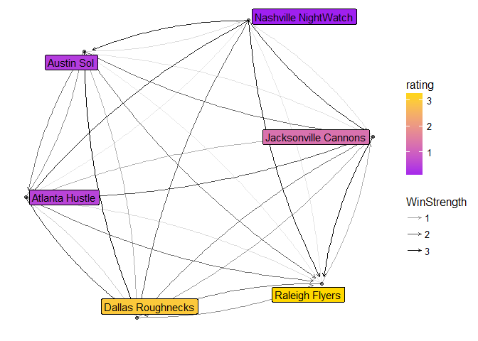
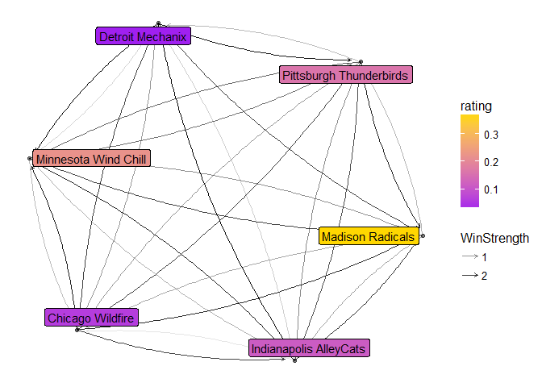
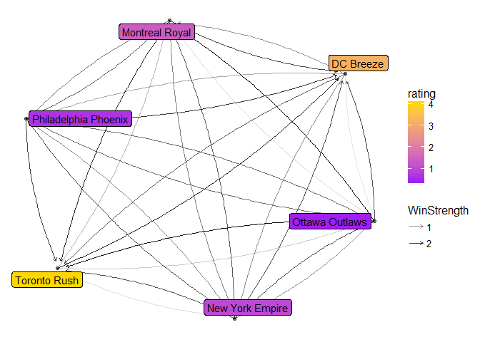
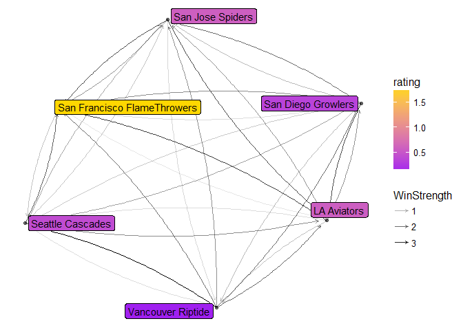

# AUDL Rankings
Matt Rissler  
August 9, 2017  


```r
teams <-read_html("http://theaudl.com/teams")
team_names <- teams %>% html_nodes("h3+ h3 a:nth-child(1)") %>% html_text()
team_links <- teams %>% html_nodes("h3+ h3 a:nth-child(1)") %>% html_attr("href")
all_teams <- tibble(Team = team_names,Wins = rep(0,length(team_names)), Losses= rep(0,length(team_names)), Link=team_links)
```

```r
all_teams <- all_teams %>% mutate(Division=NA_character_)
for(i in c("east", "midwest", "west", "south")){
  teams <-read_html(paste0("http://theaudl.com/teams/",i))
  team_links <- teams %>% html_nodes("h3+ h3 a:nth-child(1)") %>% html_attr("href")
  all_teams <- all_teams %>% mutate( Division = if_else(is.na(Division),if_else( Link %in% team_links, i, NA_character_), Division))
}
```


```r
base_url <- "http://theaudl.com/scores/2017/"
all_scores <-tibble(Time=character(), 
                    `Away Team`=character(), `Away Score`=integer(),
                    `Home Team`=character(), `Home Score`=integer())
for(i in c(1:17,"playoffs", "championship-weekend")){
  if(!is.na(as.numeric(i))){
    this_week <- read_html(paste0(base_url,"Week-", i))
  } else{
    this_week <- read_html(paste0(base_url, i))
  }
  
  this_teams <- this_week %>% 
    html_nodes("td") %>% html_nodes("a") %>% 
    html_attr("href") %>% matrix(ncol=3, byrow=TRUE) %>% 
    as.tibble()
  colnames(this_teams) <- c("Away","Home")
  
  this_scores <- this_week %>% html_nodes("table") %>%
    html_table(header=TRUE) %>% bind_rows() #%>% 
  if(dim(this_scores)[2] > 5){
    this_scores <-this_scores[1:4]  
  } else{ 
    this_scores <- this_scores %>%
      select(contains("e"))
  }
  #View(this_scores)
  #Sys.sleep(5)
  
  this_scores <- this_scores %>% 
    mutate(`Away Team`= this_teams$Away, `Home Team`=this_teams$Home) %>%
    filter(str_detect(Result, "-")) %>%
    separate(Result, c("Away Score", "Home Score", "OT"), convert=TRUE) %>%
    as.tibble()
  
  all_scores <- bind_rows(all_scores, this_scores)
  #Need to put in team links and then probably a join with all_teams
  
  
}


all_scores <- all_scores %>% mutate(`Away Team`= str_replace(`Away Team`, "http://theaudl.com", ""),
                                    `Home Team`= str_replace(`Home Team`, "http://theaudl.com", ""))

head(all_scores)
```

```
## # A tibble: 6 x 6
##          Time       `Away Team` `Away Score`          `Home Team`
##         <chr>             <chr>        <int>                <chr>
## 1  6:30 PM/ET     /teams/hustle           19        /teams/flyers
## 2  7:00 PM/ET /teams/nightwatch           23       /teams/cannons
## 3  8:00 PM/ET        /teams/sol           17    /teams/roughnecks
## 4  9:00 PM/ET    /teams/spiders           29 /teams/flamethrowers
## 5 10:00 PM/ET   /teams/aviators           31      /teams/growlers
## 6 10:00 PM/ET    /teams/riptide           18      /teams/cascades
## # ... with 2 more variables: `Home Score` <int>, OT <chr>
```


```r
#MOV of 7 is insurmountable
maxMOV=7
P=matrix(c(1   ,-1/2,0   ,0,0,0,0,0,0,0,0,0,0,
           -1/2,1   ,-1/2,0   ,0,0,0,0,0,0,0,0,0,
           0   ,-1/2,1   ,-1/2,0   ,0,0,0,0,0,0,0,0,
           0   ,0   ,-1/2,1   ,-1/2,0,0,0,0,0,0,0,0,
           0,0   ,0   ,-1/2,1   ,-1/2,0,0,0,0,0,0,0,
           0,0,0   ,0   ,-1/2,1   ,-1/2,0,0,0,0,0,0,
           0,0,0,0   ,0   ,-1/2,1   ,-1/2,0,0,0,0,0,
           0,0,0,0,0   ,0   ,-1/2,1   ,-1/2,0,0,0,0,
           0,0,0,0,0,0   ,0   ,-1/2,1   ,-1/2,0,0,0,
           0,0,0,0,0,0,0   ,0   ,-1/2,1   ,-1/2,0,0,
           0,0,0,0,0,0,0,0   ,0   ,-1/2,1 , -1/2, 0,
           0,0,0,0,0,0,0,0,0   ,0   ,-1/2,1 , -1/2,
           0,0,0,0,0,0,0,0,0,0   ,0   ,-1/2,1 
)
,nrow=13)
v=c(0,0,0,0,0,0,0,0,0,0,0,0,1/2)
shares<-solve(P,v)

library(Matrix)
```

```
## 
## Attaching package: 'Matrix'
```

```
## The following object is masked from 'package:tidyr':
## 
##     expand
```

```r
A=sparseMatrix(seq(1,length(all_teams$Team)),seq(1,length(all_teams$Team)),x=0)
b=rep(1,length(all_teams$Team))


for(i in 1:length(all_scores$Time)){
  away=all_scores[i,]$`Away Score`
  home=all_scores[i,]$`Home Score`
  if(is.na(home) | is.na(away)){ next }
  if(abs(away-home)>=maxMOV){
    if(away>home){
      Share1<-1
      Share2<-0
    } else{
      Share2<-1
      Share1<-0
    }
  } else{
    Share1<-shares[away-home+maxMOV]
    Share2<-1-Share1
  }
  team1=match(all_scores[i,]$`Away Team`,all_teams$Link)
  team2=match(all_scores[i,]$`Home Team`,all_teams$Link)
  if( is.na(team1) | is.na(team2)){ next }
  A[team1,team2]=
    A[team1,team2]+Share2
  A[team2,team1]=
    A[team2,team1]+Share1
  A[team1,team1]=
    A[team1,team1]+Share1
  A[team2,team2]=
    A[team2,team2]+Share2
  if(Share1>Share2)
  {
    all_teams[team1,]$Wins = all_teams[team1,]$Wins + 1
    all_teams[team2,]$Losses = all_teams[team2,]$Losses + 1
  } else{
    all_teams[team2,]$Wins = all_teams[team2,]$Wins + 1
    all_teams[team1,]$Losses = all_teams[team1,]$Losses + 1
  }
}
```


```r
A_unnormed <- A
for(i in 1:length(all_teams$Team)){
  if(sum(A[i,])!=0){ 
    A[i,]=A[i,]/sum(A[i,])
  }
}

ranking <- all_teams
b<- Re(eigen(t(A))$vectors[,1]/sum(eigen(t(A))$vectors[,1])*length(eigen(t(A))$vectors[,1]))
ranking$Rating <- b

ranking <-mutate(ranking, Ranking = dense_rank(-Rating)) %>% arrange(desc(Rating)) %>% select(Ranking, Rating, Team:Losses)


knitr::kable(ranking)
```


 Ranking      Rating  Team                           Wins   Losses
--------  ----------  ----------------------------  -----  -------
       1   4.0226866  Toronto Rush                     13        4
       2   3.2852578  Raleigh Flyers                   13        2
       3   3.1885402  DC Breeze                        11        5
       4   3.0037183  Dallas Roughnecks                13        4
       5   1.7964051  San Francisco FlameThrowers      13        4
       6   1.3789747  Montreal Royal                    9        6
       7   1.3153156  Jacksonville Cannons             10        5
       8   0.9924181  New York Empire                   6        8
       9   0.6420320  Philadelphia Phoenix              4       10
      10   0.5827888  San Jose Spiders                  8        7
      11   0.5726526  LA Aviators                      10        6
      12   0.5267972  Atlanta Hustle                    5        9
      13   0.4213643  Austin Sol                        4       10
      14   0.4136687  Seattle Cascades                  7        7
      15   0.3984721  Ottawa Outlaws                    2       12
      16   0.3675077  Madison Radicals                 13        3
      17   0.3392999  San Diego Growlers                7        7
      18   0.2209801  Minnesota Wind Chill             11        4
      19   0.1603186  Pittsburgh Thunderbirds          10        6
      20   0.1115732  Indianapolis AlleyCats            5        9
      21   0.1057805  Vancouver Riptide                 1       13
      22   0.0749024  Nashville NightWatch              0       14
      23   0.0584074  Chicago Wildfire                  3       11
      24   0.0201381  Detroit Mechanix                  1       13


```r
library(network)
```

```
## network: Classes for Relational Data
## Version 1.13.0 created on 2015-08-31.
## copyright (c) 2005, Carter T. Butts, University of California-Irvine
##                     Mark S. Handcock, University of California -- Los Angeles
##                     David R. Hunter, Penn State University
##                     Martina Morris, University of Washington
##                     Skye Bender-deMoll, University of Washington
##  For citation information, type citation("network").
##  Type help("network-package") to get started.
```

```r
library(ggnetwork)
#library(plotly)
n <- network( A_unnormed,matrix.type="adjacency", directed=TRUE, loops=TRUE)
```

```
## <sparse>[ <logic> ] : .M.sub.i.logical() maybe inefficient
```

```r
n %e% "WinStrength" = A_unnormed

n %v% "Division" = all_teams$Division

network.vertex.names(n) <- all_teams$Team
n %v% "rating" <- left_join(all_teams, ranking, by = "Team" ) %>%
  .$Rating

for(i in unique(all_teams$Division)){
  g <- n %s% which(n %v% "Division" == i)
  net<-ggnetwork(g , weights="WinStrength", layout="fruchtermanreingold")
  p<-ggplot(net, aes(x = x, y = y, xend = xend, yend = yend))+
    geom_edges(aes(alpha=WinStrength), curvature = 0.1, 
               arrow=arrow(length = unit(0.25, "lines")))+
    geom_nodes(   alpha=0.5 ) +theme_blank()+
    scale_fill_gradient(low="purple", high="gold")+
    geom_nodelabel_repel(aes(fill=rating,label=vertex.names))
  print(p)
}
```

```
## Loading required package: sna
```

```
## Loading required package: statnet.common
```

```
## 
## Attaching package: 'statnet.common'
```

```
## The following object is masked from 'package:base':
## 
##     order
```

```
## sna: Tools for Social Network Analysis
## Version 2.4 created on 2016-07-23.
## copyright (c) 2005, Carter T. Butts, University of California-Irvine
##  For citation information, type citation("sna").
##  Type help(package="sna") to get started.
```

```
## Warning: Ignoring unknown parameters: segment.color

## Warning: Ignoring unknown parameters: segment.color
```

<!-- -->

```
## Warning: Ignoring unknown parameters: segment.color
```

<!-- -->

```
## Warning: Ignoring unknown parameters: segment.color
```

<!-- --><!-- -->

