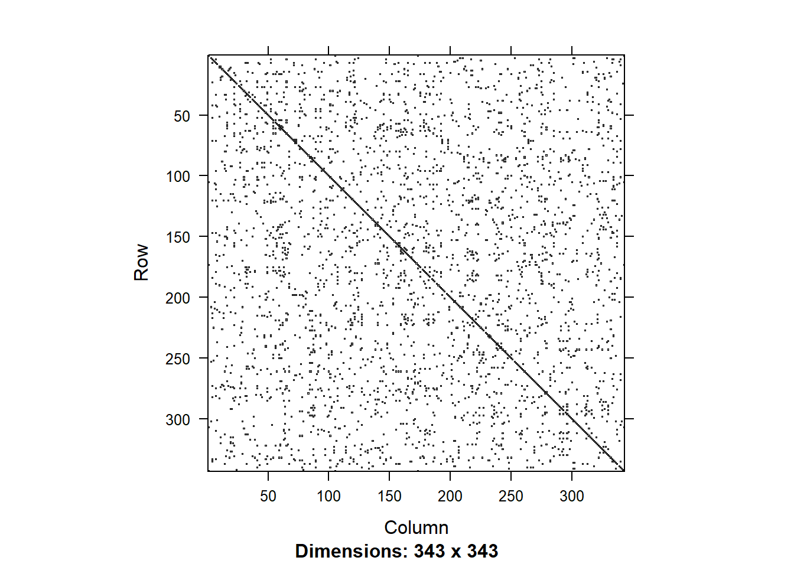
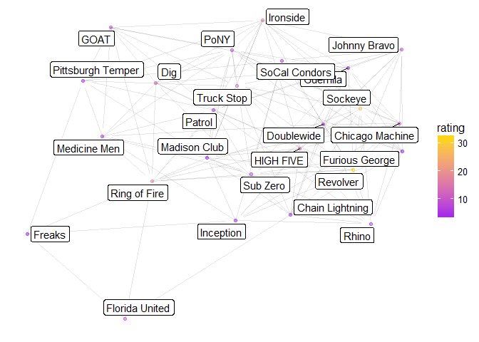

# USAU Mens Rankings
`r format(Sys.time(), '%d %B, %Y')`  


```r
library(RSelenium)
rD <- rsDriver()
```

```
## checking Selenium Server versions:
```

```
## BEGIN: PREDOWNLOAD
```

```
## BEGIN: DOWNLOAD
```

```
## BEGIN: POSTDOWNLOAD
```

```
## checking chromedriver versions:
```

```
## BEGIN: PREDOWNLOAD
```

```
## BEGIN: DOWNLOAD
```

```
## BEGIN: POSTDOWNLOAD
```

```
## checking geckodriver versions:
```

```
## BEGIN: PREDOWNLOAD
```

```
## BEGIN: DOWNLOAD
```

```
## BEGIN: POSTDOWNLOAD
```

```
## checking phantomjs versions:
```

```
## BEGIN: PREDOWNLOAD
```

```
## BEGIN: DOWNLOAD
```

```
## BEGIN: POSTDOWNLOAD
```

```
## [1] "Connecting to remote server"
## $applicationCacheEnabled
## [1] FALSE
## 
## $rotatable
## [1] FALSE
## 
## $mobileEmulationEnabled
## [1] FALSE
## 
## $networkConnectionEnabled
## [1] FALSE
## 
## $chrome
## $chrome$chromedriverVersion
## [1] "2.33.506120 (e3e53437346286c0bc2d2dc9aa4915ba81d9023f)"
## 
## $chrome$userDataDir
## [1] "C:\\Users\\mr437799\\AppData\\Local\\Temp\\scoped_dir6444_18038"
## 
## 
## $takesHeapSnapshot
## [1] TRUE
## 
## $pageLoadStrategy
## [1] "normal"
## 
## $databaseEnabled
## [1] FALSE
## 
## $handlesAlerts
## [1] TRUE
## 
## $hasTouchScreen
## [1] FALSE
## 
## $version
## [1] "61.0.3163.100"
## 
## $platform
## [1] "Windows NT"
## 
## $browserConnectionEnabled
## [1] FALSE
## 
## $nativeEvents
## [1] TRUE
## 
## $acceptSslCerts
## [1] TRUE
## 
## $locationContextEnabled
## [1] TRUE
## 
## $webStorageEnabled
## [1] TRUE
## 
## $browserName
## [1] "chrome"
## 
## $takesScreenshot
## [1] TRUE
## 
## $javascriptEnabled
## [1] TRUE
## 
## $cssSelectorsEnabled
## [1] TRUE
## 
## $setWindowRect
## [1] TRUE
## 
## $unexpectedAlertBehaviour
## [1] ""
## 
## $id
## [1] "697497e7617dd26a3eb896637b811079"
```

```r
remDr <- rD[["client"]]
```

```r
library(tidyverse)
```

```
## Loading tidyverse: ggplot2
## Loading tidyverse: tibble
## Loading tidyverse: tidyr
## Loading tidyverse: readr
## Loading tidyverse: purrr
## Loading tidyverse: dplyr
```

```
## Warning: package 'tidyr' was built under R version 3.4.2
```

```
## Warning: package 'dplyr' was built under R version 3.4.2
```

```
## Conflicts with tidy packages ----------------------------------------------
```

```
## filter(): dplyr, stats
## lag():    dplyr, stats
```

```r
library(rvest)
```

```
## Loading required package: xml2
```

```
## 
## Attaching package: 'rvest'
```

```
## The following object is masked from 'package:purrr':
## 
##     pluck
```

```
## The following object is masked from 'package:readr':
## 
##     guess_encoding
```

```r
library(XML)
```

```
## 
## Attaching package: 'XML'
```

```
## The following object is masked from 'package:rvest':
## 
##     xml
```

```r
remDr$navigate("http://play.usaultimate.org/teams/events/rankings/")
# elem <- remDr$findElement(using = 'xpath', "//*/option[@value = 'Club']")
# elem$clickElement()

elem <- remDr$findElement(using = 'xpath', "//*/option[@value = '17']")
elem$clickElement()

elem <- remDr$findElement(using = 'id', "CT_Main_0_btnSubmit")
elem$clickElement()
```


```r
elem <- remDr$findElement(using="id", value="CT_Main_0_gvList")
data<-elem$getElementAttribute("outerHTML")[[1]]  %>% read_html() %>%
  html_table(fill=TRUE)


teams <- data[[1]][-(nrow(data[[1]])-1),-8:-9] %>% filter(!is.na(Losses))

teams$Links <- elem$getElementAttribute("outerHTML")[[1]] %>% htmlTreeParse(useInternalNodes=TRUE) %>% xpathApply("//a", xmlGetAttr, 'href') %>% unlist %>% .[1:nrow(teams)]

teams <- teams %>% filter( Wins !=0 | Losses !=0 )
```


```r
library(stringr)
num_pages <- data[[2]][2] %>% str_split(.," of ") %>% .[[1]] %>% .[2] %>% as.numeric()
for( n in 2:num_pages){
  
  
  if(n<10){
    link <- paste0("CT_Main_0$gvList$ctl23$ctl00$ctl0",n)
  } else{
    link <- paste0("CT_Main_0$gvList$ctl23$ctl00$ctl",n)
  }
  elem <- remDr$findElement(using="partial link text", value="Next ")
  elem$clickElement()

  elem <- remDr$findElement(using="id", value="CT_Main_0_gvList")
  data<-elem$getElementAttribute("outerHTML")[[1]]  %>% read_html() %>%
    html_table(fill=TRUE)

  new_teams <- data[[1]][-(nrow(data[[1]])-1),-8:-9] %>% filter(!is.na(Losses))

  new_teams$Links <- elem$getElementAttribute("outerHTML")[[1]] %>%
    htmlTreeParse(useInternalNodes=TRUE) %>% 
    xpathApply("//a", xmlGetAttr, 'href') %>% unlist %>% .[1:nrow(new_teams)]

  teams <- bind_rows(teams, new_teams)
  
}

rm(data)
rm(elem)
teams <- teams %>% filter( Wins !=0 | Losses !=0) %>% 
  filter( !grepl("[Tt]esting",Team)) %>% 
  filter(`Competition Level` != "College") %>%  
  arrange(Team) 

teams <- teams %>% mutate(Wins = 0, Losses = 0)
```

```r
# 
# remDr$navigate("http://play.usaultimate.org/teams/events/team_rankings/?RankSet=College-Women")
# 
# elem <- remDr$findElement(using="link text", value="View All")
# elem$clickElement()
# 
# elem <- remDr$findElement(using="id", value="CT_Main_0_gvList")
# data<-elem$getElementAttribute("outerHTML")[[1]]  %>% read_html() %>%
#   html_table(fill=TRUE)
# 
# teamsInfo <- data[[1]][-(nrow(data[[1]])-1),-11:-12] %>% filter(!is.na(Losses))
# 
# teamsInfo$Links <- elem$getElementAttribute("outerHTML")[[1]] %>% htmlTreeParse(useInternalNodes=TRUE) %>% xpathApply("//a", xmlGetAttr, 'href') %>% unlist %>% .[1:nrow(teamsInfo)]
# 
# teams <- left_join(teams,teamsInfo,by=c("Links", "Competition Level", "Gender Division")) %>% select(-Wins.y, -Losses.y, -Wins.x, -Losses.x) %>% rename(Team=Team.x, School=Team.y) %>% mutate(Rank=as.numeric(Rank), `Power Rating`=as.numeric(`Power Rating`))
# 
# teams <- teams %>% arrange(Team) %>% mutate(Wins=0, Losses=0)
# 
# rm(teamsInfo)
```


```r
scores <-data.frame(Team1=character(), Score1=numeric(), Link1=character(),
                    Team2=character(), Score2=numeric(), Link2=character(),
                    Date=character())

for( i in 1:length(teams$Team)){
  Sys.sleep(runif(1))
  url <- paste0("http://play.usaultimate.org", teams$Links[i])
  remDr$navigate(url)
  #pull table of games
  elem <- remDr$findElement(using = "id", value="CT_Right_0_gvEventScheduleScores")
  data <- elem$getElementAttribute("outerHTML")[[1]] %>% 
    read_html() %>% html_table(fill=TRUE)
  data <- data[[1]]
  names(data) <- c("Date", "Scores", "Opponent")
  data <- filter(data, Date != Scores)
  data <- data %>% separate(Scores, c("For", "Against"))
  data <- data %>% filter(!is.na(Against) & !is.na(For)) %>% filter(Opponent != "N/A") %>%
    mutate(For=ifelse(For=="W", 1, 
                      ifelse(For=="F", -1, 
                             ifelse(For=="L",0,
                                    as.numeric(For)))),
           Against=ifelse(Against=="W", 1, 
                          ifelse(Against=="F", -1, 
                                 ifelse(Against=="L",0,
                                        as.numeric(Against))))
    )
  data$Links <- elem$getElementAttribute("outerHTML")[[1]] %>%
    htmlTreeParse(useInternalNodes=TRUE) %>% 
    xpathApply("//a", xmlGetAttr, 'href') %>% 
    unlist %>% grep("Eventteam",., value=TRUE) %>% .[1:length(data$Against)]
  
  for(j in 1:length(data$Links)){
    oppID = grep(data$Links[j], teams$Links, fixed=TRUE)
    if( length(oppID) >0){
      if( oppID > i){
        scores <- bind_rows(scores, 
                            tibble(Team1=teams$Team[i], 
                                   Score1=data$For[j],
                                   Link1=teams$Links[i],
                                   Team2=teams$Team[oppID], 
                                   Score2=data$Against[j],
                                   Link2=teams$Links[oppID],
                                   Date=data$Date[j])
        )
        if(!is.na(data$For[j]) && !is.na(data$Against[j])){
          if(data$For[j]>data$Against[j]){
            teams$Wins[i]=teams$Wins[i]+1;
            teams$Losses[oppID]=teams$Losses[oppID]+1;
          } else{
            teams$Losses[i]=teams$Losses[i]+1;
            teams$Wins[oppID]=teams$Wins[oppID]+1;
          }
        }
      }
    }
    #if opposing team is later in list (match on URL) add the game to the dataframe of games
    
    
  }
}
```

```
## Warning in bind_rows_(x, .id): binding factor and character vector,
## coercing into character vector
```

```
## Warning in bind_rows_(x, .id): binding character and factor vector,
## coercing into character vector
```

```
## Warning in bind_rows_(x, .id): binding factor and character vector,
## coercing into character vector
```

```
## Warning in bind_rows_(x, .id): binding character and factor vector,
## coercing into character vector
```

```
## Warning in bind_rows_(x, .id): binding factor and character vector,
## coercing into character vector
```

```
## Warning in bind_rows_(x, .id): binding character and factor vector,
## coercing into character vector
```

```
## Warning in bind_rows_(x, .id): binding factor and character vector,
## coercing into character vector
```

```
## Warning in bind_rows_(x, .id): binding character and factor vector,
## coercing into character vector
```

```
## Warning in bind_rows_(x, .id): binding factor and character vector,
## coercing into character vector
```

```
## Warning in bind_rows_(x, .id): binding character and factor vector,
## coercing into character vector
```

```
## Warning in ifelse(For == "L", 0, as.numeric(For)): NAs introduced by
## coercion
```

```
## Warning in ifelse(Against == "L", 0, as.numeric(Against)): NAs introduced
## by coercion
```

```
## Warning: Too few values at 1 locations: 2
```

```
## Warning in ifelse(For == "L", 0, as.numeric(For)): NAs introduced by
## coercion
```

```
## Warning in ifelse(Against == "L", 0, as.numeric(Against)): NAs introduced
## by coercion
```

```
## Warning in ifelse(For == "L", 0, as.numeric(For)): NAs introduced by
## coercion
```

```
## Warning in ifelse(Against == "L", 0, as.numeric(Against)): NAs introduced
## by coercion
```

```
## Warning in ifelse(For == "L", 0, as.numeric(For)): NAs introduced by
## coercion
```

```
## Warning in ifelse(Against == "L", 0, as.numeric(Against)): NAs introduced
## by coercion
```

```
## Warning in ifelse(For == "L", 0, as.numeric(For)): NAs introduced by
## coercion
```

```
## Warning in ifelse(Against == "L", 0, as.numeric(Against)): NAs introduced
## by coercion
```

```
## Warning in ifelse(For == "L", 0, as.numeric(For)): NAs introduced by
## coercion
```

```
## Warning in ifelse(Against == "L", 0, as.numeric(Against)): NAs introduced
## by coercion
```

```
## Warning in ifelse(For == "L", 0, as.numeric(For)): NAs introduced by
## coercion
```

```
## Warning in ifelse(Against == "L", 0, as.numeric(Against)): NAs introduced
## by coercion
```

```
## Warning in ifelse(For == "L", 0, as.numeric(For)): NAs introduced by
## coercion
```

```
## Warning in ifelse(Against == "L", 0, as.numeric(Against)): NAs introduced
## by coercion
```

```
## Warning in ifelse(For == "L", 0, as.numeric(For)): NAs introduced by
## coercion
```

```
## Warning in ifelse(Against == "L", 0, as.numeric(Against)): NAs introduced
## by coercion
```

```
## Warning: Too many values at 1 locations: 20
```

```
## Warning in ifelse(For == "L", 0, as.numeric(For)): NAs introduced by
## coercion
```

```
## Warning in ifelse(Against == "L", 0, as.numeric(Against)): NAs introduced
## by coercion
```

```
## Warning in ifelse(For == "L", 0, as.numeric(For)): NAs introduced by
## coercion
```

```
## Warning in ifelse(Against == "L", 0, as.numeric(Against)): NAs introduced
## by coercion
```

```
## Warning in ifelse(For == "L", 0, as.numeric(For)): NAs introduced by
## coercion
```

```
## Warning in ifelse(Against == "L", 0, as.numeric(Against)): NAs introduced
## by coercion
```

```
## Warning: Too few values at 1 locations: 10
```

```
## Warning in ifelse(For == "L", 0, as.numeric(For)): NAs introduced by
## coercion
```

```
## Warning in ifelse(Against == "L", 0, as.numeric(Against)): NAs introduced
## by coercion
```

```
## Warning: Too few values at 1 locations: 14
```

```
## Warning in ifelse(For == "L", 0, as.numeric(For)): NAs introduced by
## coercion
```

```
## Warning in ifelse(Against == "L", 0, as.numeric(Against)): NAs introduced
## by coercion
```

```
## Warning in ifelse(For == "L", 0, as.numeric(For)): NAs introduced by
## coercion
```

```
## Warning in ifelse(Against == "L", 0, as.numeric(Against)): NAs introduced
## by coercion
```

```
## Warning: Too many values at 1 locations: 28
```

```
## Warning in ifelse(For == "L", 0, as.numeric(For)): NAs introduced by
## coercion
```

```
## Warning in ifelse(Against == "L", 0, as.numeric(Against)): NAs introduced
## by coercion
```

```
## Warning in ifelse(For == "L", 0, as.numeric(For)): NAs introduced by
## coercion
```

```
## Warning in ifelse(Against == "L", 0, as.numeric(Against)): NAs introduced
## by coercion
```

```
## Warning in ifelse(For == "L", 0, as.numeric(For)): NAs introduced by
## coercion
```

```
## Warning in ifelse(Against == "L", 0, as.numeric(Against)): NAs introduced
## by coercion
```

```
## Warning in ifelse(For == "L", 0, as.numeric(For)): NAs introduced by
## coercion
```

```
## Warning in ifelse(Against == "L", 0, as.numeric(Against)): NAs introduced
## by coercion
```

```
## Warning in ifelse(For == "L", 0, as.numeric(For)): NAs introduced by
## coercion
```

```
## Warning in ifelse(Against == "L", 0, as.numeric(Against)): NAs introduced
## by coercion
```

```
## Warning in ifelse(For == "L", 0, as.numeric(For)): NAs introduced by
## coercion
```

```
## Warning in ifelse(Against == "L", 0, as.numeric(Against)): NAs introduced
## by coercion
```

```
## Warning: Too few values at 1 locations: 31
```

```
## Warning in ifelse(For == "L", 0, as.numeric(For)): NAs introduced by
## coercion
```

```
## Warning in ifelse(Against == "L", 0, as.numeric(Against)): NAs introduced
## by coercion
```

```
## Warning in ifelse(For == "L", 0, as.numeric(For)): NAs introduced by
## coercion
```

```
## Warning in ifelse(Against == "L", 0, as.numeric(Against)): NAs introduced
## by coercion
```

```
## Warning in ifelse(For == "L", 0, as.numeric(For)): NAs introduced by
## coercion
```

```
## Warning in ifelse(Against == "L", 0, as.numeric(Against)): NAs introduced
## by coercion
```

```
## Warning in ifelse(For == "L", 0, as.numeric(For)): NAs introduced by
## coercion
```

```
## Warning in ifelse(Against == "L", 0, as.numeric(Against)): NAs introduced
## by coercion
```

```
## Warning: Too few values at 2 locations: 15, 27
```

```
## Warning: Too few values at 2 locations: 3, 17
```

```
## Warning in ifelse(For == "L", 0, as.numeric(For)): NAs introduced by
## coercion
```

```
## Warning in ifelse(Against == "L", 0, as.numeric(Against)): NAs introduced
## by coercion
```

```
## Warning: Too few values at 2 locations: 3, 17
```

```
## Warning in ifelse(For == "L", 0, as.numeric(For)): NAs introduced by
## coercion
```

```
## Warning in ifelse(Against == "L", 0, as.numeric(Against)): NAs introduced
## by coercion
```

```
## Warning in ifelse(For == "L", 0, as.numeric(For)): NAs introduced by
## coercion
```

```
## Warning in ifelse(Against == "L", 0, as.numeric(Against)): NAs introduced
## by coercion
```

```
## Warning in ifelse(For == "L", 0, as.numeric(For)): NAs introduced by
## coercion
```

```
## Warning in ifelse(Against == "L", 0, as.numeric(Against)): NAs introduced
## by coercion
```

```
## Warning in ifelse(For == "L", 0, as.numeric(For)): NAs introduced by
## coercion
```

```
## Warning in ifelse(Against == "L", 0, as.numeric(Against)): NAs introduced
## by coercion
```

```
## Warning: Too few values at 1 locations: 36
```

```
## Warning in ifelse(For == "L", 0, as.numeric(For)): NAs introduced by
## coercion
```

```
## Warning in ifelse(Against == "L", 0, as.numeric(Against)): NAs introduced
## by coercion
```

```
## Warning in ifelse(For == "L", 0, as.numeric(For)): NAs introduced by
## coercion
```

```
## Warning in ifelse(Against == "L", 0, as.numeric(Against)): NAs introduced
## by coercion
```

```
## Warning in ifelse(For == "L", 0, as.numeric(For)): NAs introduced by
## coercion
```

```
## Warning in ifelse(Against == "L", 0, as.numeric(Against)): NAs introduced
## by coercion
```

```
## Warning: Too few values at 1 locations: 7
```

```
## Warning: Too few values at 1 locations: 25
```

```
## Warning: Too few values at 1 locations: 12
```

```
## Warning in ifelse(For == "L", 0, as.numeric(For)): NAs introduced by
## coercion
```

```
## Warning in ifelse(Against == "L", 0, as.numeric(Against)): NAs introduced
## by coercion
```

```
## Warning: Too few values at 3 locations: 18, 19, 20
```

```
## Warning: Too few values at 1 locations: 12
```

```
## Warning: Too few values at 2 locations: 5, 6
```

```
## Warning in ifelse(For == "L", 0, as.numeric(For)): NAs introduced by
## coercion
```

```
## Warning in ifelse(Against == "L", 0, as.numeric(Against)): NAs introduced
## by coercion
```

```
## Warning in ifelse(For == "L", 0, as.numeric(For)): NAs introduced by
## coercion
```

```
## Warning in ifelse(Against == "L", 0, as.numeric(Against)): NAs introduced
## by coercion
```

```
## Warning in ifelse(For == "L", 0, as.numeric(For)): NAs introduced by
## coercion
```

```
## Warning in ifelse(Against == "L", 0, as.numeric(Against)): NAs introduced
## by coercion
```

```
## Warning in ifelse(For == "L", 0, as.numeric(For)): NAs introduced by
## coercion
```

```
## Warning in ifelse(Against == "L", 0, as.numeric(Against)): NAs introduced
## by coercion
```

```
## Warning in ifelse(For == "L", 0, as.numeric(For)): NAs introduced by
## coercion
```

```
## Warning in ifelse(Against == "L", 0, as.numeric(Against)): NAs introduced
## by coercion
```

```
## Warning: Too few values at 1 locations: 27
```

```
## Warning in ifelse(For == "L", 0, as.numeric(For)): NAs introduced by
## coercion
```

```
## Warning in ifelse(Against == "L", 0, as.numeric(Against)): NAs introduced
## by coercion
```

```
## Warning in ifelse(For == "L", 0, as.numeric(For)): NAs introduced by
## coercion
```

```
## Warning in ifelse(Against == "L", 0, as.numeric(Against)): NAs introduced
## by coercion
```

```
## Warning: Too few values at 1 locations: 7
```

```
## Warning in ifelse(For == "L", 0, as.numeric(For)): NAs introduced by
## coercion
```

```
## Warning in ifelse(Against == "L", 0, as.numeric(Against)): NAs introduced
## by coercion
```

```
## Warning in ifelse(For == "L", 0, as.numeric(For)): NAs introduced by
## coercion
```

```
## Warning in ifelse(Against == "L", 0, as.numeric(Against)): NAs introduced
## by coercion
```

```
## Warning: Too few values at 1 locations: 28
```

```
## Warning in ifelse(For == "L", 0, as.numeric(For)): NAs introduced by
## coercion
```

```
## Warning in ifelse(Against == "L", 0, as.numeric(Against)): NAs introduced
## by coercion
```

```
## Warning: Too few values at 1 locations: 33
```

```
## Warning in ifelse(For == "L", 0, as.numeric(For)): NAs introduced by
## coercion
```

```
## Warning in ifelse(Against == "L", 0, as.numeric(Against)): NAs introduced
## by coercion
```

```
## Warning in ifelse(For == "L", 0, as.numeric(For)): NAs introduced by
## coercion
```

```
## Warning in ifelse(Against == "L", 0, as.numeric(Against)): NAs introduced
## by coercion
```

```
## Warning: Too few values at 1 locations: 7
```

```
## Warning in ifelse(For == "L", 0, as.numeric(For)): NAs introduced by
## coercion
```

```
## Warning in ifelse(Against == "L", 0, as.numeric(Against)): NAs introduced
## by coercion
```

```
## Warning: Too few values at 1 locations: 3
```

```
## Warning in ifelse(For == "L", 0, as.numeric(For)): NAs introduced by
## coercion
```

```
## Warning in ifelse(Against == "L", 0, as.numeric(Against)): NAs introduced
## by coercion
```

```
## Warning in ifelse(For == "L", 0, as.numeric(For)): NAs introduced by
## coercion
```

```
## Warning in ifelse(Against == "L", 0, as.numeric(Against)): NAs introduced
## by coercion
```

```
## Warning: Too few values at 1 locations: 33
```

```
## Warning: Too few values at 1 locations: 7
```

```
## Warning in ifelse(For == "L", 0, as.numeric(For)): NAs introduced by
## coercion
```

```
## Warning in ifelse(Against == "L", 0, as.numeric(Against)): NAs introduced
## by coercion
```

```
## Warning in ifelse(For == "L", 0, as.numeric(For)): NAs introduced by
## coercion
```

```
## Warning in ifelse(Against == "L", 0, as.numeric(Against)): NAs introduced
## by coercion
```

```
## Warning: Too few values at 1 locations: 3
```

```
## Warning in ifelse(For == "L", 0, as.numeric(For)): NAs introduced by
## coercion
```

```
## Warning in ifelse(Against == "L", 0, as.numeric(Against)): NAs introduced
## by coercion
```

```
## Warning in ifelse(For == "L", 0, as.numeric(For)): NAs introduced by
## coercion
```

```
## Warning in ifelse(Against == "L", 0, as.numeric(Against)): NAs introduced
## by coercion
```

```
## Warning: Too few values at 1 locations: 36
```

```
## Warning in ifelse(For == "L", 0, as.numeric(For)): NAs introduced by
## coercion
```

```
## Warning in ifelse(Against == "L", 0, as.numeric(Against)): NAs introduced
## by coercion
```

```
## Warning: Too few values at 1 locations: 31
```

```
## Warning: Too few values at 1 locations: 11
```

```
## Warning: Too few values at 1 locations: 18
```

```
## Warning in ifelse(For == "L", 0, as.numeric(For)): NAs introduced by
## coercion
```

```
## Warning in ifelse(Against == "L", 0, as.numeric(Against)): NAs introduced
## by coercion
```

```
## Warning in ifelse(For == "L", 0, as.numeric(For)): NAs introduced by
## coercion
```

```
## Warning in ifelse(Against == "L", 0, as.numeric(Against)): NAs introduced
## by coercion
```

```
## Warning in ifelse(For == "L", 0, as.numeric(For)): NAs introduced by
## coercion
```

```
## Warning in ifelse(Against == "L", 0, as.numeric(Against)): NAs introduced
## by coercion
```

```
## Warning: Too few values at 1 locations: 28
```

```
## Warning in ifelse(For == "L", 0, as.numeric(For)): NAs introduced by
## coercion
```

```
## Warning in ifelse(Against == "L", 0, as.numeric(Against)): NAs introduced
## by coercion
```

```
## Warning in ifelse(For == "L", 0, as.numeric(For)): NAs introduced by
## coercion
```

```
## Warning in ifelse(Against == "L", 0, as.numeric(Against)): NAs introduced
## by coercion
```

```
## Warning in ifelse(For == "L", 0, as.numeric(For)): NAs introduced by
## coercion
```

```
## Warning in ifelse(Against == "L", 0, as.numeric(Against)): NAs introduced
## by coercion
```

```
## Warning in ifelse(For == "L", 0, as.numeric(For)): NAs introduced by
## coercion
```

```
## Warning in ifelse(Against == "L", 0, as.numeric(Against)): NAs introduced
## by coercion
```

```
## Warning: Too few values at 1 locations: 12
```

```
## Warning in ifelse(For == "L", 0, as.numeric(For)): NAs introduced by
## coercion
```

```
## Warning in ifelse(Against == "L", 0, as.numeric(Against)): NAs introduced
## by coercion
```

```
## Warning in ifelse(For == "L", 0, as.numeric(For)): NAs introduced by
## coercion
```

```
## Warning in ifelse(Against == "L", 0, as.numeric(Against)): NAs introduced
## by coercion
```

```
## Warning in ifelse(For == "L", 0, as.numeric(For)): NAs introduced by
## coercion
```

```
## Warning in ifelse(Against == "L", 0, as.numeric(Against)): NAs introduced
## by coercion
```

```
## Warning in ifelse(For == "L", 0, as.numeric(For)): NAs introduced by
## coercion
```

```
## Warning in ifelse(Against == "L", 0, as.numeric(Against)): NAs introduced
## by coercion
```

```
## Warning in ifelse(For == "L", 0, as.numeric(For)): NAs introduced by
## coercion
```

```
## Warning in ifelse(Against == "L", 0, as.numeric(Against)): NAs introduced
## by coercion
```

```
## Warning: Too few values at 1 locations: 6
```

```
## Warning in ifelse(For == "L", 0, as.numeric(For)): NAs introduced by
## coercion
```

```
## Warning in ifelse(Against == "L", 0, as.numeric(Against)): NAs introduced
## by coercion
```

```
## Warning: Too few values at 1 locations: 33
```

```
## Warning in ifelse(For == "L", 0, as.numeric(For)): NAs introduced by
## coercion
```

```
## Warning in ifelse(Against == "L", 0, as.numeric(Against)): NAs introduced
## by coercion
```

```
## Warning in ifelse(For == "L", 0, as.numeric(For)): NAs introduced by
## coercion
```

```
## Warning in ifelse(Against == "L", 0, as.numeric(Against)): NAs introduced
## by coercion
```

```
## Warning: Too few values at 1 locations: 33
```

```
## Warning in ifelse(For == "L", 0, as.numeric(For)): NAs introduced by
## coercion
```

```
## Warning in ifelse(Against == "L", 0, as.numeric(Against)): NAs introduced
## by coercion
```

```
## Warning: Too few values at 1 locations: 6
```

```
## Warning in ifelse(For == "L", 0, as.numeric(For)): NAs introduced by
## coercion
```

```
## Warning in ifelse(Against == "L", 0, as.numeric(Against)): NAs introduced
## by coercion
```

```
## Warning in ifelse(For == "L", 0, as.numeric(For)): NAs introduced by
## coercion
```

```
## Warning in ifelse(Against == "L", 0, as.numeric(Against)): NAs introduced
## by coercion
```

```
## Warning: Too few values at 1 locations: 4
```

```
## Warning: Too few values at 2 locations: 3, 17
```

```
## Warning in ifelse(For == "L", 0, as.numeric(For)): NAs introduced by
## coercion
```

```
## Warning in ifelse(Against == "L", 0, as.numeric(Against)): NAs introduced
## by coercion
```

```
## Warning in ifelse(For == "L", 0, as.numeric(For)): NAs introduced by
## coercion
```

```
## Warning in ifelse(Against == "L", 0, as.numeric(Against)): NAs introduced
## by coercion
```

```
## Warning in ifelse(For == "L", 0, as.numeric(For)): NAs introduced by
## coercion
```

```
## Warning in ifelse(Against == "L", 0, as.numeric(Against)): NAs introduced
## by coercion
```

```
## Warning: Too few values at 1 locations: 7
```

```
## Warning in ifelse(For == "L", 0, as.numeric(For)): NAs introduced by
## coercion
```

```
## Warning in ifelse(Against == "L", 0, as.numeric(Against)): NAs introduced
## by coercion
```

```
## Warning in ifelse(For == "L", 0, as.numeric(For)): NAs introduced by
## coercion
```

```
## Warning in ifelse(Against == "L", 0, as.numeric(Against)): NAs introduced
## by coercion
```

```
## Warning: Too few values at 1 locations: 29
```

```
## Warning: Too few values at 1 locations: 32
```

```
## Warning in ifelse(For == "L", 0, as.numeric(For)): NAs introduced by
## coercion
```

```
## Warning in ifelse(Against == "L", 0, as.numeric(Against)): NAs introduced
## by coercion
```

```
## Warning: Too many values at 1 locations: 7
```

```
## Warning in ifelse(For == "L", 0, as.numeric(For)): NAs introduced by
## coercion
```

```
## Warning in ifelse(Against == "L", 0, as.numeric(Against)): NAs introduced
## by coercion
```

```
## Warning in ifelse(For == "L", 0, as.numeric(For)): NAs introduced by
## coercion
```

```
## Warning in ifelse(Against == "L", 0, as.numeric(Against)): NAs introduced
## by coercion
```

```
## Warning: Too few values at 1 locations: 3
```

```
## Warning in ifelse(For == "L", 0, as.numeric(For)): NAs introduced by
## coercion
```

```
## Warning in ifelse(Against == "L", 0, as.numeric(Against)): NAs introduced
## by coercion
```

```
## Warning in ifelse(For == "L", 0, as.numeric(For)): NAs introduced by
## coercion
```

```
## Warning in ifelse(Against == "L", 0, as.numeric(Against)): NAs introduced
## by coercion
```

```
## Warning in ifelse(For == "L", 0, as.numeric(For)): NAs introduced by
## coercion
```

```
## Warning in ifelse(Against == "L", 0, as.numeric(Against)): NAs introduced
## by coercion
```

```
## Warning in ifelse(For == "L", 0, as.numeric(For)): NAs introduced by
## coercion
```

```
## Warning in ifelse(Against == "L", 0, as.numeric(Against)): NAs introduced
## by coercion
```

```
## Warning: Too few values at 1 locations: 11
```

```
## Warning in ifelse(For == "L", 0, as.numeric(For)): NAs introduced by
## coercion
```

```
## Warning in ifelse(Against == "L", 0, as.numeric(Against)): NAs introduced
## by coercion
```

```
## Warning in ifelse(For == "L", 0, as.numeric(For)): NAs introduced by
## coercion
```

```
## Warning in ifelse(Against == "L", 0, as.numeric(Against)): NAs introduced
## by coercion
```

```
## Warning in ifelse(For == "L", 0, as.numeric(For)): NAs introduced by
## coercion
```

```
## Warning in ifelse(Against == "L", 0, as.numeric(Against)): NAs introduced
## by coercion
```

```
## Warning: Too few values at 1 locations: 23
```

```
## Warning: Too few values at 1 locations: 7
```

```
## Warning in ifelse(For == "L", 0, as.numeric(For)): NAs introduced by
## coercion
```

```
## Warning in ifelse(Against == "L", 0, as.numeric(Against)): NAs introduced
## by coercion
```

```
## Warning: Too few values at 1 locations: 31
```

```
## Warning: Too few values at 1 locations: 34
```

```
## Warning in ifelse(For == "L", 0, as.numeric(For)): NAs introduced by
## coercion
```

```
## Warning in ifelse(Against == "L", 0, as.numeric(Against)): NAs introduced
## by coercion
```

```
## Warning: Too many values at 1 locations: 22
```

```
## Warning in ifelse(For == "L", 0, as.numeric(For)): NAs introduced by
## coercion
```

```
## Warning in ifelse(Against == "L", 0, as.numeric(Against)): NAs introduced
## by coercion
```

```
## Warning in ifelse(For == "L", 0, as.numeric(For)): NAs introduced by
## coercion
```

```
## Warning in ifelse(Against == "L", 0, as.numeric(Against)): NAs introduced
## by coercion
```

```
## Warning in ifelse(For == "L", 0, as.numeric(For)): NAs introduced by
## coercion
```

```
## Warning in ifelse(Against == "L", 0, as.numeric(Against)): NAs introduced
## by coercion
```

```
## Warning: Too few values at 1 locations: 3
```

```
## Warning in ifelse(For == "L", 0, as.numeric(For)): NAs introduced by
## coercion
```

```
## Warning in ifelse(Against == "L", 0, as.numeric(Against)): NAs introduced
## by coercion
```

```
## Warning: Too few values at 3 locations: 4, 6, 7
```

```
## Warning: Too few values at 1 locations: 34
```

```
## Warning: Too few values at 1 locations: 15
```

```
## Warning in ifelse(For == "L", 0, as.numeric(For)): NAs introduced by
## coercion
```

```
## Warning in ifelse(Against == "L", 0, as.numeric(Against)): NAs introduced
## by coercion
```

```
## Warning in ifelse(For == "L", 0, as.numeric(For)): NAs introduced by
## coercion
```

```
## Warning in ifelse(Against == "L", 0, as.numeric(Against)): NAs introduced
## by coercion
```

```
## Warning in ifelse(For == "L", 0, as.numeric(For)): NAs introduced by
## coercion
```

```
## Warning in ifelse(Against == "L", 0, as.numeric(Against)): NAs introduced
## by coercion
```

```
## Warning: Too few values at 3 locations: 3, 5, 7
```

```
## Warning in ifelse(For == "L", 0, as.numeric(For)): NAs introduced by
## coercion
```

```
## Warning in ifelse(Against == "L", 0, as.numeric(Against)): NAs introduced
## by coercion
```

```
## Warning in ifelse(For == "L", 0, as.numeric(For)): NAs introduced by
## coercion
```

```
## Warning in ifelse(Against == "L", 0, as.numeric(Against)): NAs introduced
## by coercion
```

```
## Warning: Too few values at 1 locations: 11
```

```
## Warning: Too few values at 3 locations: 4, 6, 7
```

```
## Warning in ifelse(For == "L", 0, as.numeric(For)): NAs introduced by
## coercion
```

```
## Warning in ifelse(Against == "L", 0, as.numeric(Against)): NAs introduced
## by coercion
```

```
## Warning in ifelse(For == "L", 0, as.numeric(For)): NAs introduced by
## coercion
```

```
## Warning in ifelse(Against == "L", 0, as.numeric(Against)): NAs introduced
## by coercion
```

```
## Warning: Too few values at 1 locations: 31
```

```
## Warning in ifelse(For == "L", 0, as.numeric(For)): NAs introduced by
## coercion
```

```
## Warning in ifelse(Against == "L", 0, as.numeric(Against)): NAs introduced
## by coercion
```

```
## Warning: Too few values at 1 locations: 2
```

```
## Warning in ifelse(For == "L", 0, as.numeric(For)): NAs introduced by
## coercion
```

```
## Warning in ifelse(Against == "L", 0, as.numeric(Against)): NAs introduced
## by coercion
```

```
## Warning in ifelse(For == "L", 0, as.numeric(For)): NAs introduced by
## coercion
```

```
## Warning in ifelse(Against == "L", 0, as.numeric(Against)): NAs introduced
## by coercion
```

```
## Warning in ifelse(For == "L", 0, as.numeric(For)): NAs introduced by
## coercion
```

```
## Warning in ifelse(Against == "L", 0, as.numeric(Against)): NAs introduced
## by coercion
```

```
## Warning in ifelse(For == "L", 0, as.numeric(For)): NAs introduced by
## coercion
```

```
## Warning in ifelse(Against == "L", 0, as.numeric(Against)): NAs introduced
## by coercion
```

```
## Warning in ifelse(For == "L", 0, as.numeric(For)): NAs introduced by
## coercion
```

```
## Warning in ifelse(Against == "L", 0, as.numeric(Against)): NAs introduced
## by coercion
```

```
## Warning: Too few values at 1 locations: 7
```

```
## Warning in ifelse(For == "L", 0, as.numeric(For)): NAs introduced by
## coercion
```

```
## Warning in ifelse(Against == "L", 0, as.numeric(Against)): NAs introduced
## by coercion
```

```r
scores <- scores %>% filter(!is.na(Score1) & !is.na(Score2))
```

Add a new chunk by clicking the *Insert Chunk* button on the toolbar or by pressing *Ctrl+Alt+I*.

When you save the notebook, an HTML file containing the code and output will be saved alongside it (click the *Preview* button or press *Ctrl+Shift+K* to preview the HTML file).


```r
remDr$close()
rD[["server"]]$stop()
```

```
## [1] TRUE
```

```r
gc(rD)
```

```
##           used (Mb) gc trigger (Mb) max used (Mb)
## Ncells  922565 49.3    1442291 77.1  1442291 77.1
## Vcells 1317337 10.1    2552219 19.5  2374628 18.2
```

```r
save(scores, teams, file=paste0("AllMenScores",format(Sys.time(),"%Y %m %d"),".Rdata"))
```


```r
#MOV of 6 is insurmountable
P=matrix(c(1   ,-1/2,0   ,0,0,0,0,0,0,0,0,
           -1/2,1   ,-1/2,0   ,0,0,0,0,0,0,0,
           0   ,-1/2,1   ,-1/2,0   ,0,0,0,0,0,0,
           0   ,0   ,-1/2,1   ,-1/2,0,0,0,0,0,0,
           0,0   ,0   ,-1/2,1   ,-1/2,0,0,0,0,0,
           0,0,0   ,0   ,-1/2,1   ,-1/2,0,0,0,0,
           0,0,0,0   ,0   ,-1/2,1   ,-1/2,0,0,0,
           0,0,0,0,0   ,0   ,-1/2,1   ,-1/2,0,0,
           0,0,0,0,0,0   ,0   ,-1/2,1   ,-1/2,0,
           0,0,0,0,0,0,0   ,0   ,-1/2,1   ,-1/2,
           0,0,0,0,0,0,0,0   ,0   ,-1/2,1   )
         ,nrow=11)
v=c(0,0,0,0,0,0,0,0,0,0,1/2)
shares<-solve(P,v)
```

```r
library(Matrix)
```

```
## 
## Attaching package: 'Matrix'
```

```
## The following object is masked from 'package:tidyr':
## 
##     expand
```

```r
A=sparseMatrix(seq(1,length(teams$Team)),seq(1,length(teams$Team)),x=0)
b=rep(1,length(teams$Team))

for(i in 1:length(scores$Team1)){
  if(abs(scores[i,]$Score1-scores[i,]$Score2)>=6){
    if(scores[i,]$Score1>scores[i,]$Score2){
      Share1<-1
      Share2<-0
    } else{
      Share2<-1
      Share1<-0
    }
  } else{
    Share1<-shares[scores[i,]$Score1-scores[i,]$Score2+6]
    Share2<-1-Share1
  }
  team1=match(scores[i,]$Link1,teams$Links)
  team2=match(scores[i,]$Link2,teams$Links)
  if( is.na(team1) | is.na(team2)){ next }
  A[team1,team2]=
    A[team1,team2]+Share2
  A[team2,team1]=
    A[team2,team1]+Share1
  A[team1,team1]=
    A[team1,team1]+Share1
  A[team2,team2]=
    A[team2,team2]+Share2
}
image(A)
```

<!-- -->

```r
which(rowSums(A)==0)
```

```
## [1]   2  36  75 190 230
```


```r
A_unnormed <- A
for(i in 1:length(teams$Team)){
  if(sum(A[i,])!=0){ 
    A[i,]=A[i,]/sum(A[i,])
  }
}
```

```r
b=t(rep(1,length(teams$Team)))
for( i in 1:10000){
  b<-b%*%A
}
```


```r
library(tidyverse)
teams$Index = 1:length(teams$Team)
rankedteams<-bind_cols(teams, tibble(Rating=as.numeric(b)))
rankedteams <-arrange(rankedteams, desc(Rating))
```


```r
write.csv(rankedteams, paste("USAU All Men RW", format(Sys.time(),"%Y %m %d"),".csv",sep=""), row.names = TRUE)

rankedteams %>% filter(`Competition Level`== "Club") %>% mutate(Rank=dense_rank(desc(Rating))) %>% select(Rank, Team, Wins, Losses, Rating, City, State) %>% write.csv( paste("USAU Club Men RW", format(Sys.time(),"%Y %m %d"),".csv",sep=""), row.names = FALSE)

rankedteams %>% filter(`Competition Level`== "Masters") %>% mutate(Rank=dense_rank(desc(Rating))) %>% select(Rank, Team, Wins, Losses, Rating, City, State) %>% write.csv( paste("USAU Masters Men RW", format(Sys.time(),"%Y %m %d"),".csv",sep=""), row.names = FALSE)

rankedteams %>% filter(`Competition Level`== "Grand Masters") %>% mutate(Rank=dense_rank(desc(Rating))) %>% select(Rank, Team, Wins, Losses, Rating, City, State) %>% write.csv( paste("USAU Grand Masters Men RW", format(Sys.time(),"%Y %m %d"),".csv",sep=""), row.names = FALSE)
```


```r
rankedteams %>% filter(`Competition Level`== "Club") %>% mutate(Rank=dense_rank(desc(Rating))) %>% select(Rank, Team, Wins, Losses, Rating, City, State) %>% knitr::kable()
```


 Rank  Team                                         Wins   Losses       Rating  City                           State          
-----  ------------------------------------------  -----  -------  -----------  -----------------------------  ---------------
    1  Revolver                                       25        3   35.6015835  San Francisco                  CA             
    2  Sockeye                                        23       10   21.6278367  Seattle                        WA             
    3  Ring of Fire                                   27        4   19.9414108  Raleigh                        NC             
    4  Ironside                                       26        9   17.7663933  Boston                         MA             
    5  Truck Stop                                     24        6   15.8587117  Washington                     DC             
    6  Dig                                            27        7   15.1301401  Boston                         MA             
    7  Florida United                                 22        4   12.3308332  Florida                        FL             
    8  HIGH FIVE                                      21       11   12.1214467  Ohio                           MI             
    9  Chicago Machine                                16       14   10.3568576  Chicago                        IL             
   10  Johnny Bravo                                   20       10   10.1289508  Denver                         CO             
   11  PoNY                                           19       13    9.5848508  New York                       NY             
   12  GOAT                                           21       11    9.4139680  Toronto                        Ontario        
   13  Doublewide                                     17        7    8.3051359  Austin                         TX             
   14  Sub Zero                                       19       14    6.5865780  Minneapolis                    MN             
   15  Patrol                                         16       16    6.0881204  Philadelphia                   PA             
   16  SoCal Condors                                  17       13    6.0448181  Calico                         CA             
   17  Medicine Men                                   27       13    4.8952880  Baltimore                      MD             
   18  Chain Lightning                                19       12    4.5888883  Atlanta                        GA             
   19  Guerrilla                                      18       15    4.4979619  Oakland                        CA             
   20  Rhino                                          17       11    3.9408469  Portland                       OR             
   21  Pittsburgh Temper                              16       10    3.6157557  Pittsburgh                     PA             
   22  Freaks                                         28        6    3.2150219  Huntsville                     AL             
   23  Inception                                      20        9    3.1805611  Denver                         CO             
   24  Madison Club                                   13       13    2.6876558  Madison                        WI             
   25  Furious George                                 12       13    2.6107742  Vancouver                      BC             
   26  Richmond Floodwall                             24        9    2.3015076  Richmond                       VA             
   27  Dark Star                                      22        5    2.0647867  Eugene                         OR             
   28  Mad Men                                        28        8    2.0353698  Madison                        WI             
   29  Voodoo                                         20        5    1.9761142  Seattle                        WA             
   30  Cash Crop                                      17        7    1.9672943  Triangle                       NC             
   31  CLE Smokestack                                 21       12    1.9173706  Cleveland                      OH             
   32  Garden State Ultimate                          28       10    1.8288243  Princeton                      NJ             
   33  Brickyard                                      28        6    1.6584481  Indianapolis                   IN             
   34  PowderHogs                                     13       10    1.5811039  Salt Lake City                 UT             
   35  Turbine                                        20       13    1.4229347  Durham                         NC             
   36  Prairie Fire                                   11       16    1.3327330  Kansas City                    KS             
   37  Sprawl                                         21        5    1.2624120  Phoenix                        AZ             
   38  Ironmen                                        22       13    1.1584734  Birmingham                     AL             
   39  Illusion                                       27        8    1.1150032  Iowa City                      IA             
   40  Lost Boys                                      19       12    1.0842806  South Carolina                 SC             
   41  Ghost Train                                    14       17    1.0790421  Seattle                        WA             
   42  Black Market                                   29       11    1.0305376  Lombard                        IL             
   43  Colt                                           24        7    0.9116506  Southington                    CT             
   44  Mockingbird                                    12        3    0.9113080  Montréal                       QC             
   45  Dreadnought                                    13        9    0.8211308  Fayetteville                   AR             
   46  Pesterbug                                      19       13    0.8094502  Pawtucket                      RI             
   47  Singlewide                                     18        3    0.8032660  Austin                         TX             
   48  Clapham Ultimate                                2        5    0.7831581  London                         UK             
   49  CUS Bologna                                     1        6    0.7625465  Bologna                        Emilia Romagna 
   50  Big Wrench                                     14       20    0.7347643  Somerville                     MA             
   51  CITYWIDE Special                               17       11    0.6857201  Philadelphia                   PA             
   52  Streetgang                                     17       10    0.6729326  San Diego                      CA             
   53  John Doe                                       13       12    0.6710640  Washington                     DC             
   54  Blueprint                                      24       14    0.6476863  NYC                            NY             
   55  Republic                                       12       14    0.6409790  Los Angeles                    CA             
   56  MKE                                            26       10    0.6235150  Milwaukee                      WI             
   57  Beachfront Property                            21       21    0.6046593  Chicago                        IL             
   58  General Strike                                 13        8    0.6042870  Winnipeg                       Manitoba       
   59  Bullet                                         15       20    0.5856082  Atlanta                        GA             
   60  Sawtooth                                       15       11    0.5386879  Boise                          ID             
   61  Dallas United: Desperados                      13       11    0.5264548  Dallas                         TX             
   62  Blade                                           5       15    0.5230153  Nashville                      TN             
   63  Haymaker                                       20       15    0.5036437  Chicago                        IL             
   64  Sundowners                                     15       10    0.4720075  Santa Barbara                  CA             
   65  Kentucky Flying Circus                         26       14    0.4471076  Louisville                     KY             
   66  Oakgrove Boys                                  15       11    0.4442477  ARLINGTON                      VA             
   67  Green River Swordfish                          13       12    0.4330221  Davis                          CA             
   68  Rip City Ultimate                              13       19    0.4300836  Portland                       OR             
   69  Rougaroux                                      14       12    0.4216909  Baton Rouge/New Orleans        LA             
   70  Choice City Hops                               13       10    0.4214176  Fort Collins                   CO             
   71  KC SmokeStack                                  11       19    0.4210998  Kansas City                    KS             
   72  Plex                                           14       12    0.4193965  Dallas                         TX             
   73  Rush Hour                                      17       16    0.4009085  Atlanta                        GA             
   74  The Killjoys                                   10        9    0.3941096  Orem                           UT             
   75  Red Circus                                      5       13    0.3873511  Halifax                        Nova Scotia    
   76  Boston Baked Beans                              8        7    0.3746569  Boston                         MA             
   77  Enigma                                         18       21    0.3697296  Dayton                         OH             
   78  Deathsquad                                     18       15    0.3632178  Needham                        MA             
   79  Inside Rakete                                   0        7    0.3533743  Darmstadt                      Hesse          
   80  Imperial                                       14       15    0.3512413  Saint Paul                     MN             
   81  Shade                                          17       13    0.3312923  New York                       NY             
   82  Club M - Manic                                 13        8    0.3231109  Montreal                       quebec         
   83  CaSTLe                                         13       17    0.3222903  St. Louis                      MO             
   84  Dallas United: Outlaws                         11       16    0.3138831  Dallas                         TX             
   85  Scythe                                         14       16    0.3117506  Omaha                          NE             
   86  Cerberus                                       15       16    0.3114506  Athens                         GA             
   87  Bruises                                        15        9    0.3073888  Boston                         MA             
   88  Climax                                         11       18    0.3037435  Minneapolis                    MN             
   89  Ham                                            13       10    0.2949106  Bellingham                     WA             
   90  Four                                           15       12    0.2938268  Ann Arbor                      MI             
   91  Schweingeist                                   19       15    0.2907107  Cincinnati                     OH             
   92  Chattanooga Gentlemen's Club                   12       18    0.2892242  Chattanooga                    TN             
   93  Brickhouse                                      7        7    0.2631490  Durham                         NC             
   94  Phoenix                                         7        6    0.2484304  Ottawa, ON                     Ontario        
   95  Omen                                           21       12    0.2458460  Orlando                        FL             
   96  JAWN                                           15       17    0.2415490  Philadelphia                   PA             
   97  Riverside Ultimate                             14        5    0.2339467  Austin                         TX             
   98  The Roofing Co.                                13        9    0.2252340  Indianapolis                   IN             
   99  Red Tide                                       13       12    0.2213311  Portland                       ME             
  100  Right Coast                                     3        5    0.2172385  Wilmington                     NC             
  101  Westchester Magma Bears                        16       17    0.2164223  Yorktown Heights               NY             
  102  South Shore Line                               16       12    0.2163883  Chicago                        IL             
  103  Breakers                                        9       15    0.2121531  Providence                     RI             
  104  BaNC                                           14       14    0.2107889  Charlotte                      NC             
  105  DTH                                            10       13    0.1882125  Houston                        TX             
  106  Papa Bear                                      10       14    0.1864644  Houston                        TX             
  107  Premium                                        11       10    0.1827443  Beaumont                       TX             
  108  Wisconsin Hops                                 10       12    0.1764141  Stevens Point                  WI             
  109  Supercell                                      10       15    0.1750004  Oklahoma City                  OK             
  110  Memphis Belle                                  10       11    0.1716508  Memphis                        TN             
  111  Black Market X                                  6        0    0.1670057  Lombard                        IL             
  112  Holy City Heathens                              8       12    0.1653321  Charleston                     SC             
  113  T.R.W.F.B.                                      4        1    0.1632302  Seattle                        WA             
  114  Rampage                                         5       10    0.1605356  Huntsville                     AL             
  115  Syndicate                                       6       10    0.1495877  Colorado Springs               CO             
  116  ISO Atmo                                        7       21    0.1453617  Boulder                        CO             
  117  War Machine                                    11       21    0.1383717  Birmingham                     AL             
  118  Mango Tree                                     13       13    0.1301498  Ann Arbor                      MI             
  119  Thundersnow                                     6       14    0.1260879  Flagstaff                      AZ             
  120  Chimney                                        14       18    0.1193212  Cleveland                      OH             
  121  Black Lung                                      9       18    0.1040612  Lexington                      KY             
  122  Rawhide                                         7       13    0.0920769  Tulsa                          OK             
  123  Blackfish                                       5        6    0.0914730  Vancouver                      BC             
  124  Spring Creek Ascension                         10        7    0.0893768  Tomball                        TX             
  125  SA Spares                                       5        9    0.0844197  San Antonio                    TX             
  126  DNA                                             4        2    0.0838813  Surrey                         BC             
  127  DeMo                                            9       11    0.0830283  Des Moines                     IA             
  128  Grand Trunk                                     2        4    0.0827766  Toronto                        ON             
  129  Dredge                                         11       11    0.0815440  Rhinebeck                      NY             
  130  Union                                           6       18    0.0806293  Seattle                        WA             
  131  H.O.G. Ultimate                                 6       20    0.0804215  Macon                          GA             
  132  Refinery                                        4        4    0.0799729  Vancouver                      BC             
  133  Slag Dump                                      12       14    0.0768720  Pittsburgh                     PA             
  134  SURE                                            8       10    0.0730412  Seattle                        WA             
  135  Adelphos                                       15       12    0.0724358  Philadelphia                   PA             
  136  Xavier's School for Gifted Youngsters          11        8    0.0707197  Syracuse                       NY             
  137  houSE                                           8       14    0.0664742  Kenosha                        WI             
  138  The Bucket Brigade                              4        9    0.0664516  Hot Springs                    AR             
  139  Shockoe Slip Flatball Club                     10        8    0.0661217                                                
  140  Low Five                                        8       17    0.0640660  Columbus                       OH             
  141  Watchdogs                                      12       13    0.0639203  Bethesda                       MD             
  142  Satellite                                      11        9    0.0620110  Normal                         IL             
  143  Dallas United: Neato Banditos                   5       14    0.0617624  Dallas                         TX             
  144  Somerville BAG                                  8       12    0.0590548  Somerville                     MA             
  145  UpRoar                                         18        7    0.0576216  Tampa Bay                      FL             
  146  Flicky Stardust and the Cutters From Mars       2        5    0.0566678  Eugene                         OR             
  147  Fénix Ultimate                                  4        8    0.0559946  Mexico City                    Mexico City    
  148  Connecticut Connvicts                          11       16    0.0548271  Manchester                     CT             
  149  Shades                                          5        3    0.0516870  Northampton                    MA             
  150  Fat and Mediocre                                4        8    0.0502495  Brooklyn                       NY             
  151  Midnight Meat Train                             5       13    0.0482740  Grand Rapids                   MI             
  152  Riverside Messengers-B                          4       11    0.0461860  Austin                         TX             
  153  Auxiliary                                       6       13    0.0438665  Quad Cities                    IA             
  154  Deaf Fruit                                      6       10    0.0432199  Lubbock                        TX             
  155  Dragon Army                                     2        3    0.0405472  Seattle                        WA             
  156  Flash Flood                                     3        3    0.0392619  Flower Mound                   TX             
  157  THE BODY                                        8        6    0.0353309  Minneapolis                    MN             
  158  AK Pipeline                                     6       19    0.0352427  Akron                          OH             
  159  Coastal Empire                                  4        3    0.0343506  Savannah                       GA             
  160  Cloverleaf                                      1       10    0.0302490  Tacoma                         WA             
  161  AndyGator                                       1        7    0.0280221  Baton Rouge                    LA             
  162  Madd Dogg                                       1        8    0.0275095  Provo                          UT             
  163  Sons                                            2        5    0.0215123  Palo Alto                      CA             
  164  Sherbrooke Gentlemen's Club                     4        3    0.0213013  Sherbrooke                     QC             
  165  Interesting Tummy Birds                         1        3    0.0206687  Fort Collins                   CO             
  166  Swangos                                         1        3    0.0199869  Austin                         TX             
  167  Cream City Crooks                               4       22    0.0196970  Milwaukee                      WI             
  168  Helots                                          8       16    0.0188947  Sparta                         NJ             
  169  Pittsburgh Puppies                              4        4    0.0182228  Pittsburgh                     PA             
  170  Munch Box                                       6        7    0.0174475  Fairfax                        VA             
  171  Black Market Y                                  1        4    0.0173870  Lombard                        IL             
  172  Baemaker                                        9       11    0.0171215  Chicago                        IL             
  173  Dirty D                                         7       15    0.0146699  Greater Detroit                MI             
  174  Club M - Rage                                   2        5    0.0145121  Montreal                       Quebec         
  175  Transatlantic Danger Zone                       0        4    0.0143070  CIncinnati                     OH             
  176  spokane flatline                                1        9    0.0129677  spokane                        WA             
  177  DingWop                                         7        7    0.0128974  Duluth                         MN             
  178  Garden Party                                   10       17    0.0128759  New Brunswick                  NJ             
  179  Black Market II                                 5       18    0.0127177  Lombard                        IL             
  180  Shrike                                          4        1    0.0110965  Ottawa                         ON             
  181  Shrimp Boat                                     5        9    0.0102724  TALLAHASSEE                    FL             
  182  Solar Eclipse                                   4       10    0.0086360  Lexington                      KY             
  183  El Niño                                        11        6    0.0075247  Oakland Park                   FL             
  184  Black Knights                                   3        4    0.0070488  West Point                     NY             
  185  Bear Proof                                      5       14    0.0069220  Harrisburg                     PA             
  186  Red Tide Black                                  1        5    0.0068573  Portland                       ME             
  187  Journeymen                                      3        3    0.0066270  Sunnyvale                      CA             
  188  Gargantuan Spider Dragons-Senior                1        4    0.0065218  Lewiston                       ME             
  189  Mutiny                                          4       11    0.0064619  Burlington                     VT             
  190  Barefoot                                        1        4    0.0062942  Tupelo                         MS             
  191  Green Bay Quackers                              3        4    0.0057788  Appleton-Oshkosh-Green Bay     WI             
  192  Bomb Squad                                      1        9    0.0056371  Bel Air                        MD             
  193  Black Penguins Club                             6        9    0.0056076  Bourbonnais                    IL             
  194  Defy the Meta                                   0        3    0.0041412  Amherst                        MA             
  195  Winc City Fog of War                            5       14    0.0036747  Winchester                     VA             
  196  Gulls                                           1        5    0.0034660  Berkeley                       CA             
  197  Hippie Mafia                                    6       13    0.0032028  Milwaukee                      WI             
  198  Gridlock                                        2       10    0.0028238  Los Angeles                    CA             
  199  The Silent Flatballers                          2        3    0.0027188  New York                       NY             
  200  Barden Btate Bultimate                          2        5    0.0027022  Maplewood                      NJ             
  201  East Rock Candy Mountain                        3       14    0.0026132  New Haven                      CT             
  202  Hammerhead                                      5       16    0.0025452  Jacksonville                   FL             
  203  Spirit Quest                                    1        5    0.0024746  Salt Lake City - Salt Lake     UT             
  204  Club M - Magma                                  4       14    0.0024616  Montreal                       Québec         
  205  Ultimate Impact                                 2        4    0.0021905  San Francisco                  CA             
  206  Big Sky                                         2        4    0.0020296  Salt Lake City                 UT             
  207  First Order                                     3        9    0.0020082  Roanoke                        VA             
  208  Mississippi Valley Tundra Swans                 3        4    0.0019724  Winona                         MN             
  209  AOL (All Outta Love)                            1        6    0.0019334  Philadephia                    PA             
  210  Brawl                                           1       12    0.0019224  Tempe                          AZ             
  211  CerB WerB-B                                     2        5    0.0017638  Athens                         GA             
  212  Snip Snip                                       1        6    0.0015862  Northfield                     MN             
  213  Vicious Cycle                                   5        9    0.0010599  Gainesville                    FL             
  214  Jelly Straus                                    2        6    0.0009288  Williamsburg                   VA             
  215  Space Coast Ultimate                            3       13    0.0009044  Melbourne                      FL             
  216  Path of Totality                                1        6    0.0008826  Bethlehem                      PA             
  217  Tyranny                                         2       14    0.0008538  Tampa                          FL             
  218  The Boys                                        0        8    0.0007369  Cincinnati                     OH             
  219  Honey Bashfords                                 0        6    0.0006362  Chapel Hill                    NC             
  220  Vortex                                          1        6    0.0004009  Chicago                        IL             
  221  Nasty Girls                                     0        7    0.0002839  Champaign                      IL             
  222  Rogue Grimace                                   0        6    0.0002242  Evanston                       IL             
  223  Club M - Inferno                                0        6    0.0001124  Montreal                       Québec         
  224  Los Beeros                                      2        5    0.0000916  Bloomington                    IN             
  225  "Parkland" PLU Alumni                           0        0    0.0000000  Parkland                       WA             
  225  Allen's Army                                    0        6    0.0000000  Orono                          ME             
  225  Black Penguins Alumni                           0        0    0.0000000  Bourbonnais                    IL             
  225  Buffalo Ultimate                                2        4    0.0000000  Buffalo                        NY             
  225  Club Test Team                                  0        0    0.0000000  Boulder                        CO             
  225  EXIT 54                                         0        4    0.0000000  Smithtown                      NY             
  225  HB Boys                                         0        7    0.0000000  Arlington                      VA             
  225  Marxmen                                         0        5    0.0000000  Clifton                        NJ             
  225  MaverNads                                       2        4    0.0000000  Kitchener-Waterloo-North Bay   Ontario        
  225  Miami Alumni                                    0        0    0.0000000  Oxford                         OH             
  225  Reaper Alum                                     0        0    0.0000000  Charleston                     IL             
  225  SPACE INVADERS                                  2        5    0.0000000  Fredericksburg                 VA             
  225  Stuyvesant Sticky Fingers                       0        5    0.0000000  New York City                  NY             
  225  Syracuse Doom                                   0        6    0.0000000  Syracuse                       NY             
  225  Team Rocket                                     2        4    0.0000000  Katonah                        NY             

```r
rankedteams %>% filter(`Competition Level`== "Masters") %>% mutate(Rank=dense_rank(desc(Rating))) %>% select(Rank, Team, Wins, Losses, Rating, City, State) %>% knitr::kable()
```


 Rank  Team                      Wins   Losses      Rating  City                          State    
-----  -----------------------  -----  -------  ----------  ----------------------------  ---------
    1  Johnny Encore               14        2   0.9494189  Denver                        CO       
    2  Rest Stop                    6        2   0.2787330  Baltimore                     MD       
    3  Voltron 2020                 6        2   0.2742293  Seattle                       WA       
    4  Boneyard                     6        1   0.2653483  Raleigh-Durham                NC       
    5  Black Cans & Highlands       5        4   0.1666501  Washington                    DC       
    6  All Bashed Out               6        3   0.1219220  Albany "Cap City Bang Bang"   NY       
    7  Surly                       11        2   0.1164167  MINNEAPOLIS                   MN       
    8  Crawl                        6        3   0.0279723  Phoenix                       AZ       
    9  Horse                        1        1   0.0097128  New York                      NY       
   10  Pacemaker                    9        3   0.0040902  Chicago                       IL       
   11  Gravy Train Wreck            1        6   0.0040787  Seattle                       WA       
   12  Get Off My Lawn              0        2   0.0025560  Burlington                    VT       
   13  Beyondors                    1        1   0.0017405  Santa Barbara                 CA       
   14  Surly Cynic                  9        6   0.0006805  Minneapolis                   MN       
   15  Naptown                      6        6   0.0003816  Indianapolis                  IN       
   16  s.u.r.l.y. BURNSIDE          0        2   0.0003270  Gresham                       OR       
   17  Geronimo                     7        6   0.0002686  Dallas/Fort Worth             TX       
   18  Young OG's                   0        2   0.0002486  San Diego                     CA       
   19  (burnside) TIPP CITY         2        5   0.0002082  Portland                      OR       
   20  Royal Stag                   5        8   0.0001050  Madison                       WI       
   21  Winnipeg                     4        4   0.0000580  Winnipeg                      Manitoba 
   22  Outlaw                       4        9   0.0000436  Fayetteville                  AR       
   23  Polar Vortex                 2        9   0.0000271  Chicago                       IL       
   24  Xtra Surly                   0        6   0.0000223  Minneapolis                   MN       
   25  FoG                          0        5   0.0000011  Cincinnati                    OH       
   26  Clippers                     0        2   0.0000000  Baltimore                     MD       
   26  curmudgeon                   2        4   0.0000000  Houston                       TX       
   26  HOV Violators                1        1   0.0000000  Arlington                     VA       
   26  Mr Miyagi                    0        5   0.0000000  Arlington                     TX       
   26  Woolly Mammoth               0        1   0.0000000  Gainesville                   FL       

```r
rankedteams %>% filter(`Competition Level`== "Grand Masters") %>% mutate(Rank=dense_rank(desc(Rating))) %>% select(Rank, Team, Wins, Losses, Rating, City, State) %>% knitr::kable()
```


 Rank  Team                                Wins   Losses      Rating  City              State            
-----  ---------------------------------  -----  -------  ----------  ----------------  -----------------
    1  Surly                                  6        0   0.3216381  Minneapolis       MN               
    2  Johnny Walker                         15        2   0.3192005  Denver/Boulder    CO               
    3  No Country                            15        2   0.1315826  Brattleboro       VT               
    4  Shadows                                9        2   0.1052213  Oakland           CA               
    5  Endless Sunset                        10        8   0.0856308  San Diego         CA               
    6  Reckon                                 9        3   0.0497041  GA/TN/etc         GA               
    7  ShutDown                               5        2   0.0288297  Washington        DC               
    8  Kalakala                               9        7   0.0250140  Seattle           WA               
    9  Hootenanny                            11        9   0.0234654  Raleigh           NC               
   10  Old Man Winter                         7        4   0.0183255  chicago           IL               
   11  Bighorn                                7        5   0.0147646  Boulder           CO               
   12  projectile dysfunction team HELM       6        5   0.0124646  columbus          OH               
   13  Critical Mass                          3        8   0.0048472  Northampton       MA               
   14  GrandMaster Flash                      8       13   0.0035405  Orlando           FL               
   15  Sick Hammers                           3        7   0.0025635  Austin            TX               
   16  DinoSlam                               1        1   0.0022346  Portland          OR               
   17  Moscow State                           2        3   0.0020501  New York          NY               
   18  Age Against the Machine                2        3   0.0018893  Cincinnati        OH               
   19  Borderline                             4        4   0.0017520  Maritimes         Nova Scotia      
   20  Rust                                   2        4   0.0009804  Birmingham        AL               
   21  Goatswitcher                           0        5   0.0009146  Montgomery        AL               
   22  Old Growth (OG)                        2       10   0.0004813  Silicon Valley    CA               
   23  Brooklyn                               0        4   0.0001964  Brooklyn, USA     NY               
   24  Grandmasters of the Universe           1        5   0.0000104  Winnipeg          Manitoba         
   25  Big D N R                              0        4   0.0000000  Dallas            TX               
   25  Cal Grand Masters                      0        5   0.0000000  San Diego         CA               
   25  Legion                                 0        2   0.0000000  Vancouver         British Columbia 
   25  Rust Belt                              0        4   0.0000000  Greater Detroit   MI               


```r
library(tidyverse)
library(network)
```

```
## network: Classes for Relational Data
## Version 1.13.0 created on 2015-08-31.
## copyright (c) 2005, Carter T. Butts, University of California-Irvine
##                     Mark S. Handcock, University of California -- Los Angeles
##                     David R. Hunter, Penn State University
##                     Martina Morris, University of Washington
##                     Skye Bender-deMoll, University of Washington
##  For citation information, type citation("network").
##  Type help("network-package") to get started.
```

```r
library(sna)
```

```
## Loading required package: statnet.common
```

```
## 
## Attaching package: 'statnet.common'
```

```
## The following object is masked from 'package:base':
## 
##     order
```

```
## sna: Tools for Social Network Analysis
## Version 2.4 created on 2016-07-23.
## copyright (c) 2005, Carter T. Butts, University of California-Irvine
##  For citation information, type citation("sna").
##  Type help(package="sna") to get started.
```

```r
library(ggnetwork)
library(forcats)
library(readr)
division="Men"
level="Club"

clubTeams <- teams %>% filter(`Competition Level` == level)
clubScores <- scores %>% filter(Team1 %in% clubTeams$Team & Team2 %in% clubTeams$Team)
Ranking <- rankedteams %>% filter(`Competition Level`== level) %>% mutate(Rank=dense_rank(desc(Rating))) %>% select(Rank, Team, Wins, Losses, Rating, City, State)
n<-network.initialize(nrow(clubTeams), directed = TRUE, multiple = TRUE)
network.vertex.names(n)<-clubTeams$Team
n %v% "rank" <- left_join(clubTeams, Ranking, by = "Team" ) %>%
  .$Rank
n %v% "rating" <- left_join(clubTeams, Ranking, by = "Team" ) %>%
  .$Rating
add.edges(n, 
          parse_factor(clubScores$Team1,clubTeams$Team), 
          parse_factor(clubScores$Team2,clubTeams$Team), 
          names.eval = rep("PtDiff", nrow(clubScores)), 
          vals.eval = clubScores %>% mutate(PtDiff= Score1 - Score2) %>%
            .$PtDiff )
```

## Game Network


```r
net<-ggnetwork(n %s% which( n %v% "rank" < 26), layout="fruchtermanreingold")
```

```
## Warning in fortify.network(x, ...): duplicated edges detected
```

```r
ggplot(net, aes(x = x, y = y, xend = xend, yend = yend))+
  geom_edges(alpha=0.1)+
  geom_nodes( aes(color=rating), alpha=0.5 ) +theme_blank()+
  scale_color_gradient(low="purple", high="gold")+
  geom_nodelabel_repel(aes(label=vertex.names))
```

```
## Warning: Ignoring unknown parameters: segment.color
```

<!-- -->
