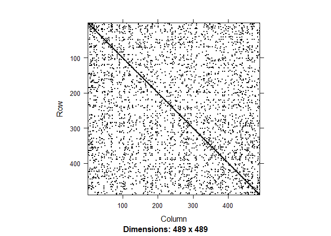
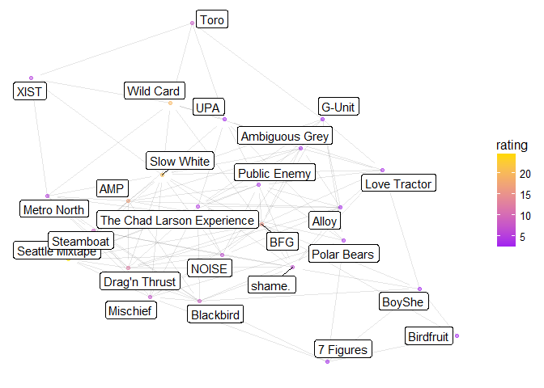

# Mixed Rankings
lubridate::now()  


```r
library(RSelenium)
rD <- rsDriver()
```

```
## checking Selenium Server versions:
```

```
## BEGIN: PREDOWNLOAD
```

```
## BEGIN: DOWNLOAD
```

```
## BEGIN: POSTDOWNLOAD
```

```
## checking chromedriver versions:
```

```
## BEGIN: PREDOWNLOAD
```

```
## BEGIN: DOWNLOAD
```

```
## BEGIN: POSTDOWNLOAD
```

```
## checking geckodriver versions:
```

```
## BEGIN: PREDOWNLOAD
```

```
## BEGIN: DOWNLOAD
```

```
## BEGIN: POSTDOWNLOAD
```

```
## checking phantomjs versions:
```

```
## BEGIN: PREDOWNLOAD
```

```
## BEGIN: DOWNLOAD
```

```
## BEGIN: POSTDOWNLOAD
```

```
## [1] "Connecting to remote server"
## $applicationCacheEnabled
## [1] FALSE
## 
## $rotatable
## [1] FALSE
## 
## $mobileEmulationEnabled
## [1] FALSE
## 
## $networkConnectionEnabled
## [1] FALSE
## 
## $chrome
## $chrome$chromedriverVersion
## [1] "2.32.498550 (9dec58e66c31bcc53a9ce3c7226f0c1c5810906a)"
## 
## $chrome$userDataDir
## [1] "C:\\Users\\mr437799\\AppData\\Local\\Temp\\scoped_dir8780_19294"
## 
## 
## $takesHeapSnapshot
## [1] TRUE
## 
## $pageLoadStrategy
## [1] "normal"
## 
## $databaseEnabled
## [1] FALSE
## 
## $handlesAlerts
## [1] TRUE
## 
## $hasTouchScreen
## [1] FALSE
## 
## $version
## [1] "60.0.3112.113"
## 
## $platform
## [1] "Windows NT"
## 
## $browserConnectionEnabled
## [1] FALSE
## 
## $nativeEvents
## [1] TRUE
## 
## $acceptSslCerts
## [1] TRUE
## 
## $locationContextEnabled
## [1] TRUE
## 
## $webStorageEnabled
## [1] TRUE
## 
## $browserName
## [1] "chrome"
## 
## $takesScreenshot
## [1] TRUE
## 
## $javascriptEnabled
## [1] TRUE
## 
## $cssSelectorsEnabled
## [1] TRUE
## 
## $setWindowRect
## [1] TRUE
## 
## $unexpectedAlertBehaviour
## [1] ""
## 
## $id
## [1] "8e98d0dbe47a56a2e1a123b11828f530"
```

```r
remDr <- rD[["client"]]
```

```r
library(tidyverse)
```

```
## Loading tidyverse: ggplot2
## Loading tidyverse: tibble
## Loading tidyverse: tidyr
## Loading tidyverse: readr
## Loading tidyverse: purrr
## Loading tidyverse: dplyr
```

```
## Conflicts with tidy packages ----------------------------------------------
```

```
## filter(): dplyr, stats
## lag():    dplyr, stats
```

```r
library(rvest)
```

```
## Loading required package: xml2
```

```
## 
## Attaching package: 'rvest'
```

```
## The following object is masked from 'package:purrr':
## 
##     pluck
```

```
## The following object is masked from 'package:readr':
## 
##     guess_encoding
```

```r
library(XML)
```

```
## 
## Attaching package: 'XML'
```

```
## The following object is masked from 'package:rvest':
## 
##     xml
```

```r
remDr$navigate("http://play.usaultimate.org/teams/events/rankings/")
# elem <- remDr$findElement(using = 'xpath', "//*/option[@value = 'Club']")
# elem$clickElement()

elem <- remDr$findElement(using = 'xpath', "//*/option[@value = '1']")
elem$clickElement()

elem <- remDr$findElement(using = 'id', "CT_Main_0_btnSubmit")
elem$clickElement()
```


```r
elem <- remDr$findElement(using="id", value="CT_Main_0_gvList")
data<-elem$getElementAttribute("outerHTML")[[1]]  %>% read_html() %>%
  html_table(fill=TRUE)


teams <- data[[1]][-(nrow(data[[1]])-1),-8:-9] %>% filter(!is.na(Losses))

teams$Links <- elem$getElementAttribute("outerHTML")[[1]] %>% htmlTreeParse(useInternalNodes=TRUE) %>% xpathApply("//a", xmlGetAttr, 'href') %>% unlist %>% .[1:nrow(teams)]

teams <- teams %>% filter( Wins !=0 | Losses !=0 )
```


```r
library(stringr)
num_pages <- data[[2]][2] %>% str_split(.," of ") %>% .[[1]] %>% .[2] %>% as.numeric()
for( n in 2:num_pages){
  
  
  if(n<10){
    link <- paste0("CT_Main_0$gvList$ctl23$ctl00$ctl0",n)
  } else{
    link <- paste0("CT_Main_0$gvList$ctl23$ctl00$ctl",n)
  }
  elem <- remDr$findElement(using="partial link text", value="Next ")
  elem$clickElement()

  elem <- remDr$findElement(using="id", value="CT_Main_0_gvList")
  data<-elem$getElementAttribute("outerHTML")[[1]]  %>% read_html() %>%
    html_table(fill=TRUE)

  new_teams <- data[[1]][-(nrow(data[[1]])-1),-8:-9] %>% filter(!is.na(Losses))

  new_teams$Links <- elem$getElementAttribute("outerHTML")[[1]] %>%
    htmlTreeParse(useInternalNodes=TRUE) %>% 
    xpathApply("//a", xmlGetAttr, 'href') %>% unlist %>% .[1:nrow(new_teams)]

  teams <- bind_rows(teams, new_teams)
  
}

rm(data)
rm(elem)
teams <- teams %>% filter( Wins !=0 | Losses !=0) %>% 
  filter( !grepl("[Tt]esting",Team)) %>% 
  filter(`Competition Level` != "College") %>%  arrange(Team) 

teams <- teams %>% mutate(Wins = 0, Losses = 0)
```

```r
# 
# remDr$navigate("http://play.usaultimate.org/teams/events/team_rankings/?RankSet=College-Women")
# 
# elem <- remDr$findElement(using="link text", value="View All")
# elem$clickElement()
# 
# elem <- remDr$findElement(using="id", value="CT_Main_0_gvList")
# data<-elem$getElementAttribute("outerHTML")[[1]]  %>% read_html() %>%
#   html_table(fill=TRUE)
# 
# teamsInfo <- data[[1]][-(nrow(data[[1]])-1),-11:-12] %>% filter(!is.na(Losses))
# 
# teamsInfo$Links <- elem$getElementAttribute("outerHTML")[[1]] %>% htmlTreeParse(useInternalNodes=TRUE) %>% xpathApply("//a", xmlGetAttr, 'href') %>% unlist %>% .[1:nrow(teamsInfo)]
# 
# teams <- left_join(teams,teamsInfo,by=c("Links", "Competition Level", "Gender Division")) %>% select(-Wins.y, -Losses.y, -Wins.x, -Losses.x) %>% rename(Team=Team.x, School=Team.y) %>% mutate(Rank=as.numeric(Rank), `Power Rating`=as.numeric(`Power Rating`))
# 
# teams <- teams %>% arrange(Team) %>% mutate(Wins=0, Losses=0)
# 
# rm(teamsInfo)
```


```r
scores <-data.frame(Team1=character(), Score1=numeric(), 
                    Team2=character(), Score2=numeric(), Date=character())

for( i in 1:length(teams$Team)){
  #Sys.sleep(runif(1))
  url <- paste0("http://play.usaultimate.org", teams$Links[i])
  remDr$navigate(url)
  #pull table of games
  elem <- remDr$findElement(using = "id", value="CT_Right_0_gvEventScheduleScores")
  data <- elem$getElementAttribute("outerHTML")[[1]] %>% 
    read_html() %>% html_table(fill=TRUE)
  data <- data[[1]]
  names(data) <- c("Date", "Scores", "Opponent")
  data <- filter(data, Date != Scores)
  data <- data %>% separate(Scores, c("For", "Against"))
  data <- data %>% filter(!is.na(Against) & !is.na(For)) %>% filter(Opponent != "N/A") %>%
    mutate(For=ifelse(For=="W", 1, 
                      ifelse(For=="F", -1, 
                             ifelse(For=="L",0,
                                    as.numeric(For)))),
           Against=ifelse(Against=="W", 1, 
                          ifelse(Against=="F", -1, 
                                 ifelse(Against=="L",0,
                                        as.numeric(Against))))
    )
  data$Links <- elem$getElementAttribute("outerHTML")[[1]] %>%
    htmlTreeParse(useInternalNodes=TRUE) %>% 
    xpathApply("//a", xmlGetAttr, 'href') %>% 
    unlist %>% grep("Eventteam",., value=TRUE) %>% .[1:length(data$Against)]
  
  for(j in 1:length(data$Links)){
    oppID = grep(data$Links[j], teams$Links, fixed=TRUE)
    if( length(oppID) >0){
      if( oppID > i){
        scores <- bind_rows(scores, 
                            tibble(Team1=teams$Team[i], 
                                   Score1=data$For[j], 
                                   Team2=teams$Team[oppID], 
                                   Score2=data$Against[j], 
                                   Date=data$Date[j])
        )
        if(!is.na(data$For[j]) && !is.na(data$Against[j])){
          if(data$For[j]>data$Against[j]){
            teams$Wins[i]=teams$Wins[i]+1;
            teams$Losses[oppID]=teams$Losses[oppID]+1;
          } else{
            teams$Losses[i]=teams$Losses[i]+1;
            teams$Wins[oppID]=teams$Wins[oppID]+1;
          }
        }
      }
    }
    #if opposing team is later in list (match on URL) add the game to the dataframe of games
    
    
  }
}
```

```
## Warning in bind_rows_(x, .id): binding factor and character vector,
## coercing into character vector
```

```
## Warning in bind_rows_(x, .id): binding character and factor vector,
## coercing into character vector
```

```
## Warning in bind_rows_(x, .id): binding factor and character vector,
## coercing into character vector
```

```
## Warning in bind_rows_(x, .id): binding character and factor vector,
## coercing into character vector
```

```
## Warning in bind_rows_(x, .id): binding factor and character vector,
## coercing into character vector
```

```
## Warning in bind_rows_(x, .id): binding character and factor vector,
## coercing into character vector
```

```
## Warning: Too few values at 1 locations: 15
```

```
## Warning in ifelse(For == "L", 0, as.numeric(For)): NAs introduced by
## coercion
```

```
## Warning in ifelse(Against == "L", 0, as.numeric(Against)): NAs introduced
## by coercion
```

```
## Warning: Too few values at 1 locations: 14
```

```
## Warning in ifelse(For == "L", 0, as.numeric(For)): NAs introduced by
## coercion
```

```
## Warning in ifelse(Against == "L", 0, as.numeric(Against)): NAs introduced
## by coercion
```

```
## Warning in ifelse(For == "L", 0, as.numeric(For)): NAs introduced by
## coercion
```

```
## Warning in ifelse(Against == "L", 0, as.numeric(Against)): NAs introduced
## by coercion
```

```
## Warning: Too few values at 1 locations: 5
```

```
## Warning in ifelse(For == "L", 0, as.numeric(For)): NAs introduced by
## coercion
```

```
## Warning in ifelse(Against == "L", 0, as.numeric(Against)): NAs introduced
## by coercion
```

```
## Warning: Too few values at 7 locations: 1, 2, 3, 4, 12, 13, 14
```

```
## Warning: Too few values at 6 locations: 31, 32, 33, 34, 35, 36
```

```
## Warning in ifelse(For == "L", 0, as.numeric(For)): NAs introduced by
## coercion
```

```
## Warning in ifelse(Against == "L", 0, as.numeric(Against)): NAs introduced
## by coercion
```

```
## Warning: Too few values at 1 locations: 16
```

```
## Warning: Too few values at 1 locations: 8
```

```
## Warning in ifelse(For == "L", 0, as.numeric(For)): NAs introduced by
## coercion
```

```
## Warning in ifelse(Against == "L", 0, as.numeric(Against)): NAs introduced
## by coercion
```

```
## Warning: Too few values at 26 locations: 1, 2, 3, 4, 5, 6, 7, 8, 9, 10, 11,
## 12, 13, 14, 15, 16, 17, 18, 19, 20, ...
```

```
## Warning: Too few values at 3 locations: 13, 14, 15
```

```
## Warning in ifelse(For == "L", 0, as.numeric(For)): NAs introduced by
## coercion
```

```
## Warning in ifelse(Against == "L", 0, as.numeric(Against)): NAs introduced
## by coercion
```

```
## Warning in ifelse(For == "L", 0, as.numeric(For)): NAs introduced by
## coercion
```

```
## Warning in ifelse(Against == "L", 0, as.numeric(Against)): NAs introduced
## by coercion
```

```
## Warning: Too few values at 1 locations: 6

## Warning: Too few values at 1 locations: 6
```

```
## Warning: Too few values at 1 locations: 25
```

```
## Warning: Too few values at 5 locations: 28, 29, 30, 31, 32
```

```
## Warning: Too few values at 1 locations: 22
```

```
## Warning in ifelse(For == "L", 0, as.numeric(For)): NAs introduced by
## coercion
```

```
## Warning in ifelse(Against == "L", 0, as.numeric(Against)): NAs introduced
## by coercion
```

```
## Warning: Too few values at 3 locations: 1, 2, 3
```

```
## Warning in ifelse(For == "L", 0, as.numeric(For)): NAs introduced by
## coercion
```

```
## Warning in ifelse(Against == "L", 0, as.numeric(Against)): NAs introduced
## by coercion
```

```
## Warning: Too few values at 1 locations: 15
```

```
## Warning in ifelse(For == "L", 0, as.numeric(For)): NAs introduced by
## coercion
```

```
## Warning in ifelse(Against == "L", 0, as.numeric(Against)): NAs introduced
## by coercion
```

```
## Warning: Too few values at 3 locations: 1, 2, 3
```

```
## Warning in ifelse(For == "L", 0, as.numeric(For)): NAs introduced by
## coercion
```

```
## Warning in ifelse(Against == "L", 0, as.numeric(Against)): NAs introduced
## by coercion
```

```
## Warning: Too few values at 3 locations: 1, 2, 3
```

```
## Warning in ifelse(For == "L", 0, as.numeric(For)): NAs introduced by
## coercion
```

```
## Warning in ifelse(Against == "L", 0, as.numeric(Against)): NAs introduced
## by coercion
```

```
## Warning: Too few values at 4 locations: 8, 15, 16, 17
```

```
## Warning in ifelse(For == "L", 0, as.numeric(For)): NAs introduced by
## coercion
```

```
## Warning in ifelse(Against == "L", 0, as.numeric(Against)): NAs introduced
## by coercion
```

```
## Warning: Too few values at 3 locations: 1, 2, 3
```

```
## Warning in ifelse(For == "L", 0, as.numeric(For)): NAs introduced by
## coercion
```

```
## Warning in ifelse(Against == "L", 0, as.numeric(Against)): NAs introduced
## by coercion
```

```
## Warning: Too few values at 5 locations: 29, 30, 31, 32, 33
```

```
## Warning: Too few values at 5 locations: 22, 23, 24, 25, 26
```

```
## Warning in ifelse(For == "L", 0, as.numeric(For)): NAs introduced by
## coercion
```

```
## Warning in ifelse(Against == "L", 0, as.numeric(Against)): NAs introduced
## by coercion
```

```
## Warning: Too few values at 1 locations: 18
```

```
## Warning: Too few values at 1 locations: 7
```

```
## Warning in ifelse(For == "L", 0, as.numeric(For)): NAs introduced by
## coercion
```

```
## Warning in ifelse(Against == "L", 0, as.numeric(Against)): NAs introduced
## by coercion
```

```
## Warning: Too few values at 1 locations: 20
```

```
## Warning in ifelse(For == "L", 0, as.numeric(For)): NAs introduced by
## coercion
```

```
## Warning in ifelse(Against == "L", 0, as.numeric(Against)): NAs introduced
## by coercion

## Warning in ifelse(Against == "L", 0, as.numeric(Against)): NAs introduced
## by coercion
```

```
## Warning: Too few values at 3 locations: 1, 2, 3
```

```
## Warning in ifelse(For == "L", 0, as.numeric(For)): NAs introduced by
## coercion
```

```
## Warning in ifelse(Against == "L", 0, as.numeric(Against)): NAs introduced
## by coercion
```

```
## Warning: Too few values at 26 locations: 8, 9, 10, 11, 12, 13, 14, 15, 16,
## 17, 18, 19, 20, 21, 22, 23, 24, 25, 26, 27, ...
```

```
## Warning in ifelse(For == "L", 0, as.numeric(For)): NAs introduced by
## coercion
```

```
## Warning in ifelse(Against == "L", 0, as.numeric(Against)): NAs introduced
## by coercion
```

```
## Warning in ifelse(For == "L", 0, as.numeric(For)): NAs introduced by
## coercion
```

```
## Warning in ifelse(Against == "L", 0, as.numeric(Against)): NAs introduced
## by coercion
```

```
## Warning: Too few values at 2 locations: 1, 4
```

```
## Warning: Too few values at 2 locations: 1, 2
```

```
## Warning in ifelse(For == "L", 0, as.numeric(For)): NAs introduced by
## coercion
```

```
## Warning in ifelse(Against == "L", 0, as.numeric(Against)): NAs introduced
## by coercion
```

```
## Warning in ifelse(For == "L", 0, as.numeric(For)): NAs introduced by
## coercion
```

```
## Warning in ifelse(Against == "L", 0, as.numeric(Against)): NAs introduced
## by coercion
```

```
## Warning: Too few values at 5 locations: 19, 20, 21, 22, 23
```

```
## Warning: Too few values at 2 locations: 1, 4
```

```
## Warning in ifelse(For == "L", 0, as.numeric(For)): NAs introduced by
## coercion
```

```
## Warning in ifelse(Against == "L", 0, as.numeric(Against)): NAs introduced
## by coercion
```

```
## Warning: Too few values at 1 locations: 6
```

```
## Warning in ifelse(For == "L", 0, as.numeric(For)): NAs introduced by
## coercion
```

```
## Warning in ifelse(Against == "L", 0, as.numeric(Against)): NAs introduced
## by coercion
```

```
## Warning: Too few values at 3 locations: 22, 23, 24
```

```
## Warning: Too few values at 6 locations: 19, 20, 21, 22, 23, 24
```

```
## Warning in ifelse(For == "L", 0, as.numeric(For)): NAs introduced by
## coercion
```

```
## Warning in ifelse(Against == "L", 0, as.numeric(Against)): NAs introduced
## by coercion
```

```
## Warning: Too few values at 3 locations: 13, 14, 15
```

```
## Warning: Too few values at 1 locations: 26
```

```
## Warning: Too few values at 2 locations: 6, 33
```

```
## Warning in ifelse(For == "L", 0, as.numeric(For)): NAs introduced by
## coercion
```

```
## Warning in ifelse(Against == "L", 0, as.numeric(Against)): NAs introduced
## by coercion
```

```
## Warning: Too few values at 1 locations: 6
```

```
## Warning in ifelse(For == "L", 0, as.numeric(For)): NAs introduced by
## coercion
```

```
## Warning in ifelse(Against == "L", 0, as.numeric(Against)): NAs introduced
## by coercion
```

```
## Warning: Too few values at 1 locations: 8
```

```
## Warning in ifelse(For == "L", 0, as.numeric(For)): NAs introduced by
## coercion
```

```
## Warning in ifelse(Against == "L", 0, as.numeric(Against)): NAs introduced
## by coercion
```

```
## Warning: Too few values at 4 locations: 4, 5, 6, 7
```

```
## Warning: Too few values at 1 locations: 23
```

```
## Warning in ifelse(For == "L", 0, as.numeric(For)): NAs introduced by
## coercion
```

```
## Warning in ifelse(Against == "L", 0, as.numeric(Against)): NAs introduced
## by coercion
```

```
## Warning in ifelse(For == "L", 0, as.numeric(For)): NAs introduced by
## coercion
```

```
## Warning in ifelse(Against == "L", 0, as.numeric(Against)): NAs introduced
## by coercion
```

```
## Warning: Too few values at 1 locations: 19
```

```
## Warning: Too few values at 5 locations: 20, 21, 22, 23, 24
```

```
## Warning in ifelse(For == "L", 0, as.numeric(For)): NAs introduced by
## coercion
```

```
## Warning in ifelse(Against == "L", 0, as.numeric(Against)): NAs introduced
## by coercion
```

```
## Warning in ifelse(For == "L", 0, as.numeric(For)): NAs introduced by
## coercion
```

```
## Warning in ifelse(Against == "L", 0, as.numeric(Against)): NAs introduced
## by coercion
```

```
## Warning: Too few values at 1 locations: 10
```

```
## Warning: Too few values at 1 locations: 19
```

```
## Warning: Too few values at 2 locations: 6, 7
```

```
## Warning: Too few values at 26 locations: 8, 9, 10, 11, 12, 13, 14, 15, 16,
## 17, 18, 19, 20, 21, 22, 23, 24, 25, 26, 27, ...
```

```
## Warning: Too few values at 1 locations: 7
```

```
## Warning in ifelse(For == "L", 0, as.numeric(For)): NAs introduced by
## coercion
```

```
## Warning in ifelse(Against == "L", 0, as.numeric(Against)): NAs introduced
## by coercion
```

```
## Warning: Too few values at 1 locations: 18
```

```
## Warning: Too few values at 1 locations: 14
```

```
## Warning: Too few values at 1 locations: 4
```

```
## Warning: Too few values at 1 locations: 13
```

```
## Warning: Too few values at 1 locations: 28
```

```
## Warning in ifelse(For == "L", 0, as.numeric(For)): NAs introduced by
## coercion
```

```
## Warning in ifelse(Against == "L", 0, as.numeric(Against)): NAs introduced
## by coercion
```

```
## Warning: Too few values at 1 locations: 13
```

```
## Warning: Too few values at 1 locations: 18
```

```
## Warning: Too few values at 1 locations: 20
```

```
## Warning in ifelse(For == "L", 0, as.numeric(For)): NAs introduced by
## coercion
```

```
## Warning in ifelse(Against == "L", 0, as.numeric(Against)): NAs introduced
## by coercion
```

```
## Warning: Too few values at 1 locations: 7
```

```
## Warning: Too few values at 6 locations: 24, 25, 26, 27, 28, 29
```

```
## Warning: Too many values at 1 locations: 15
```

```
## Warning in ifelse(For == "L", 0, as.numeric(For)): NAs introduced by
## coercion
```

```
## Warning in ifelse(Against == "L", 0, as.numeric(Against)): NAs introduced
## by coercion
```

```
## Warning: Too few values at 6 locations: 28, 29, 30, 31, 32, 33
```

```
## Warning: Too few values at 1 locations: 1
```

```
## Warning in ifelse(For == "L", 0, as.numeric(For)): NAs introduced by
## coercion
```

```
## Warning in ifelse(Against == "L", 0, as.numeric(Against)): NAs introduced
## by coercion
```

```
## Warning: Too few values at 2 locations: 5, 31
```

```
## Warning: Too few values at 1 locations: 14
```

```
## Warning: Too few values at 7 locations: 19, 20, 21, 22, 23, 24, 25
```

```
## Warning: Too few values at 6 locations: 27, 28, 29, 30, 31, 32
```

```
## Warning in ifelse(For == "L", 0, as.numeric(For)): NAs introduced by
## coercion
```

```
## Warning in ifelse(Against == "L", 0, as.numeric(Against)): NAs introduced
## by coercion
```

```
## Warning in ifelse(For == "L", 0, as.numeric(For)): NAs introduced by
## coercion
```

```
## Warning in ifelse(Against == "L", 0, as.numeric(Against)): NAs introduced
## by coercion
```

```
## Warning: Too few values at 1 locations: 4
```

```
## Warning in ifelse(For == "L", 0, as.numeric(For)): NAs introduced by
## coercion
```

```
## Warning in ifelse(Against == "L", 0, as.numeric(Against)): NAs introduced
## by coercion
```

```
## Warning: Too few values at 1 locations: 15
```

```
## Warning in ifelse(For == "L", 0, as.numeric(For)): NAs introduced by
## coercion
```

```
## Warning in ifelse(Against == "L", 0, as.numeric(Against)): NAs introduced
## by coercion
```

```
## Warning: Too few values at 1 locations: 4
```

```
## Warning in ifelse(For == "L", 0, as.numeric(For)): NAs introduced by
## coercion
```

```
## Warning in ifelse(Against == "L", 0, as.numeric(Against)): NAs introduced
## by coercion
```

```
## Warning in ifelse(For == "L", 0, as.numeric(For)): NAs introduced by
## coercion
```

```
## Warning in ifelse(Against == "L", 0, as.numeric(Against)): NAs introduced
## by coercion
```

```
## Warning in ifelse(For == "L", 0, as.numeric(For)): NAs introduced by
## coercion
```

```
## Warning in ifelse(Against == "L", 0, as.numeric(Against)): NAs introduced
## by coercion
```

```
## Warning: Too few values at 1 locations: 5
```

```
## Warning in ifelse(For == "L", 0, as.numeric(For)): NAs introduced by
## coercion
```

```
## Warning in ifelse(Against == "L", 0, as.numeric(Against)): NAs introduced
## by coercion
```

```
## Warning in ifelse(For == "L", 0, as.numeric(For)): NAs introduced by
## coercion
```

```
## Warning in ifelse(Against == "L", 0, as.numeric(Against)): NAs introduced
## by coercion
```

```
## Warning: Too few values at 1 locations: 7
```

```
## Warning: Too few values at 2 locations: 21, 22
```

```
## Warning: Too few values at 3 locations: 1, 2, 3
```

```
## Warning in ifelse(For == "L", 0, as.numeric(For)): NAs introduced by
## coercion
```

```
## Warning in ifelse(Against == "L", 0, as.numeric(Against)): NAs introduced
## by coercion
```

```
## Warning: Too few values at 7 locations: 31, 32, 33, 34, 35, 36, 37
```

```
## Warning in ifelse(For == "L", 0, as.numeric(For)): NAs introduced by
## coercion
```

```
## Warning in ifelse(Against == "L", 0, as.numeric(Against)): NAs introduced
## by coercion
```

```
## Warning: Too few values at 1 locations: 4
```

```
## Warning: Too few values at 3 locations: 18, 19, 20
```

```
## Warning in ifelse(For == "L", 0, as.numeric(For)): NAs introduced by
## coercion
```

```
## Warning in ifelse(Against == "L", 0, as.numeric(Against)): NAs introduced
## by coercion
```

```
## Warning: Too few values at 1 locations: 4
```

```
## Warning in ifelse(For == "L", 0, as.numeric(For)): NAs introduced by
## coercion
```

```
## Warning in ifelse(Against == "L", 0, as.numeric(Against)): NAs introduced
## by coercion
```

```
## Warning: Too few values at 3 locations: 19, 20, 21
```

```
## Warning: Too few values at 4 locations: 22, 27, 28, 29
```

```
## Warning: Too few values at 5 locations: 30, 31, 32, 33, 34
```

```
## Warning: Too few values at 1 locations: 8
```

```
## Warning in ifelse(For == "L", 0, as.numeric(For)): NAs introduced by
## coercion
```

```
## Warning in ifelse(Against == "L", 0, as.numeric(Against)): NAs introduced
## by coercion
```

```
## Warning: Too many values at 1 locations: 15
```

```
## Warning in ifelse(For == "L", 0, as.numeric(For)): NAs introduced by
## coercion
```

```
## Warning in ifelse(Against == "L", 0, as.numeric(Against)): NAs introduced
## by coercion
```

```
## Warning: Too few values at 1 locations: 11
```

```
## Warning in ifelse(For == "L", 0, as.numeric(For)): NAs introduced by
## coercion
```

```
## Warning in ifelse(Against == "L", 0, as.numeric(Against)): NAs introduced
## by coercion
```

```
## Warning: Too few values at 5 locations: 11, 12, 13, 14, 15
```

```
## Warning: Too few values at 3 locations: 21, 22, 23
```

```
## Warning in ifelse(For == "L", 0, as.numeric(For)): NAs introduced by
## coercion
```

```
## Warning in ifelse(Against == "L", 0, as.numeric(Against)): NAs introduced
## by coercion
```

```
## Warning: Too few values at 6 locations: 21, 22, 23, 24, 25, 26
```

```
## Warning: Too few values at 3 locations: 15, 16, 17
```

```
## Warning in ifelse(For == "L", 0, as.numeric(For)): NAs introduced by
## coercion
```

```
## Warning in ifelse(Against == "L", 0, as.numeric(Against)): NAs introduced
## by coercion
```

```
## Warning in ifelse(For == "L", 0, as.numeric(For)): NAs introduced by
## coercion
```

```
## Warning in ifelse(Against == "L", 0, as.numeric(Against)): NAs introduced
## by coercion
```

```
## Warning in ifelse(For == "L", 0, as.numeric(For)): NAs introduced by
## coercion
```

```
## Warning in ifelse(Against == "L", 0, as.numeric(Against)): NAs introduced
## by coercion
```

```
## Warning: Too few values at 5 locations: 27, 28, 29, 30, 31
```

```
## Warning: Too few values at 3 locations: 21, 22, 23
```

```
## Warning: Too few values at 1 locations: 7
```

```
## Warning in ifelse(For == "L", 0, as.numeric(For)): NAs introduced by
## coercion
```

```
## Warning in ifelse(Against == "L", 0, as.numeric(Against)): NAs introduced
## by coercion
```

```
## Warning: Too few values at 1 locations: 6
```

```
## Warning: Too few values at 1 locations: 8
```

```
## Warning: Too few values at 3 locations: 26, 27, 28
```

```
## Warning: Too few values at 5 locations: 31, 32, 33, 34, 35
```

```
## Warning in ifelse(For == "L", 0, as.numeric(For)): NAs introduced by
## coercion
```

```
## Warning in ifelse(Against == "L", 0, as.numeric(Against)): NAs introduced
## by coercion
```

```
## Warning in ifelse(For == "L", 0, as.numeric(For)): NAs introduced by
## coercion
```

```
## Warning in ifelse(Against == "L", 0, as.numeric(Against)): NAs introduced
## by coercion
```

```
## Warning: Too few values at 3 locations: 26, 27, 28
```

```
## Warning: Too few values at 3 locations: 1, 2, 3
```

```
## Warning in ifelse(For == "L", 0, as.numeric(For)): NAs introduced by
## coercion
```

```
## Warning in ifelse(Against == "L", 0, as.numeric(Against)): NAs introduced
## by coercion
```

```
## Warning in ifelse(For == "L", 0, as.numeric(For)): NAs introduced by
## coercion
```

```
## Warning in ifelse(Against == "L", 0, as.numeric(Against)): NAs introduced
## by coercion
```

```
## Warning in ifelse(For == "L", 0, as.numeric(For)): NAs introduced by
## coercion
```

```
## Warning in ifelse(Against == "L", 0, as.numeric(Against)): NAs introduced
## by coercion
```

```
## Warning: Too few values at 2 locations: 29, 30
```

```
## Warning in ifelse(For == "L", 0, as.numeric(For)): NAs introduced by
## coercion
```

```
## Warning in ifelse(Against == "L", 0, as.numeric(Against)): NAs introduced
## by coercion
```

```
## Warning: Too few values at 3 locations: 1, 2, 3
```

```
## Warning in ifelse(For == "L", 0, as.numeric(For)): NAs introduced by
## coercion
```

```
## Warning in ifelse(Against == "L", 0, as.numeric(Against)): NAs introduced
## by coercion
```

```
## Warning in ifelse(For == "L", 0, as.numeric(For)): NAs introduced by
## coercion
```

```
## Warning in ifelse(Against == "L", 0, as.numeric(Against)): NAs introduced
## by coercion
```

```
## Warning: Too few values at 5 locations: 13, 14, 15, 16, 17
```

```
## Warning: Too few values at 5 locations: 20, 21, 22, 23, 24
```

```
## Warning in ifelse(For == "L", 0, as.numeric(For)): NAs introduced by
## coercion
```

```
## Warning in ifelse(Against == "L", 0, as.numeric(Against)): NAs introduced
## by coercion
```

```
## Warning: Too few values at 5 locations: 31, 32, 33, 34, 35
```

```
## Warning: Too few values at 1 locations: 7
```

```
## Warning in ifelse(For == "L", 0, as.numeric(For)): NAs introduced by
## coercion
```

```
## Warning in ifelse(Against == "L", 0, as.numeric(Against)): NAs introduced
## by coercion
```

```
## Warning in ifelse(For == "L", 0, as.numeric(For)): NAs introduced by
## coercion
```

```
## Warning in ifelse(Against == "L", 0, as.numeric(Against)): NAs introduced
## by coercion
```

```
## Warning in ifelse(For == "L", 0, as.numeric(For)): NAs introduced by
## coercion
```

```
## Warning in ifelse(Against == "L", 0, as.numeric(Against)): NAs introduced
## by coercion
```

```
## Warning in ifelse(For == "L", 0, as.numeric(For)): NAs introduced by
## coercion
```

```
## Warning in ifelse(Against == "L", 0, as.numeric(Against)): NAs introduced
## by coercion
```

```
## Warning: Too few values at 3 locations: 19, 20, 21
```

```
## Warning in ifelse(For == "L", 0, as.numeric(For)): NAs introduced by
## coercion
```

```
## Warning in ifelse(Against == "L", 0, as.numeric(Against)): NAs introduced
## by coercion
```

```
## Warning: Too few values at 5 locations: 19, 20, 21, 22, 23
```

```
## Warning: Too few values at 1 locations: 20
```

```
## Warning in ifelse(For == "L", 0, as.numeric(For)): NAs introduced by
## coercion
```

```
## Warning in ifelse(Against == "L", 0, as.numeric(Against)): NAs introduced
## by coercion
```

```
## Warning: Too few values at 1 locations: 6
```

```
## Warning in ifelse(For == "L", 0, as.numeric(For)): NAs introduced by
## coercion
```

```
## Warning in ifelse(Against == "L", 0, as.numeric(Against)): NAs introduced
## by coercion
```

```
## Warning: Too few values at 4 locations: 25, 26, 27, 28
```

```
## Warning: Too few values at 3 locations: 21, 22, 23
```

```
## Warning: Too few values at 1 locations: 6
```

```
## Warning: Too few values at 1 locations: 5
```

```
## Warning: Too few values at 1 locations: 6
```

```
## Warning in ifelse(For == "L", 0, as.numeric(For)): NAs introduced by
## coercion
```

```
## Warning in ifelse(Against == "L", 0, as.numeric(Against)): NAs introduced
## by coercion
```

```
## Warning: Too few values at 3 locations: 16, 17, 18
```

```
## Warning in ifelse(For == "L", 0, as.numeric(For)): NAs introduced by
## coercion
```

```
## Warning in ifelse(Against == "L", 0, as.numeric(Against)): NAs introduced
## by coercion
```

```
## Warning: Too few values at 1 locations: 6
```

```
## Warning: Too few values at 4 locations: 8, 33, 36, 37
```

```
## Warning in ifelse(For == "L", 0, as.numeric(For)): NAs introduced by
## coercion
```

```
## Warning in ifelse(Against == "L", 0, as.numeric(Against)): NAs introduced
## by coercion
```

```
## Warning in ifelse(For == "L", 0, as.numeric(For)): NAs introduced by
## coercion
```

```
## Warning in ifelse(Against == "L", 0, as.numeric(Against)): NAs introduced
## by coercion
```

```
## Warning: Too few values at 1 locations: 2
```

```
## Warning: Too few values at 1 locations: 6

## Warning: Too few values at 1 locations: 6
```

```
## Warning in ifelse(For == "L", 0, as.numeric(For)): NAs introduced by
## coercion
```

```
## Warning in ifelse(Against == "L", 0, as.numeric(Against)): NAs introduced
## by coercion
```

```
## Warning: Too few values at 3 locations: 26, 27, 28
```

```
## Warning in ifelse(For == "L", 0, as.numeric(For)): NAs introduced by
## coercion
```

```
## Warning in ifelse(Against == "L", 0, as.numeric(Against)): NAs introduced
## by coercion
```

```
## Warning: Too few values at 2 locations: 1, 2
```

```
## Warning in ifelse(For == "L", 0, as.numeric(For)): NAs introduced by
## coercion
```

```
## Warning in ifelse(Against == "L", 0, as.numeric(Against)): NAs introduced
## by coercion
```

```
## Warning: Too few values at 3 locations: 1, 2, 3

## Warning: Too few values at 3 locations: 1, 2, 3
```

```
## Warning in ifelse(For == "L", 0, as.numeric(For)): NAs introduced by
## coercion
```

```
## Warning in ifelse(Against == "L", 0, as.numeric(Against)): NAs introduced
## by coercion
```

```
## Warning: Too few values at 4 locations: 15, 18, 19, 20
```

```
## Warning: Too few values at 1 locations: 8
```

```
## Warning: Too few values at 3 locations: 1, 2, 3
```

```
## Warning in ifelse(For == "L", 0, as.numeric(For)): NAs introduced by
## coercion
```

```
## Warning in ifelse(Against == "L", 0, as.numeric(Against)): NAs introduced
## by coercion
```

```
## Warning: Too few values at 1 locations: 6
```

```
## Warning in ifelse(For == "L", 0, as.numeric(For)): NAs introduced by
## coercion
```

```
## Warning in ifelse(Against == "L", 0, as.numeric(Against)): NAs introduced
## by coercion
```

```
## Warning: Too few values at 1 locations: 20
```

```
## Warning: Too few values at 3 locations: 17, 18, 19
```

```
## Warning in ifelse(For == "L", 0, as.numeric(For)): NAs introduced by
## coercion
```

```
## Warning in ifelse(Against == "L", 0, as.numeric(Against)): NAs introduced
## by coercion
```

```
## Warning in ifelse(For == "L", 0, as.numeric(For)): NAs introduced by
## coercion
```

```
## Warning in ifelse(Against == "L", 0, as.numeric(Against)): NAs introduced
## by coercion
```

```
## Warning: Too few values at 3 locations: 21, 22, 23
```

```
## Warning in ifelse(For == "L", 0, as.numeric(For)): NAs introduced by
## coercion
```

```
## Warning in ifelse(Against == "L", 0, as.numeric(Against)): NAs introduced
## by coercion
```

```
## Warning: Too few values at 3 locations: 28, 29, 30
```

```
## Warning: Too few values at 1 locations: 7
```

```
## Warning in ifelse(For == "L", 0, as.numeric(For)): NAs introduced by
## coercion
```

```
## Warning in ifelse(Against == "L", 0, as.numeric(Against)): NAs introduced
## by coercion
```

```
## Warning in ifelse(For == "L", 0, as.numeric(For)): NAs introduced by
## coercion
```

```
## Warning in ifelse(Against == "L", 0, as.numeric(Against)): NAs introduced
## by coercion
```

```
## Warning: Too few values at 1 locations: 5
```

```
## Warning: Too few values at 3 locations: 1, 2, 3
```

```
## Warning: Too few values at 1 locations: 6
```

```
## Warning in ifelse(For == "L", 0, as.numeric(For)): NAs introduced by
## coercion
```

```
## Warning in ifelse(Against == "L", 0, as.numeric(Against)): NAs introduced
## by coercion
```

```
## Warning: Too few values at 4 locations: 1, 2, 3, 4
```

```
## Warning in ifelse(For == "L", 0, as.numeric(For)): NAs introduced by
## coercion
```

```
## Warning in ifelse(Against == "L", 0, as.numeric(Against)): NAs introduced
## by coercion
```

```
## Warning: Too few values at 1 locations: 1
```

```
## Warning in ifelse(For == "L", 0, as.numeric(For)): NAs introduced by
## coercion
```

```
## Warning in ifelse(Against == "L", 0, as.numeric(Against)): NAs introduced
## by coercion
```

```
## Warning: Too few values at 2 locations: 6, 33
```

```
## Warning: Too few values at 3 locations: 24, 25, 26
```

```
## Warning: Too few values at 3 locations: 28, 29, 30
```

```
## Warning in ifelse(For == "L", 0, as.numeric(For)): NAs introduced by
## coercion
```

```
## Warning in ifelse(Against == "L", 0, as.numeric(Against)): NAs introduced
## by coercion
```

```
## Warning: Too few values at 1 locations: 5
```

```
## Warning in ifelse(For == "L", 0, as.numeric(For)): NAs introduced by
## coercion
```

```
## Warning in ifelse(Against == "L", 0, as.numeric(Against)): NAs introduced
## by coercion
```

```
## Warning: Too few values at 1 locations: 7
```

```
## Warning: Too few values at 4 locations: 15, 24, 25, 26
```

```
## Warning: Too few values at 1 locations: 18
```

```
## Warning: Too few values at 5 locations: 24, 25, 26, 27, 28
```

```
## Warning in ifelse(For == "L", 0, as.numeric(For)): NAs introduced by
## coercion
```

```
## Warning in ifelse(Against == "L", 0, as.numeric(Against)): NAs introduced
## by coercion
```

```
## Warning: Too few values at 3 locations: 30, 31, 32
```

```
## Warning: Too few values at 26 locations: 1, 2, 3, 4, 5, 6, 7, 8, 9, 10, 11,
## 12, 13, 14, 15, 16, 17, 18, 19, 20, ...
```

```
## Warning in ifelse(For == "L", 0, as.numeric(For)): NAs introduced by
## coercion
```

```
## Warning in ifelse(Against == "L", 0, as.numeric(Against)): NAs introduced
## by coercion
```

```
## Warning: Too few values at 3 locations: 19, 20, 21
```

```
## Warning in ifelse(For == "L", 0, as.numeric(For)): NAs introduced by
## coercion
```

```
## Warning in ifelse(Against == "L", 0, as.numeric(Against)): NAs introduced
## by coercion
```

```
## Warning in ifelse(For == "L", 0, as.numeric(For)): NAs introduced by
## coercion
```

```
## Warning in ifelse(Against == "L", 0, as.numeric(Against)): NAs introduced
## by coercion
```

```
## Warning: Too few values at 5 locations: 20, 21, 22, 23, 24
```

```
## Warning: Too few values at 3 locations: 25, 26, 27
```

```
## Warning: Too few values at 2 locations: 1, 2
```

```
## Warning in ifelse(For == "L", 0, as.numeric(For)): NAs introduced by
## coercion
```

```
## Warning in ifelse(Against == "L", 0, as.numeric(Against)): NAs introduced
## by coercion
```

```
## Warning: Too few values at 4 locations: 28, 29, 30, 31
```

```
## Warning in ifelse(For == "L", 0, as.numeric(For)): NAs introduced by
## coercion
```

```
## Warning in ifelse(Against == "L", 0, as.numeric(Against)): NAs introduced
## by coercion
```

```
## Warning in ifelse(For == "L", 0, as.numeric(For)): NAs introduced by
## coercion
```

```
## Warning in ifelse(Against == "L", 0, as.numeric(Against)): NAs introduced
## by coercion
```

```
## Warning: Too few values at 3 locations: 24, 25, 26
```

```
## Warning: Too few values at 3 locations: 1, 2, 3
```

```
## Warning in ifelse(For == "L", 0, as.numeric(For)): NAs introduced by
## coercion
```

```
## Warning in ifelse(Against == "L", 0, as.numeric(Against)): NAs introduced
## by coercion
```

```
## Warning in ifelse(For == "L", 0, as.numeric(For)): NAs introduced by
## coercion
```

```
## Warning in ifelse(Against == "L", 0, as.numeric(Against)): NAs introduced
## by coercion
```

```
## Warning in ifelse(For == "L", 0, as.numeric(For)): NAs introduced by
## coercion
```

```
## Warning in ifelse(Against == "L", 0, as.numeric(Against)): NAs introduced
## by coercion
```

```
## Warning in ifelse(For == "L", 0, as.numeric(For)): NAs introduced by
## coercion
```

```
## Warning in ifelse(Against == "L", 0, as.numeric(Against)): NAs introduced
## by coercion
```

```
## Warning: Too few values at 3 locations: 18, 19, 20
```

```
## Warning: Too few values at 1 locations: 7
```

```
## Warning in ifelse(For == "L", 0, as.numeric(For)): NAs introduced by
## coercion
```

```
## Warning in ifelse(Against == "L", 0, as.numeric(Against)): NAs introduced
## by coercion
```

```
## Warning: Too few values at 1 locations: 3
```

```
## Warning: Too few values at 1 locations: 5
```

```
## Warning: Too few values at 1 locations: 7

## Warning: Too few values at 1 locations: 7
```

```
## Warning: Too few values at 1 locations: 8
```

```
## Warning in ifelse(For == "L", 0, as.numeric(For)): NAs introduced by
## coercion
```

```
## Warning in ifelse(Against == "L", 0, as.numeric(Against)): NAs introduced
## by coercion
```

```
## Warning: Too few values at 3 locations: 32, 33, 34
```

```
## Warning in ifelse(For == "L", 0, as.numeric(For)): NAs introduced by
## coercion
```

```
## Warning in ifelse(Against == "L", 0, as.numeric(Against)): NAs introduced
## by coercion
```

```
## Warning in ifelse(For == "L", 0, as.numeric(For)): NAs introduced by
## coercion
```

```
## Warning in ifelse(Against == "L", 0, as.numeric(Against)): NAs introduced
## by coercion
```

```
## Warning in ifelse(For == "L", 0, as.numeric(For)): NAs introduced by
## coercion
```

```
## Warning in ifelse(Against == "L", 0, as.numeric(Against)): NAs introduced
## by coercion
```

```
## Warning: Too few values at 4 locations: 7, 27, 28, 29
```

```r
scores <- scores %>% filter(!is.na(Score1) & !is.na(Score2))
```

Add a new chunk by clicking the *Insert Chunk* button on the toolbar or by pressing *Ctrl+Alt+I*.

When you save the notebook, an HTML file containing the code and output will be saved alongside it (click the *Preview* button or press *Ctrl+Shift+K* to preview the HTML file).


```r
remDr$close()
rD[["server"]]$stop()
```

```
## [1] TRUE
```

```r
gc(rD)
```

```
##           used (Mb) gc trigger (Mb) max used (Mb)
## Ncells  921606 49.3    1442291 77.1  1442291 77.1
## Vcells 1316749 10.1    2552219 19.5  2193305 16.8
```

```r
save(scores, teams, file=paste0("AllMixedScores",format(Sys.time(),"%Y %m %d"),".Rdata"))
```


```r
#MOV of 6 is insurmountable
P=matrix(c(1   ,-1/2,0   ,0,0,0,0,0,0,0,0,
           -1/2,1   ,-1/2,0   ,0,0,0,0,0,0,0,
           0   ,-1/2,1   ,-1/2,0   ,0,0,0,0,0,0,
           0   ,0   ,-1/2,1   ,-1/2,0,0,0,0,0,0,
           0,0   ,0   ,-1/2,1   ,-1/2,0,0,0,0,0,
           0,0,0   ,0   ,-1/2,1   ,-1/2,0,0,0,0,
           0,0,0,0   ,0   ,-1/2,1   ,-1/2,0,0,0,
           0,0,0,0,0   ,0   ,-1/2,1   ,-1/2,0,0,
           0,0,0,0,0,0   ,0   ,-1/2,1   ,-1/2,0,
           0,0,0,0,0,0,0   ,0   ,-1/2,1   ,-1/2,
           0,0,0,0,0,0,0,0   ,0   ,-1/2,1   )
         ,nrow=11)
v=c(0,0,0,0,0,0,0,0,0,0,1/2)
shares<-solve(P,v)
```

```r
library(Matrix)
```

```
## 
## Attaching package: 'Matrix'
```

```
## The following object is masked from 'package:tidyr':
## 
##     expand
```

```r
A=sparseMatrix(seq(1,length(teams$Team)),seq(1,length(teams$Team)),x=0)
b=rep(1,length(teams$Team))

for(i in 1:length(scores$Team1)){
  if(abs(scores[i,]$Score1-scores[i,]$Score2)>=6){
    if(scores[i,]$Score1>scores[i,]$Score2){
      Share1<-1
      Share2<-0
    } else{
      Share2<-1
      Share1<-0
    }
  } else{
    Share1<-shares[scores[i,]$Score1-scores[i,]$Score2+6]
    Share2<-1-Share1
  }
  team1=match(scores[i,]$Team1,teams$Team)
  team2=match(scores[i,]$Team2,teams$Team)
  if( is.na(team1) | is.na(team2)){ next }
  A[team1,team2]=
    A[team1,team2]+Share2
  A[team2,team1]=
    A[team2,team1]+Share1
  A[team1,team1]=
    A[team1,team1]+Share1
  A[team2,team2]=
    A[team2,team2]+Share2
}
image(A)
```

<!-- -->

```r
which(rowSums(A)==0)
```

```
##  [1]  27  30  76  93 120 124 133 142 191 203 206 211 215 226 245 272 304
## [18] 350 351 359 397 398 403 412
```


```r
A_unnormed <- A
for(i in 1:length(teams$Team)){
  if(sum(A[i,])!=0){ 
    A[i,]=A[i,]/sum(A[i,])
  }
}
```

```r
b=t(rep(1,length(teams$Team)))
for( i in 1:10000){
  b<-b%*%A
}
```


```r
library(tidyverse)
teams$Index = 1:length(teams$Team)
rankedteams<-bind_cols(teams, tibble(Rating=as.numeric(b)))
rankedteams <-arrange(rankedteams, desc(Rating))
```


```r
write.csv(rankedteams, paste("USAU All Mixed RW", format(Sys.time(),"%Y %m %d"),".csv",sep=""), row.names = TRUE)

rankedteams %>% filter(`Competition Level`== "Club") %>% mutate(Rank=dense_rank(desc(Rating))) %>% select(Rank, Team, Wins, Losses, Rating, City, State) %>% write.csv( paste("USAU Club Mixed RW", format(Sys.time(),"%Y %m %d"),".csv",sep=""), row.names = FALSE)

rankedteams %>% filter(`Competition Level`== "Masters") %>% mutate(Rank=dense_rank(desc(Rating))) %>% select(Rank, Team, Wins, Losses, Rating, City, State) %>% write.csv( paste("USAU Masters Mixed RW", format(Sys.time(),"%Y %m %d"),".csv",sep=""), row.names = FALSE)
```


```r
rankedteams %>% filter(`Competition Level`== "Club") %>% mutate(Rank=dense_rank(desc(Rating))) %>% select(Rank, Team, Wins, Losses, Rating, City, State) %>% knitr::kable()
```


 Rank  Team                                                     Wins   Losses       Rating  City                        State        
-----  ------------------------------------------------------  -----  -------  -----------  --------------------------  -------------
    1  Seattle Mixtape                                            16        3   25.0864196  Seattle                     WA           
    2  Wild Card                                                  29        2   23.4299006  Boston                      MA           
    3  Slow White                                                 21        6   21.0193058  Boston                      MA           
    4  BFG                                                        18        6   16.4010706  Seattle                     WA           
    5  AMP                                                        11        3   15.9071431  Philadelphia                PA           
    6  Drag'n Thrust                                              12        7   11.0043612  Minneapolis                 MN           
    7  Blackbird                                                  17        8    9.6350725  San Francisco               CA           
    8  Steamboat                                                  15       10    8.9107628  Cincinnati                  OH           
    9  Mischief                                                   12        8    7.0484290  San Francisco Bay Area      CA           
   10  shame.                                                     15        5    6.8092900  Fort Collins                CO           
   11  Toro                                                       23        3    6.7840792  Durham                      NC           
   12  NOISE                                                      11        8    6.5241054  Madison                     WI           
   13  Metro North                                                13        7    5.3540113  Mianus                      CT           
   14  The Chad Larson Experience                                 12       11    4.6862781  Ames                        IA           
   15  Love Tractor                                               12        6    4.4535508  Denver                      CO           
   16  7 Figures                                                  18        3    3.9142452  Los Angeles                 CA           
   17  Ambiguous Grey                                             11        7    3.6462993  Washington                  DC           
   18  BoyShe                                                     19        9    3.5895521  Boise                       ID           
   19  Polar Bears                                                14        6    3.3959336  Berkeley                    CA           
   20  Birdfruit                                                  17        4    3.2396199  Seattle                     WA           
   21  XIST                                                       21        4    3.0212807  New York                    NY           
   22  Public Enemy                                                7        8    2.8770811  Dallas/Fort Worth           TX           
   23  UPA                                                        13        6    2.5954367  Chicago                     IL           
   24  Alloy                                                       6        7    2.5726464  Pittsburgh                  PA           
   25  G-Unit                                                     10        9    2.4173390  Gainesville                 FL           
   26  Bozos                                                      13        8    2.3949610  Bozeman                     MT           
   27  Snake Country Bromance                                      5        1    2.1177738  SOMERVILLE                  MA           
   28  BW Ultimate                                                17       12    2.0775331  Sunnyvale                   CA           
   29  Distelfink                                                 18        4    1.9756332  Lancaster                   PA           
   30  Columbus Cocktails                                         24        4    1.9230088  Columbus                    OH           
   31  Bucket                                                     15        2    1.7759263  Atlanta                     GA           
   32  Charlotte Storm                                            18        6    1.7710543  Charlotte                   NC           
   33  Minnesota Star Power                                       22        4    1.6912469  Minneapolis/ St. Paul       MN           
   34  Bang!                                                      13        8    1.5610559  West Chester                PA           
   35  Battleship                                                 13        8    1.5394029  St-Jean-sur-Richelieu       Quebec       
   36  Cosa Nostra                                                12        9    1.5155750  Austin                      TX           
   37  No Touching!                                                4        8    1.5148415  Twin Cities                 MN           
   38  Classy                                                     15        7    1.5026054  San Francisco               CA           
   39  Swing State                                                21       11    1.4633524  Orlando                     FL           
   40  SHINSHU LOOSE-Upper                                         2        5    1.4181527  Matsumoto                   Nagano       
   41  UNION                                                       9        8    1.3673606  Toronto                     Ontario      
   42  Pegasus                                                    10        9    1.2695488  Seattle                     WA           
   43  Happy Hour                                                 11        2    1.1889158  McMinnville                 OR           
   44  Dub Club                                                   15        8    1.1703304  West Chester                PA           
   45  Freakshow                                                   2        0    1.1666667  Newark                      DE           
   46  Bird                                                       17       10    1.0756150  Minneapolis                 MN           
   47  Donuts                                                     15        7    1.0352174  Bay Area                    CA           
   48  The Administrators                                         14        3    1.0186160  Willamette Valley           OR           
   49  Jughandle                                                  15        7    0.9866577  Princeton                   NJ           
   50  Sparkle Ponies                                             13        7    0.9845092  Rockville                   MD           
   51  Heartless                                                  20        6    0.9539364  Burlington                  VT           
   52  Tequila Mockingbird                                        20        9    0.9405530  Chicago-apolis              IN           
   53  Garbage Plates                                             17        6    0.8860266  Rochester                   NY           
   54  The Feminists                                              16       12    0.8434199  New York                    NY           
   55  Alchemy                                                    19        8    0.8410531  San Francisco               CA           
   56  Geekshow                                                    0        2    0.8333333  Newark                      DE           
   57  JLP                                                        16        5    0.8314226  Atlanta                     GA           
   58  Titan NE                                                   15       10    0.7502601  Bar Harbor                  ME           
   59  Cahoots                                                    21        6    0.7425855  Asheville                   NC           
   60  Team Mexico                                                 1        6    0.7413953  Ciudad de Mexico            Mex          
   61  Grand Army                                                 14       13    0.6537715  Brooklyn                    NY           
   62  Long Beach Legacy                                          12        5    0.6363915  Long Beach                  CA           
   63  Sellout                                                    14        2    0.6321261  Austin/Houston/Dallas       TX           
   64  Anchor                                                      6        2    0.6272638  Halifax                     Nova Scotia  
   65  Darkwing                                                   18       13    0.6237246  Mansfield                   MA           
   66  Platypi                                                    11       10    0.5968891  Chico                       CA           
   67  HAOS                                                       18       12    0.5424419  Watertown                   MA           
   68  Murmur                                                     21        8    0.5255943  Athens                      GA           
   69  Chalice                                                     9        9    0.5235591  St. Louis                   MO           
   70  Powermove                                                  13       13    0.5179640  New York                    NY           
   71  Family Style                                               11        7    0.5169922  Los Angeles                 CA           
   72  Alternative Stacks                                         19       11    0.5149264  Fairfield                   CT           
   73  Mojo Jojo                                                  23        7    0.5028157  Minneapolis                 MN           
   74  Happy Valley                                               11        7    0.4969251  Amherst                     MA           
   75  tHUMP                                                      18        6    0.4911453  Houston                     TX           
   76  Rubix                                                      12        8    0.4841961  Phoenix                     AZ           
   77  Method                                                     21        5    0.4814275  Huntsville                  AL           
   78  Malice in Wonderland                                       15        6    0.4642461  Raleigh                     NC           
   79  Clue                                                       12        9    0.4570091  Philadelphia                PA           
   80  American Barbecue                                          10        5    0.4539469  San Francisco               CA           
   81  PleasureTown                                               10       14    0.4495935  Boston                      MA           
   82  Mixed Nuts                                                 11       20    0.4428130  Boston                      MA           
   83  Mesteño                                                    10        9    0.4419941  Denver                      CO           
   84  Risky Business                                             18        7    0.4415851  Dallas                      TX           
   85  Argo                                                        9       13    0.4379816  San Francisco               CA           
   86  Rainbow                                                    20       13    0.4226337  Somerville                  MA           
   87  Cutthroat                                                  15       10    0.4145413  Reno                        NV           
   88  Sunken Circus                                              17       14    0.4077361  Portland                    ME           
   89  Buffalo Lake Effect                                        19       10    0.3995663  Buffalo                     NY           
   90  Firefly                                                    14       13    0.3976577  San Francisco               CA           
   91  Hybrid                                                     19        5    0.3895233  Ann Arbor                   MI           
   92  Ant Madness                                                19       11    0.3738609  Arlington                   VA           
   93  Northern Comfort                                           20       10    0.3736057  Milwaukee                   WI           
   94  Townies                                                    14        9    0.3681765  Ithaca                      NY           
   95  League of Shadows                                          16       14    0.3463445  Boston                      MA           
   96  8 Bit Heroes                                               18       10    0.3340706  Frederick                   MD           
   97  Crucible                                                   17        6    0.3145734  Pittsburgh                  PA           
   98  Providence Mob                                             13       17    0.3116264  Providence                  RI           
   99  Prion                                                      14        8    0.3068591  Champaign-Urbana            IL           
  100  Fireball                                                    6        1    0.2899348  Rockville                   MD           
  101  Albany Airbenders                                          11       19    0.2889050  Albany                      NY           
  102  Goose Lee                                                  15        6    0.2738611  Cincinnati                  OH           
  103  American Hyperbole                                         14       13    0.2733459  Baltimore                   MD           
  104  RUT                                                        12       13    0.2724054  Burlington                  VT           
  105  Buckwild                                                    5        9    0.2652691  Sacramento                  CA           
  106  Shakedown                                                  14        9    0.2648426  Chicago                     IL           
  107  Thoroughbred                                               11        8    0.2552063  Saint Louis                 MO           
  108  #Birdz                                                     13        8    0.2531749  Long Island                 NY           
  109  AC Bandits                                                 17        9    0.2470228  Oakland                     CA           
  110  Fear and Loathing                                           9        9    0.2390922  Las Vegas                   NV           
  111  Toast                                                      14        8    0.2347958  Grand Rapids                MI           
  112  Unlimited Swipes                                           13       15    0.2200673  New York                    NY           
  113  Crash                                                       3       14    0.2187753  Kitchener-Waterloo-Guelph   Ontario      
  114  Sir Walter Rowdy                                           13        7    0.2069210  Raleigh                     NC           
  115  Enough Monkeys                                              7       10    0.1976488  Hartford                    VT           
  116  Blitzkrieg                                                  8       14    0.1972116  Kansas City                 MO           
  117  VIP Club                                                    6        7    0.1968276  Quebec                      QC           
  118  TAU                                                        10        4    0.1950227  Winston Salem               NC           
  119  Fable                                                       5        8    0.1934498  Vancouver                   BC           
  120  Instant Karma                                              11        9    0.1880017  Tucson                      AZ           
  121  Moontower                                                  11       13    0.1864835  Austin                      TX           
  122  Makeshift Returns                                           5        1    0.1775622  Portland                    OR           
  123  Lovebomb                                                    4        4    0.1763677  Ben Avon                    PA           
  124  Lawn Patrol                                                 6       10    0.1742901  San Jose                    CA           
  125  Sweet Action                                                8       16    0.1731971  Denver                      CO           
  126  Asylum                                                     11       11    0.1670211  Athens                      OH           
  127  Friday Night Couch                                         11        8    0.1592215  Seattle                     WA           
  128  Scarecrow                                                  12       21    0.1562922  Manchester                  NH           
  129  Freetail                                                   12       12    0.1538549  San Antonio                 TX           
  130  Mutiny                                                     17        8    0.1521662  St. Petersburg              FL           
  131  Sabotage                                                    9       12    0.1479566  Philadelphia                PA           
  132  The Bandits                                                11       10    0.1473098  Montclair                   NJ           
  133  Legion                                                     14       13    0.1453527  Lynchburg                   VA           
  134  panIC                                                       9        8    0.1439749  Iowa City                   IA           
  135  LoveShack                                                  15       11    0.1388453  Atlanta                     GA           
  136  Tex Mix                                                    11       12    0.1383856  Dallas                      TX           
  137  Trash Pandas                                               11       11    0.1286854  Nashville                   TN           
  138  LORD                                                       14       13    0.1280994  Fairfax                     VA           
  139  Tyrannis                                                   11       12    0.1263108  Charlottesville             VA           
  140  DTH                                                         9        9    0.1226406  Cambridge                   MA           
  141  Boomtown                                                    9        4    0.1205686  Tulsa                       OK           
  142  Mad Udderburn                                              17       12    0.1191972  Madison                     WI           
  143  Dead Reckoning                                              7       10    0.1156743  Portland                    ME           
  144  Crush                                                       7        5    0.1148169  Knoxville                   TN           
  145  Coalition Ultimate                                         12       10    0.1136678  Minneapolis                 MN           
  146  The Hucking Dead                                           14       15    0.1122266  Jacksonville                FL           
  147  Superstition                                               10       13    0.1114608  Phoenix                     AZ           
  148  Impact                                                     11        9    0.1100832  Wichita                     KS           
  149  rubber duck ultimate.                                      10        6    0.1083461  Fayetteville                AR           
  150  Mimosas                                                     7       17    0.1058822  Berkeley                    CA           
  151  Free Ride                                                  10       12    0.1029682  Columbia                    MO           
  152  Blowing Heat 2.0                                            5        3    0.1019305  New Castle                  DE           
  153  Chef Curry with the Pot                                     5        3    0.1001696  Arlington                   VA           
  154  Memphis Hustle & Flow                                       9        7    0.0952185  Memphis                     TN           
  155  Possum                                                      9        6    0.0947306  Greenville                  SC           
  156  ¡Fiesta!                                                    6        6    0.0915103  San Diego                   CA           
  157  Misfits                                                     4        2    0.0888808  Spokane                     WA           
  158  Moonshine                                                   9       14    0.0870136  Lexington                   KY           
  159  Los  Heros                                                 14       16    0.0867408  Bloomington                 IN           
  160  North Coast Disc Co.                                       13       16    0.0848609  Cleveland                   OH           
  161  Garbage                                                     2        4    0.0835411  Seattle                     WA           
  162  Robot                                                       6        6    0.0823164  Santa Barbara               CA           
  163  Petey's Pirates                                            15       10    0.0820136  Columbus                    OH           
  164  Varsity                                                     7       10    0.0721305  New York                    NY           
  165  Rat City                                                    5       16    0.0716365  Baltimore                   MD           
  166  Nautilus                                                    6        7    0.0710477  Farmington                  CT           
  167  ELevate                                                    13       15    0.0682923  Chicago                     IL           
  168  Wingdings                                                   7       11    0.0655585  Des Moines                  IA           
  169  Animals                                                     2        5    0.0652865  Sherbrooke                  Québec       
  170  Mental Toss Flycoons                                        5        5    0.0644577  Missoula                    MT           
  171  Mixed Results                                               9       16    0.0619301  Knoxville                   TN           
  172  Liquid Hustle                                              10       20    0.0610786  Indianapolis                IN           
  173  Raft Ultimate                                               2        4    0.0594973  Ottawa                      Ontario      
  174  Snail                                                       2        2    0.0551126  Geneseo                     NY           
  175  Rocket LawnChair                                           10        8    0.0537435  Ann Arbor                   MI           
  176  Jabba                                                      14       14    0.0527616  Chicago                     IL           
  177  Drunk in Space                                              2        9    0.0508692  Boston                      MA           
  178  Mississippi Blues                                           7        5    0.0498395  Jackson                     MS           
  179  NEKUD                                                       4        7    0.0490783  Burke                       VT           
  180  Absolute Zero                                               8       12    0.0489975  Santa Clara                 CA           
  181  MxD                                                         9       13    0.0483305  College Park                MD           
  182  OMBU                                                        4        5    0.0477309  Portland                    OR           
  183  Mastodon                                                    8       12    0.0474621  Madison                     WI           
  184  Stormborn                                                   7       19    0.0466275  Washington                  DC           
  185  Spirit Fowl                                                11       17    0.0456073  Saint Paul                  MN           
  186  Baywatch                                                    7       15    0.0449708  Pensacola                   FL           
  187  Swing                                                       4       12    0.0440736  San Diego                   CA           
  188  Spawn                                                       2        3    0.0414439  Fredericton                 NB           
  189  Springs Mixed Ulty Team (SMUT)                             10       10    0.0405997  Colorado Springs            CO           
  190  Stackcats                                                   9       20    0.0401618  Chicago                     IL           
  191  Dixon Melons                                                2        1    0.0386746  Missoula                    MT           
  192  Midnight Whiskey                                            6        2    0.0386021  Eugene                      OR           
  193  Local 613                                                   4        3    0.0379392  Kingston                    ON           
  194  Bitmap                                                      5       17    0.0377857  Philadelphia                PA           
  195  Wildstyle                                                  10       11    0.0369336  Austin                      TX           
  196  Dream Team Frisbee                                          3        4    0.0368858  Columbia                    SC           
  197  Dumpster Fire                                               4       10    0.0359113  North Charleston            SC           
  198  Igneous Ultimate                                            3       14    0.0339266  Bend                        OR           
  199  District Cocktails                                          6       14    0.0324735  Washington                  DC           
  200  Feral Cows                                                  5       13    0.0308406  Palo Alto                   CA           
  201  DR                                                          3       15    0.0307626  Berkeley                    CA           
  202  Merry Band of Muffin Makers from the Land of Megastar       3        3    0.0288450  Denver                      CO           
  203  Quest                                                       2        6    0.0282117  Québec                      Québec       
  204  The Strangers                                               8       10    0.0269233  Westminster                 CO           
  205  OutKast                                                     6       12    0.0268990  Atlanta                     GA           
  206  Heavy Flow                                                  6       19    0.0267483  Columbia                    MD           
  207  Doppler Effect                                             10       19    0.0267303  Detroit                     MI           
  208  Swipe >                                                     4        3    0.0265317  Fossil Cove                 OK           
  209  Boomtown Pandas                                             6       22    0.0263367  Madison                     WI           
  210  Fifth Element                                               6       12    0.0261356  Louisville                  KY           
  211  Bulleit Train                                               7       12    0.0259337  Seattle                     WA           
  212  BRUH                                                        4       10    0.0252955  Clemson                     SC           
  213  Breakers Mark                                               3        4    0.0246281  Portland                    OR           
  214  Carolina Reign                                              4       16    0.0229122  Winston-Salem               NC           
  215  Magic City Mayhem                                           4        7    0.0228630  Birmingham                  AL           
  216  Mixed Pi                                                    4        4    0.0221239  Lexington                   KY           
  217  Pink Pear                                                   4        8    0.0192332  NYC                         NY           
  218  Serial Crusher Theory                                       5        3    0.0185577  Twin Cities                 MN           
  219  Oh My!                                                     10       12    0.0174470  Portland                    OR           
  220  Glitter Bomb                                                6       14    0.0172032  San Francisco               CA           
  221  Bold City                                                   2       10    0.0169636  Jacksonville                FL           
  222  Turmoil                                                     2        8    0.0169520  Memphis                     TN           
  223  Crop That Top (Davidson)                                    0        7    0.0151647  Davidson                    NC           
  224  Swag State                                                  4       12    0.0147404  Orlando                     FL           
  225  Flicks and Chill                                            3        3    0.0146379  Austin                      TX           
  226  SOFA Spartans                                               1        4    0.0142625  Oneonta                     NY           
  227  The Tossers                                                 4        2    0.0136755  Austin                      TX           
  228  Hairy Otter                                                 2        5    0.0132068  Nashville                   TN           
  229  Beezer Ultimate                                             1        4    0.0119405  Durham                      NH           
  230  Turnstyle                                                   3       16    0.0110275  New York                    NY           
  231  Get A Baby                                                  2       10    0.0109463  Plymouth                    NH           
  232  Skyhawks                                                    6       16    0.0106170  South Bend                  IN           
  233  FIRE ULTIMATE CLUB                                          0        7    0.0104618  BOGOTA                      CUNDINAMARCA 
  234  FENOD & Friends                                             1        2    0.0103875  Cambridge                   MA           
  235  I-79                                                        6       17    0.0095183  Pittsburgh/Erie             PA           
  236  Mixed on the Rock                                           2        8    0.0090867  Little Rock                 AR           
  237  ThunderCats                                                 2        5    0.0088306  Charlotte                   NC           
  238  Mousetrap                                                   6       15    0.0083641  Madison                     WI           
  239  Friend Zone                                                 2       12    0.0081470  Gainesville                 GA           
  240  Flying Circus Disc Club                                     4       12    0.0078839  Portland                    OR           
  241  Tlacuaches                                                  4        9    0.0072590  McAllen                     TX           
  242  7 Express                                                   2        4    0.0071481  New York                    NY           
  243  Twonies                                                     1        4    0.0070957  Ithaca                      NY           
  244  Thunderpants the Magic Dragon                               4       12    0.0067976  Dayton                      OH           
  245  Los Penguinos                                               3        9    0.0065559  DC/Baltimore                DC           
  246  #Beez                                                       4       15    0.0062325  Long Island                 NY           
  247  All Jeeps, All Night                                        1        3    0.0056741  Boulder                     CO           
  248  Balloon                                                     3        9    0.0055972  College Station             TX           
  249  Slam                                                        3        5    0.0046331  Greenville                  SC           
  250  Rogue                                                       0       11    0.0043822  Tucson                      AZ           
  251  CUFAX                                                       1        7    0.0043247  Cranford                    NJ           
  252  Taco Truck PNC                                              1        5    0.0041336  Turlock                     CA           
  253  Family Julez                                                2        6    0.0038176  Newark                      DE           
  254  Pocket City Approach                                        0        6    0.0036341  Evansville                  IN           
  255  EDM                                                         0       11    0.0034357  Denver                      CO           
  256  Hot Stix                                                    0       18    0.0026608  San Francisco               CA           
  257  Mud Turtles                                                 1       13    0.0024457  Houston                     TX           
  258  Pandatime                                                   0       11    0.0016685  Towson                      MD           
  259  The Greatest Team in America                                2       11    0.0013962  Baltimore                   MD           
  260  Identity Crisis                                             0        6    0.0013658  Boone                       NC           
  261  CimaSalta-Upper                                             1        3    0.0012536  Jacksonville                FL           
  262  Norfolkin' Around                                           0        6    0.0011335  Norfolk                     VA           
  263  ALTimate Brews                                              3       18    0.0010325  Madison                     WI           
  264  Natural Twenties                                            0        5    0.0010081  Portland                    OR           
  265  Flat Earth Club                                             1        5    0.0009354  Washington                  DC           
  266  HORUS ULTIMATE TEAM                                         1        5    0.0008888  MEXICO CITY                 MEXICO CITY  
  267  Taco Cat                                                    1       12    0.0007258  Chicago                     IL           
  268  defunct                                                     0        5    0.0004667  Middlebury                  CT           
  269  Mishigami                                                   1        8    0.0001823  East Lansing                MI           
  270  Sun Bats                                                    0        5    0.0000673  Austin                      TX           
  271  Petey's Parrots                                             2       19    0.0000359  Columbus                    OH           
  272  WOOcestershire Sauce                                        0        4    0.0000006  Wooster                     OH           
  273  Bro Kittens                                                 0        4    0.0000000  Athens                      OH           
  273  Choco Ghost House                                           0        4    0.0000000  Portland                    OR           
  273  Delta Breeze                                                0        7    0.0000000  Sacramento                  CA           
  273  Missoula Yoursoula                                          0        3    0.0000000  Missoula                    MT           
  273  MUTT                                                        0        6    0.0000000  Saint Paul                  MN           
  273  N.A.B.P.S. (Not Awesome But Pretty Solid)                   0        6    0.0000000  Madison                     WI           

```r
rankedteams %>% filter(`Competition Level`== "Masters") %>% mutate(Rank=dense_rank(desc(Rating))) %>% select(Rank, Team, Wins, Losses, Rating, City, State) %>% knitr::kable()
```


 Rank  Team                         Wins   Losses      Rating  City            State            
-----  --------------------------  -----  -------  ----------  --------------  -----------------
    1  UPAARP                          6        2   4.5536727  Chicago         IL               
    2  512                             8        1   4.3983298  Austin          TX               
    3  Members Only                    7        3   2.4445589  SoCal           CA               
    4  Molasses Disaster               8        2   2.1110319  Boston          MA               
    5  Hey Babe                        7        3   1.9598312  Minneapolis     MN               
    6  San Francisco Bridge Club       6        4   1.8526471  San Francisco   CA               
    7  Trickle Down                    5        5   0.7917594  Portland        OR               
    8  Old Parts and Pandas            3        7   0.5288036  Seattle         WA               
    9  Prime                           5        4   0.2431945  Greenville      SC               
   10  Charge!                         2        4   0.1062934  Washington      DC               
   11  Old Fashioned                   3        6   0.0581835  Madison         WI               
   12  Third Party                     4        6   0.0240328  Washington      DC               
   13  Trainwreck                      1        8   0.0204583  Durham          NC               
   14  Old DErty People                1        2   0.0100938  Wilmington      DE               
   15  Millennial Falcons              0        2   0.0034025  Saint Louis     MO               
   16  Drunken Masters                 0        2   0.0000000  Somerville      MA               
   16  Fossil                          0        2   0.0000000  Tampa           FL               
   16  Mastadon                        0        2   0.0000000  Vancouver       British Columbia 
   16  Oso Busco                       0        1   0.0000000  Denver          CO               
   16  Sacramentos-Freshmakers         0        2   0.0000000  Sacramento      CA               


```r
library(tidyverse)
library(network)
```

```
## network: Classes for Relational Data
## Version 1.13.0 created on 2015-08-31.
## copyright (c) 2005, Carter T. Butts, University of California-Irvine
##                     Mark S. Handcock, University of California -- Los Angeles
##                     David R. Hunter, Penn State University
##                     Martina Morris, University of Washington
##                     Skye Bender-deMoll, University of Washington
##  For citation information, type citation("network").
##  Type help("network-package") to get started.
```

```r
library(sna)
```

```
## Loading required package: statnet.common
```

```
## 
## Attaching package: 'statnet.common'
```

```
## The following object is masked from 'package:base':
## 
##     order
```

```
## sna: Tools for Social Network Analysis
## Version 2.4 created on 2016-07-23.
## copyright (c) 2005, Carter T. Butts, University of California-Irvine
##  For citation information, type citation("sna").
##  Type help(package="sna") to get started.
```

```r
library(ggnetwork)
library(forcats)
library(readr)
division="Mixed"
level="Club"

clubTeams <- teams %>% filter(`Competition Level` == level)
clubScores <- scores %>% filter(Team1 %in% clubTeams$Team & Team2 %in% clubTeams$Team)
Ranking <- rankedteams %>% filter(`Competition Level`== level) %>% mutate(Rank=dense_rank(desc(Rating))) %>% select(Rank, Team, Wins, Losses, Rating, City, State)
n<-network.initialize(nrow(clubTeams), directed = TRUE, multiple = TRUE)
network.vertex.names(n)<-clubTeams$Team
n %v% "rank" <- left_join(clubTeams, Ranking, by = "Team" ) %>%
  .$Rank
n %v% "rating" <- left_join(clubTeams, Ranking, by = "Team" ) %>%
  .$Rating
add.edges(n, 
          parse_factor(clubScores$Team1,clubTeams$Team), 
          parse_factor(clubScores$Team2,clubTeams$Team), 
          names.eval = rep("PtDiff", nrow(clubScores)), 
          vals.eval = clubScores %>% mutate(PtDiff= Score1 - Score2) %>%
            .$PtDiff )
```

## Game Network


```r
net<-ggnetwork(n %s% which( n %v% "rank" < 26), layout="fruchtermanreingold")
```

```
## Warning in fortify.network(x, ...): duplicated edges detected
```

```r
ggplot(net, aes(x = x, y = y, xend = xend, yend = yend))+
  geom_edges(alpha=0.1)+
  geom_nodes( aes(color=rating), alpha=0.5 ) +theme_blank()+
  scale_color_gradient(low="purple", high="gold")+
  geom_nodelabel_repel(aes(label=vertex.names))
```

```
## Warning: Ignoring unknown parameters: segment.color
```

<!-- -->

