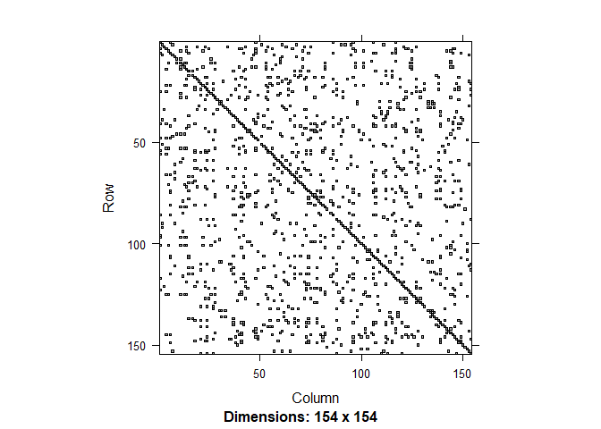
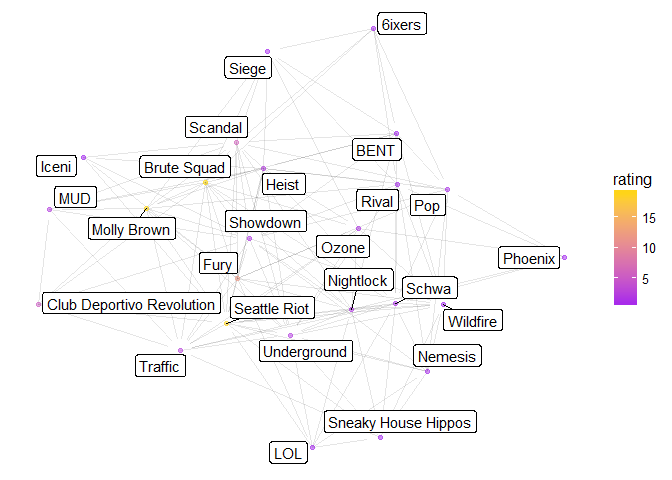

# USAU Women's Rankings


```r
library(RSelenium)
rD <- rsDriver()
```

```
## checking Selenium Server versions:
```

```
## BEGIN: PREDOWNLOAD
```

```
## BEGIN: DOWNLOAD
```

```
## BEGIN: POSTDOWNLOAD
```

```
## checking chromedriver versions:
```

```
## BEGIN: PREDOWNLOAD
```

```
## BEGIN: DOWNLOAD
```

```
## BEGIN: POSTDOWNLOAD
```

```
## checking geckodriver versions:
```

```
## BEGIN: PREDOWNLOAD
```

```
## BEGIN: DOWNLOAD
```

```
## BEGIN: POSTDOWNLOAD
```

```
## checking phantomjs versions:
```

```
## BEGIN: PREDOWNLOAD
```

```
## BEGIN: DOWNLOAD
```

```
## BEGIN: POSTDOWNLOAD
```

```
## [1] "Connecting to remote server"
## $applicationCacheEnabled
## [1] FALSE
## 
## $rotatable
## [1] FALSE
## 
## $mobileEmulationEnabled
## [1] FALSE
## 
## $networkConnectionEnabled
## [1] FALSE
## 
## $chrome
## $chrome$chromedriverVersion
## [1] "2.32.498550 (9dec58e66c31bcc53a9ce3c7226f0c1c5810906a)"
## 
## $chrome$userDataDir
## [1] "C:\\Users\\mr437799\\AppData\\Local\\Temp\\scoped_dir1060_44"
## 
## 
## $takesHeapSnapshot
## [1] TRUE
## 
## $pageLoadStrategy
## [1] "normal"
## 
## $databaseEnabled
## [1] FALSE
## 
## $handlesAlerts
## [1] TRUE
## 
## $hasTouchScreen
## [1] FALSE
## 
## $version
## [1] "60.0.3112.113"
## 
## $platform
## [1] "Windows NT"
## 
## $browserConnectionEnabled
## [1] FALSE
## 
## $nativeEvents
## [1] TRUE
## 
## $acceptSslCerts
## [1] TRUE
## 
## $locationContextEnabled
## [1] TRUE
## 
## $webStorageEnabled
## [1] TRUE
## 
## $browserName
## [1] "chrome"
## 
## $takesScreenshot
## [1] TRUE
## 
## $javascriptEnabled
## [1] TRUE
## 
## $cssSelectorsEnabled
## [1] TRUE
## 
## $setWindowRect
## [1] TRUE
## 
## $unexpectedAlertBehaviour
## [1] ""
## 
## $id
## [1] "0d0f7a8b9b2420412eab300abd2d32ba"
```

```r
remDr <- rD[["client"]]
```

```r
library(tidyverse)
```

```
## Loading tidyverse: ggplot2
## Loading tidyverse: tibble
## Loading tidyverse: tidyr
## Loading tidyverse: readr
## Loading tidyverse: purrr
## Loading tidyverse: dplyr
```

```
## Conflicts with tidy packages ----------------------------------------------
```

```
## filter(): dplyr, stats
## lag():    dplyr, stats
```

```r
library(rvest)
```

```
## Loading required package: xml2
```

```
## 
## Attaching package: 'rvest'
```

```
## The following object is masked from 'package:purrr':
## 
##     pluck
```

```
## The following object is masked from 'package:readr':
## 
##     guess_encoding
```

```r
library(XML)
```

```
## 
## Attaching package: 'XML'
```

```
## The following object is masked from 'package:rvest':
## 
##     xml
```

```r
remDr$navigate("http://play.usaultimate.org/teams/events/rankings/")
# elem <- remDr$findElement(using = 'xpath', "//*/option[@value = 'Club']")
# elem$clickElement()

elem <- remDr$findElement(using = 'xpath', "//*/option[@value = '2']")
elem$clickElement()

elem <- remDr$findElement(using = 'id', "CT_Main_0_btnSubmit")
elem$clickElement()
```


```r
elem <- remDr$findElement(using="id", value="CT_Main_0_gvList")
data<-elem$getElementAttribute("outerHTML")[[1]]  %>% read_html() %>%
  html_table(fill=TRUE)


teams <- data[[1]][-(nrow(data[[1]])-1),-8:-9] %>% filter(!is.na(Losses))

teams$Links <- elem$getElementAttribute("outerHTML")[[1]] %>% htmlTreeParse(useInternalNodes=TRUE) %>% xpathApply("//a", xmlGetAttr, 'href') %>% unlist %>% .[1:nrow(teams)]

teams <- teams %>% filter( Wins !=0 | Losses !=0 )
```


```r
library(stringr)
num_pages <- data[[2]][2] %>% str_split(.," of ") %>% .[[1]] %>% .[2] %>% as.numeric()
for( n in 2:num_pages){
  
  
  if(n<10){
    link <- paste0("CT_Main_0$gvList$ctl23$ctl00$ctl0",n)
  } else{
    link <- paste0("CT_Main_0$gvList$ctl23$ctl00$ctl",n)
  }
  elem <- remDr$findElement(using="partial link text", value="Next ")
  elem$clickElement()

  elem <- remDr$findElement(using="id", value="CT_Main_0_gvList")
  data<-elem$getElementAttribute("outerHTML")[[1]]  %>% read_html() %>%
    html_table(fill=TRUE)

  new_teams <- data[[1]][-(nrow(data[[1]])-1),-8:-9] %>% filter(!is.na(Losses))

  new_teams$Links <- elem$getElementAttribute("outerHTML")[[1]] %>%
    htmlTreeParse(useInternalNodes=TRUE) %>% 
    xpathApply("//a", xmlGetAttr, 'href') %>% unlist %>% .[1:nrow(new_teams)]

  teams <- bind_rows(teams, new_teams)
  
}

rm(data)
rm(elem)
teams <- teams %>% filter( Wins !=0 | Losses !=0) %>% 
  filter( !grepl("[Tt]esting",Team)) %>% 
  filter(`Competition Level` != "College") %>%  arrange(Team) 

teams <- teams %>% mutate(Wins = 0, Losses = 0)
```

```r
# 
# remDr$navigate("http://play.usaultimate.org/teams/events/team_rankings/?RankSet=College-Women")
# 
# elem <- remDr$findElement(using="link text", value="View All")
# elem$clickElement()
# 
# elem <- remDr$findElement(using="id", value="CT_Main_0_gvList")
# data<-elem$getElementAttribute("outerHTML")[[1]]  %>% read_html() %>%
#   html_table(fill=TRUE)
# 
# teamsInfo <- data[[1]][-(nrow(data[[1]])-1),-11:-12] %>% filter(!is.na(Losses))
# 
# teamsInfo$Links <- elem$getElementAttribute("outerHTML")[[1]] %>% htmlTreeParse(useInternalNodes=TRUE) %>% xpathApply("//a", xmlGetAttr, 'href') %>% unlist %>% .[1:nrow(teamsInfo)]
# 
# teams <- left_join(teams,teamsInfo,by=c("Links", "Competition Level", "Gender Division")) %>% select(-Wins.y, -Losses.y, -Wins.x, -Losses.x) %>% rename(Team=Team.x, School=Team.y) %>% mutate(Rank=as.numeric(Rank), `Power Rating`=as.numeric(`Power Rating`))
# 
# teams <- teams %>% arrange(Team) %>% mutate(Wins=0, Losses=0)
# 
# rm(teamsInfo)
```


```r
scores <-data.frame(Team1=character(), Score1=numeric(), 
                    Team2=character(), Score2=numeric(), Date=character())

for( i in 1:length(teams$Team)){
  Sys.sleep(runif(1))
  url <- paste0("http://play.usaultimate.org", teams$Links[i])
  remDr$navigate(url)
  #pull table of games
  elem <- remDr$findElement(using = "id", value="CT_Right_0_gvEventScheduleScores")
  data <- elem$getElementAttribute("outerHTML")[[1]] %>% 
    read_html() %>% html_table(fill=TRUE)
  data <- data[[1]]
  names(data) <- c("Date", "Scores", "Opponent")
  data <- filter(data, Date != Scores)
  data <- data %>% separate(Scores, c("For", "Against"))
  data <- data %>% filter(!is.na(Against) & !is.na(For)) %>% filter(Opponent != "N/A") %>%
    mutate(For=ifelse(For=="W", 1, 
                      ifelse(For=="F", -1, 
                             ifelse(For=="L",0,
                                    as.numeric(For)))),
           Against=ifelse(Against=="W", 1, 
                          ifelse(Against=="F", -1, 
                                 ifelse(Against=="L",0,
                                        as.numeric(Against))))
    )
  data$Links <- elem$getElementAttribute("outerHTML")[[1]] %>%
    htmlTreeParse(useInternalNodes=TRUE) %>% 
    xpathApply("//a", xmlGetAttr, 'href') %>% 
    unlist %>% grep("Eventteam",., value=TRUE) %>% .[1:length(data$Against)]
  
  for(j in 1:length(data$Links)){
    oppID = grep(data$Links[j], teams$Links, fixed=TRUE)
    if( length(oppID) >0){
      if( oppID > i){
        scores <- bind_rows(scores, 
                            tibble(Team1=teams$Team[i], 
                                   Score1=data$For[j], 
                                   Team2=teams$Team[oppID], 
                                   Score2=data$Against[j], 
                                   Date=data$Date[j])
        )
        if(!is.na(data$For[j]) && !is.na(data$Against[j])){
          if(data$For[j]>data$Against[j]){
            teams$Wins[i]=teams$Wins[i]+1;
            teams$Losses[oppID]=teams$Losses[oppID]+1;
          } else{
            teams$Losses[i]=teams$Losses[i]+1;
            teams$Wins[oppID]=teams$Wins[oppID]+1;
          }
        }
      }
    }
    #if opposing team is later in list (match on URL) add the game to the dataframe of games
    
    
  }
}
```

```
## Warning: Too few values at 4 locations: 17, 18, 19, 20
```

```
## Warning in bind_rows_(x, .id): binding factor and character vector,
## coercing into character vector
```

```
## Warning in bind_rows_(x, .id): binding character and factor vector,
## coercing into character vector
```

```
## Warning in bind_rows_(x, .id): binding factor and character vector,
## coercing into character vector
```

```
## Warning in bind_rows_(x, .id): binding character and factor vector,
## coercing into character vector
```

```
## Warning in bind_rows_(x, .id): binding factor and character vector,
## coercing into character vector
```

```
## Warning in bind_rows_(x, .id): binding character and factor vector,
## coercing into character vector
```

```
## Warning in ifelse(For == "L", 0, as.numeric(For)): NAs introduced by
## coercion
```

```
## Warning in ifelse(Against == "L", 0, as.numeric(Against)): NAs introduced
## by coercion
```

```
## Warning: Too few values at 3 locations: 23, 24, 25
```

```
## Warning: Too few values at 2 locations: 14, 16
```

```
## Warning: Too few values at 5 locations: 21, 22, 23, 24, 25
```

```
## Warning in ifelse(For == "L", 0, as.numeric(For)): NAs introduced by
## coercion
```

```
## Warning in ifelse(Against == "L", 0, as.numeric(Against)): NAs introduced
## by coercion
```

```
## Warning: Too few values at 4 locations: 19, 20, 21, 22
```

```
## Warning: Too few values at 5 locations: 21, 22, 23, 24, 25
```

```
## Warning: Too few values at 4 locations: 20, 21, 22, 23
```

```
## Warning: Too few values at 5 locations: 21, 22, 23, 24, 25
```

```
## Warning in ifelse(For == "L", 0, as.numeric(For)): NAs introduced by
## coercion
```

```
## Warning in ifelse(Against == "L", 0, as.numeric(Against)): NAs introduced
## by coercion
```

```
## Warning: Too few values at 3 locations: 22, 23, 24
```

```
## Warning: Too few values at 3 locations: 21, 22, 23
```

```
## Warning: Too few values at 6 locations: 13, 15, 16, 17, 18, 19
```

```
## Warning: Too few values at 3 locations: 26, 27, 28
```

```
## Warning: Too few values at 3 locations: 22, 23, 24
```

```
## Warning: Too few values at 3 locations: 21, 22, 23
```

```
## Warning: Too few values at 1 locations: 7
```

```
## Warning in ifelse(For == "L", 0, as.numeric(For)): NAs introduced by
## coercion
```

```
## Warning in ifelse(Against == "L", 0, as.numeric(Against)): NAs introduced
## by coercion
```

```
## Warning: Too few values at 3 locations: 20, 21, 22
```

```
## Warning: Too few values at 3 locations: 15, 16, 17
```

```
## Warning: Too few values at 3 locations: 19, 20, 21
```

```
## Warning: Too few values at 3 locations: 25, 26, 27
```

```
## Warning: Too few values at 3 locations: 26, 27, 28
```

```
## Warning: Too few values at 3 locations: 28, 29, 30
```

```
## Warning: Too few values at 3 locations: 27, 28, 29
```

```
## Warning: Too few values at 3 locations: 29, 30, 31
```

```
## Warning in ifelse(For == "L", 0, as.numeric(For)): NAs introduced by
## coercion
```

```
## Warning in ifelse(Against == "L", 0, as.numeric(Against)): NAs introduced
## by coercion
```

```
## Warning: Too few values at 5 locations: 18, 19, 20, 21, 22
```

```
## Warning: Too few values at 1 locations: 1
```

```
## Warning: Too few values at 5 locations: 16, 17, 18, 19, 20
```

```
## Warning in ifelse(For == "L", 0, as.numeric(For)): NAs introduced by
## coercion
```

```
## Warning in ifelse(Against == "L", 0, as.numeric(Against)): NAs introduced
## by coercion
```

```
## Warning: Too few values at 3 locations: 26, 27, 28
```

```
## Warning: Too few values at 4 locations: 13, 15, 16, 17
```

```
## Warning: Too few values at 5 locations: 18, 19, 20, 21, 22
```

```
## Warning: Too few values at 6 locations: 20, 21, 22, 23, 24, 25
```

```
## Warning in ifelse(For == "L", 0, as.numeric(For)): NAs introduced by
## coercion
```

```
## Warning in ifelse(Against == "L", 0, as.numeric(Against)): NAs introduced
## by coercion
```

```
## Warning in ifelse(For == "L", 0, as.numeric(For)): NAs introduced by
## coercion
```

```
## Warning in ifelse(Against == "L", 0, as.numeric(Against)): NAs introduced
## by coercion
```

```
## Warning: Too few values at 3 locations: 21, 22, 23
```

```
## Warning: Too few values at 3 locations: 26, 27, 28
```

```
## Warning: Too few values at 3 locations: 28, 29, 30
```

```
## Warning: Too few values at 3 locations: 23, 24, 25
```

```
## Warning in ifelse(For == "L", 0, as.numeric(For)): NAs introduced by
## coercion
```

```
## Warning in ifelse(Against == "L", 0, as.numeric(Against)): NAs introduced
## by coercion
```

```
## Warning: Too few values at 3 locations: 18, 19, 20
```

```
## Warning: Too few values at 3 locations: 28, 29, 30
```

```
## Warning: Too few values at 1 locations: 1
```

```
## Warning: Too few values at 3 locations: 27, 28, 29
```

```
## Warning: Too few values at 3 locations: 20, 21, 22
```

```
## Warning: Too few values at 1 locations: 6
```

```
## Warning in ifelse(For == "L", 0, as.numeric(For)): NAs introduced by
## coercion
```

```
## Warning in ifelse(Against == "L", 0, as.numeric(Against)): NAs introduced
## by coercion
```

```
## Warning: Too few values at 3 locations: 19, 20, 21
```

```
## Warning in ifelse(For == "L", 0, as.numeric(For)): NAs introduced by
## coercion
```

```
## Warning in ifelse(Against == "L", 0, as.numeric(Against)): NAs introduced
## by coercion
```

```
## Warning: Too many values at 1 locations: 6
```

```
## Warning in ifelse(For == "L", 0, as.numeric(For)): NAs introduced by
## coercion
```

```
## Warning in ifelse(Against == "L", 0, as.numeric(Against)): NAs introduced
## by coercion
```

```
## Warning: Too few values at 4 locations: 8, 9, 10, 11
```

```
## Warning: Too few values at 4 locations: 27, 28, 29, 30
```

```
## Warning: Too few values at 3 locations: 21, 22, 23
```

```
## Warning: Too few values at 3 locations: 28, 29, 30
```

```
## Warning: Too few values at 3 locations: 13, 14, 15
```

```
## Warning: Too few values at 1 locations: 8
```

```
## Warning: Too few values at 5 locations: 21, 22, 23, 24, 25
```

```
## Warning: Too few values at 4 locations: 27, 28, 29, 30
```

```
## Warning: Too few values at 3 locations: 22, 23, 24
```

```
## Warning: Too few values at 3 locations: 14, 15, 16
```

```
## Warning: Too few values at 3 locations: 21, 22, 23
```

```
## Warning in ifelse(For == "L", 0, as.numeric(For)): NAs introduced by
## coercion
```

```
## Warning in ifelse(Against == "L", 0, as.numeric(Against)): NAs introduced
## by coercion
```

```
## Warning: Too few values at 3 locations: 24, 25, 26
```

```
## Warning: Too many values at 1 locations: 6
```

```
## Warning in ifelse(For == "L", 0, as.numeric(For)): NAs introduced by
## coercion
```

```
## Warning in ifelse(Against == "L", 0, as.numeric(Against)): NAs introduced
## by coercion
```

```
## Warning: Too few values at 3 locations: 27, 28, 29
```

```
## Warning in ifelse(For == "L", 0, as.numeric(For)): NAs introduced by
## coercion
```

```
## Warning in ifelse(Against == "L", 0, as.numeric(Against)): NAs introduced
## by coercion
```

```
## Warning in ifelse(For == "L", 0, as.numeric(For)): NAs introduced by
## coercion
```

```
## Warning in ifelse(Against == "L", 0, as.numeric(Against)): NAs introduced
## by coercion
```

```
## Warning: Too few values at 1 locations: 6
```

```
## Warning: Too few values at 1 locations: 8
```

```
## Warning: Too few values at 1 locations: 7
```

```
## Warning: Too few values at 3 locations: 14, 15, 16
```

```
## Warning: Too few values at 3 locations: 32, 33, 34
```

```
## Warning: Too few values at 4 locations: 27, 28, 29, 30
```

```
## Warning in ifelse(For == "L", 0, as.numeric(For)): NAs introduced by
## coercion
```

```
## Warning in ifelse(Against == "L", 0, as.numeric(Against)): NAs introduced
## by coercion
```

```
## Warning: Too few values at 3 locations: 24, 25, 26
```

```
## Warning: Too few values at 3 locations: 23, 24, 25
```

```
## Warning in ifelse(For == "L", 0, as.numeric(For)): NAs introduced by
## coercion
```

```
## Warning in ifelse(Against == "L", 0, as.numeric(Against)): NAs introduced
## by coercion
```

```
## Warning: Too few values at 3 locations: 20, 21, 22

## Warning: Too few values at 3 locations: 20, 21, 22
```

```
## Warning: Too few values at 1 locations: 6
```

```
## Warning: Too few values at 4 locations: 2, 3, 4, 5
```

```
## Warning in ifelse(For == "L", 0, as.numeric(For)): NAs introduced by
## coercion
```

```
## Warning in ifelse(Against == "L", 0, as.numeric(Against)): NAs introduced
## by coercion
```

```r
scores <- scores %>% filter(!is.na(Score1) & !is.na(Score2))
```

Add a new chunk by clicking the *Insert Chunk* button on the toolbar or by pressing *Ctrl+Alt+I*.

When you save the notebook, an HTML file containing the code and output will be saved alongside it (click the *Preview* button or press *Ctrl+Shift+K* to preview the HTML file).


```r
remDr$close()
rD[["server"]]$stop()
```

```
## [1] TRUE
```

```r
gc(rD)
```

```
##           used (Mb) gc trigger (Mb) max used (Mb)
## Ncells  920982 49.2    1442291 77.1  1442291 77.1
## Vcells 1296175  9.9    2552219 19.5  1947771 14.9
```

```r
save(scores, teams, file=paste0("AllWomenScores",format(Sys.time(),"%Y %m %d"),".Rdata"))
```


```r
#MOV of 6 is insurmountable
P=matrix(c(1   ,-1/2,0   ,0,0,0,0,0,0,0,0,
           -1/2,1   ,-1/2,0   ,0,0,0,0,0,0,0,
           0   ,-1/2,1   ,-1/2,0   ,0,0,0,0,0,0,
           0   ,0   ,-1/2,1   ,-1/2,0,0,0,0,0,0,
           0,0   ,0   ,-1/2,1   ,-1/2,0,0,0,0,0,
           0,0,0   ,0   ,-1/2,1   ,-1/2,0,0,0,0,
           0,0,0,0   ,0   ,-1/2,1   ,-1/2,0,0,0,
           0,0,0,0,0   ,0   ,-1/2,1   ,-1/2,0,0,
           0,0,0,0,0,0   ,0   ,-1/2,1   ,-1/2,0,
           0,0,0,0,0,0,0   ,0   ,-1/2,1   ,-1/2,
           0,0,0,0,0,0,0,0   ,0   ,-1/2,1   )
         ,nrow=11)
v=c(0,0,0,0,0,0,0,0,0,0,1/2)
shares<-solve(P,v)
```

```r
library(Matrix)
```

```
## 
## Attaching package: 'Matrix'
```

```
## The following object is masked from 'package:tidyr':
## 
##     expand
```

```r
A=sparseMatrix(seq(1,length(teams$Team)),seq(1,length(teams$Team)),x=0)
b=rep(1,length(teams$Team))

for(i in 1:length(scores$Team1)){
  if(abs(scores[i,]$Score1-scores[i,]$Score2)>=6){
    if(scores[i,]$Score1>scores[i,]$Score2){
      Share1<-1
      Share2<-0
    } else{
      Share2<-1
      Share1<-0
    }
  } else{
    Share1<-shares[scores[i,]$Score1-scores[i,]$Score2+6]
    Share2<-1-Share1
  }
  team1=match(scores[i,]$Team1,teams$Team)
  team2=match(scores[i,]$Team2,teams$Team)
  if( is.na(team1) | is.na(team2)){ next }
  A[team1,team2]=
    A[team1,team2]+Share2
  A[team2,team1]=
    A[team2,team1]+Share1
  A[team1,team1]=
    A[team1,team1]+Share1
  A[team2,team2]=
    A[team2,team2]+Share2
}
image(A)
```

<!-- -->

```r
which(rowSums(A)==0)
```

```
## [1] 16 50 84
```


```r
A_unnormed <- A
for(i in 1:length(teams$Team)){
  if(sum(A[i,])!=0){ 
    A[i,]=A[i,]/sum(A[i,])
  }
}
```

```r
b=t(rep(1,length(teams$Team)))
for( i in 1:10000){
  b<-b%*%A
}
```


```r
library(tidyverse)
teams$Index = 1:length(teams$Team)
rankedteams<-bind_cols(teams, tibble(Rating=as.numeric(b)))
rankedteams <-arrange(rankedteams, desc(Rating))
```


```r
write.csv(rankedteams, paste("USAU All Women RW", format(Sys.time(),"%Y %m %d"),".csv",sep=""), row.names = TRUE)

rankedteams %>% filter(`Competition Level`== "Club") %>% mutate(Rank=dense_rank(desc(Rating))) %>% select(Rank, Team, Wins, Losses, Rating, City, State) %>% write.csv( paste("USAU Club Women RW", format(Sys.time(),"%Y %m %d"),".csv",sep=""), row.names = FALSE)

rankedteams %>% filter(`Competition Level`== "Masters") %>% mutate(Rank=dense_rank(desc(Rating))) %>% select(Rank, Team, Wins, Losses, Rating, City, State) %>% write.csv( paste("USAU Masters Women RW", format(Sys.time(),"%Y %m %d"),".csv",sep=""), row.names = FALSE)

rankedteams %>% filter(`Competition Level`== "Grand Masters") %>% mutate(Rank=dense_rank(desc(Rating))) %>% select(Rank, Team, Wins, Losses, Rating, City, State) %>% write.csv( paste("USAU Grand Masters Women RW", format(Sys.time(),"%Y %m %d"),".csv",sep=""), row.names = FALSE)
```


```r
rankedteams %>% filter(`Competition Level`== "Club") %>% mutate(Rank=dense_rank(desc(Rating))) %>% select(Rank, Team, Wins, Losses, Rating, City, State) %>% knitr::kable()
```


 Rank  Team                                Wins   Losses       Rating  City                   State            
-----  ---------------------------------  -----  -------  -----------  ---------------------  -----------------
    1  Seattle Riot                          23        4   18.4891907  Seattle                WA               
    2  Brute Squad                           16        3   15.3775226  Boston                 MA               
    3  Molly Brown                           15        4   13.3997284  Denver/Boulder         CO               
    4  Fury                                  13        6    9.9382508  San Francisco          CA               
    5  Scandal                               19        7    5.8884156  Washington             DC               
    6  Club Deportivo Revolution              5        2    5.6712760  Medellin               Colombia         
    7  Underground                           20       11    2.2275045  Seattle                WA               
    8  MUD                                    2        5    2.1936128  Edogawa-ku             Tokyo            
    9  Heist                                 12       13    1.9731973  Madison                WI               
   10  Nightlock                             12       15    1.8952193  Bay Area               CA               
   11  Traffic                                5        8    1.8239648  Vancouver              BC               
   12  Showdown                               9       11    1.6551670  Texas City             TX               
   13  Pop                                   19        7    1.3814560  Minneapolis            MN               
   14  WOLP                                   1        0    1.3333333  Northampton            MA               
   15  Ozone                                 10        8    1.2954319  Atlanta                GA               
   16  Schwa                                 10       10    1.2150592  Portland               OR               
   17  Nemesis                               19        6    0.9452414  Chicago                IL               
   18  Rival                                 11        7    0.7877119  Columbus/Ann Arbor     OH               
   19  Siege                                 19        6    0.6725352  Boston                 MA               
   20  PLOW                                   0        1    0.6666667  Northampton            MA               
   21  6ixers                                13        3    0.6601314  Toronto                Ontario          
   22  LOL                                   10        4    0.5621761  Oakland                CA               
   23  Wildfire                               8       11    0.4140193  San Diego              CA               
   24  BENT                                   8       12    0.3877509  New York               NY               
   25  Phoenix                               13        5    0.3744364  Durham                 NC               
   26  Iceni                                  0        7    0.3309079  London                 SW4 8QW          
   27  Sneaky House Hippos                    6        7    0.2192083  Vancouver              British Columbia 
   28  Hot Metal                             16       10    0.1691199  Pittsburgh             PA               
   29  Elevate                               16        5    0.1348051  Salt Lake City         UT               
   30  Iris                                  10        3    0.1290982  Québec                 Quebec           
   31  uno                                    2        5    0.1103026  Toyota                 Aichi            
   32  Green                                 17        1    0.0938228  Philadelphia           PA               
   33  FAB                                   15        5    0.0915949  Bay Area               CA               
   34  Grit                                  14       10    0.0865257  Washington             DC               
   35  Fusion                                 8        6    0.0727379  Winnipeg               Manitoba         
   36  Wicked                                13        5    0.0607646  Kansas City            KS               
   37  Viva                                   7       15    0.0449819  Los Angeles            CA               
   38  Venus                                  3        4    0.0418317  Montreal               Quebec           
   39  Notorious C.L.E.                      10       11    0.0415158  Cleveland              OH               
   40  Portland Ivy                          12        7    0.0378942  Portland               OR               
   41  Deadly Viper Assassination Squad       8       12    0.0323552  Oakland                CA               
   42  Stella                                 4        3    0.0258940  Ottawa                 Ontario          
   43  Salty                                  3        4    0.0184530  Halifax                Nova scotia      
   44  Outbreak                              13        6    0.0140222  Atlanta                GA               
   45  Virginia Rebellion                    10       12    0.0138656  Richmond               VA               
   46  Zephyr                                 5        8    0.0136921  Vancouver              British Columbia 
   47  PPF                                    4        3    0.0135963  Kitchener-Waterloo     Ontario          
   48  Colorado Small Batch                  10        9    0.0135551  Denver                 CO               
   49  Dish                                  18        7    0.0108796  Chicago                IL               
   50  Jackwagon                              7        8    0.0107212  Boulder/Denver         CO               
   51  Seattle Soul                           7        5    0.0107140  Seattle                WA               
   52  Steel                                 16       11    0.0105262  Birmingham             AL               
   53  Tempo                                  1        6    0.0095576  Bay Area               CA               
   54  Phoenix Uprising                       8        9    0.0089748  Phoenix                AZ               
   55  Tabby Rosa                            15        6    0.0089126  Gainesville            FL               
   56  Indy Rogue                            19        8    0.0070811  Indianapolis           IN               
   57  Maeve                                  7        9    0.0067854  Dallas                 TX               
   58  Pine Baroness                         13       14    0.0066454  Princeton              NJ               
   59  Trainwreck                             3       10    0.0056496  Fort Collins           CO               
   60  Rice Crispies                          4        2    0.0052642  St. Paul               MN               
   61  Seattle Beat                           4        8    0.0048209  Seattle                WA               
   62  fiasco                                13        7    0.0047379  Miami                  FL               
   63  Backhanded                             6       16    0.0044737  Baltimore/Washington   DC               
   64  Sureshot                              17        9    0.0033069  Cincinnati             OH               
   65  Vice                                  12       11    0.0029918  Cambridge              MA               
   66  Venom                                  4       13    0.0029046  Tucson                 AZ               
   67  Queen Cake                             9        7    0.0027478  New Orleans            LA               
   68  Further                                2        5    0.0023789  Eugene                 OR               
   69  Helix                                 15       11    0.0021669  Chicago                IL               
   70  Brooklyn Book Club                    12        6    0.0015881  Brooklyn               NY               
   71  Suffrage                              11       11    0.0015851  Washington             DC               
   72  Inferno                                5       11    0.0014702  Houston                TX               
   73  Wendigo                                1       11    0.0013116  Vancouver              British Columbia 
   74  MystiKuE                               9       11    0.0011098  Milwaukee              WI               
   75  Storm                                  3        4    0.0010876  Montreal               Quebec           
   76  Monsoon Ultimate                       4       11    0.0009869  Flagstaff              AZ               
   77  Boomslang                              9        9    0.0008504  Albany                 NY               
   78  Encore                                 3       10    0.0007938  Nashville              TN               
   79  Independence                           5       13    0.0007130  Philadelphia           PA               
   80  Broad City                            10       16    0.0006748  Philadelphia           PA               
   81  Sparks                                 8       10    0.0006587  Cincinnati             OH               
   82  Savage                                 4        2    0.0006097  Halifax                Nova Scotia      
   83  Snap                                   8       12    0.0005440  Minneapolis            MN               
   84  Jinx                                  10        7    0.0005333  Portland               ME               
   85  Crackle                                9       11    0.0004386  Minneapolis            MN               
   86  Lockdown                               3       20    0.0003334  Madison                WI               
   87  Hoax                                   4       14    0.0002223  Charleston             SC               
   88  Salt City Spirit                       6       10    0.0001982  Syracuse               NY               
   89  Rogue                                  3       10    0.0001904  Chapel Hill            NC               
   90  Fresh Grannies                         1        4    0.0001671  Seattle                WA               
   91  Mystik                                 4        3    0.0001579  Montréal               Québec           
   92  EXO                                    3        4    0.0001573  Sherbrooke             Québec           
   93  Baywatch                               2       12    0.0001035  New Britain            CT               
   94  Honey Pot                              3       16    0.0000684  Chattanooga            TN               
   95  Autonomous                             2       15    0.0000483  Ann Arbor/Detroit      MI               
   96  Roc Paper Scissors                     2        7    0.0000388  Rochester              NY               
   97  Frenzy                                 3       21    0.0000382  Chicago                IL               
   98  DINO                                   1       13    0.0000165  New York               NY               
   99  HOPE                                   1        6    0.0000115  Providence             RI               
  100  Orbit                                  0        7    0.0000063  Atlanta                GA               
  101  Filthy Gorgeous                        1        6    0.0000010  Saint Louis            MO               
  102  BMN                                    0        5    0.0000000  Boston                 MA               
  102  Clemson (Tiger Alumni)                 0        0    0.0000000  Clemson                SC               
  102  Huck the Patriarchy                    5        2    0.0000000  Seattle                WA               
  102  PLU Alum                               0        0    0.0000000  Tacoma                 WA               
  102  Temptress                              0       10    0.0000000  Dallas                 TX               

```r
rankedteams %>% filter(`Competition Level`== "Masters") %>% mutate(Rank=dense_rank(desc(Rating))) %>% select(Rank, Team, Wins, Losses, Rating, City, State) %>% knitr::kable()
```


 Rank  Team                                 Wins   Losses      Rating  City            State    
-----  ----------------------------------  -----  -------  ----------  --------------  ---------
    1  Surly C.O.U.G.A.R.S.                   11        0   8.4637534  Minneapolis     MN       
    2  iRot                                    7        2   3.1726502  Seattle         WA       
    3  Ripe                                    7        1   2.8870542  Raleigh         NC       
    4  Lame Duck                               8        3   2.2643382  Washington      DC       
    5  Molly Grey                              5        1   1.8334734  Denver          CO       
    6  PUMAS                                   6        7   0.6780518  Ames            IA       
    7  BKFT                                    4        2   0.6289026  Santa Cruz      CA       
    8  Loose Cannon                            7        4   0.5082603  Philadelphia    PA       
    9  ZENITH                                  6        5   0.1855198  Baltimore       MD       
   10  Winnipeg Mint                           2        4   0.1084468  Winnipeg        Manitoba 
   11  G.O.S.E.                                1       10   0.0859646  Minneapolis     MN       
   12  Seattle Mint                            4        5   0.0825099  Seattle         WA       
   13  Atlantiques                             3        6   0.0235956  Atlanta         GA       
   14  I Thought This Was A Wine Tasting       2        4   0.0219132  New York        NY       
   15  BizNasty                                2        4   0.0194896  San Francisco   CA       
   16  Hot Flash                               2        5   0.0176166  Great Lakes     OH       
   17  Vermont Women's Tapped                  1        5   0.0170801  Burlington      VT       
   18  Restless                                0        2   0.0013799  Florida         FL       
   19  DC MadDames                             1        3   0.0000000  Washington      DC       
   19  First Ladies                            0        4   0.0000000  Washington      DC       
   19  Portland Ho Bags                        0        2   0.0000000  Portland        OR       

```r
rankedteams %>% filter(`Competition Level`== "Grand Masters") %>% mutate(Rank=dense_rank(desc(Rating))) %>% select(Rank, Team, Wins, Losses, Rating, City, State) %>% knitr::kable()
```


 Rank  Team                Wins   Losses      Rating  City        State 
-----  -----------------  -----  -------  ----------  ----------  ------
    1  Boston                 6        1   2.8711688  Boston      MA    
    2  J2                     6        2   2.2517805  Seattle     WA    
    3  Sidearm                4        4   0.4316854  Chicago     IL    
    4  Poachella              3        5   0.2795890  Seattle     WA    
    5  Riding High West       4        4   0.1502927  Multiple    AZ    
    6  Peak Bloom             0        7   0.0154836  Rockville   MD    


```r
library(tidyverse)
library(network)
```

```
## network: Classes for Relational Data
## Version 1.13.0 created on 2015-08-31.
## copyright (c) 2005, Carter T. Butts, University of California-Irvine
##                     Mark S. Handcock, University of California -- Los Angeles
##                     David R. Hunter, Penn State University
##                     Martina Morris, University of Washington
##                     Skye Bender-deMoll, University of Washington
##  For citation information, type citation("network").
##  Type help("network-package") to get started.
```

```r
library(sna)
```

```
## Loading required package: statnet.common
```

```
## 
## Attaching package: 'statnet.common'
```

```
## The following object is masked from 'package:base':
## 
##     order
```

```
## sna: Tools for Social Network Analysis
## Version 2.4 created on 2016-07-23.
## copyright (c) 2005, Carter T. Butts, University of California-Irvine
##  For citation information, type citation("sna").
##  Type help(package="sna") to get started.
```

```r
library(ggnetwork)
library(forcats)
library(readr)
division="Women"
level="Club"

clubTeams <- teams %>% filter(`Competition Level` == level)
clubScores <- scores %>% filter(Team1 %in% clubTeams$Team & Team2 %in% clubTeams$Team)
Ranking <- rankedteams %>% filter(`Competition Level`== level) %>% mutate(Rank=dense_rank(desc(Rating))) %>% select(Rank, Team, Wins, Losses, Rating, City, State)
n<-network.initialize(nrow(clubTeams), directed = TRUE, multiple = TRUE)
network.vertex.names(n)<-clubTeams$Team
n %v% "rank" <- left_join(clubTeams, Ranking, by = "Team" ) %>%
  .$Rank
n %v% "rating" <- left_join(clubTeams, Ranking, by = "Team" ) %>%
  .$Rating
add.edges(n, 
          parse_factor(clubScores$Team1,clubTeams$Team), 
          parse_factor(clubScores$Team2,clubTeams$Team), 
          names.eval = rep("PtDiff", nrow(clubScores)), 
          vals.eval = clubScores %>% mutate(PtDiff= Score1 - Score2) %>%
            .$PtDiff )
```

## Game Network


```r
net<-ggnetwork(n %s% which( n %v% "rank" < 26), layout="fruchtermanreingold")
```

```
## Warning in fortify.network(x, ...): duplicated edges detected
```

```r
ggplot(net, aes(x = x, y = y, xend = xend, yend = yend))+
  geom_edges(alpha=0.1)+
  geom_nodes( aes(color=rating), alpha=0.5 ) +theme_blank()+
  scale_color_gradient(low="purple", high="gold")+
  geom_nodelabel_repel(aes(label=vertex.names))
```

```
## Warning: Ignoring unknown parameters: segment.color
```

<!-- -->
