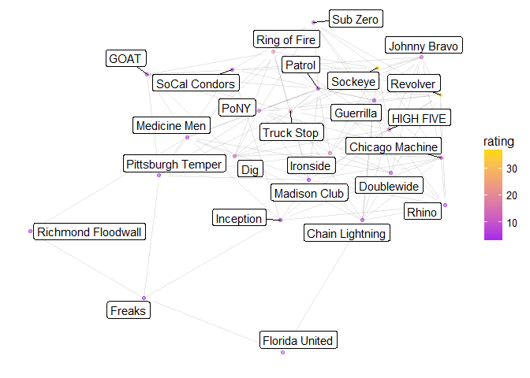

# Network Visualization
Matt Rissler  
September 11, 2017  


```r
clubTeams <- teams %>% filter(`Competition Level` == level)
clubScores <- scores %>% filter(Team1 %in% clubTeams$Team & Team2 %in% clubTeams$Team)
n<-network.initialize(nrow(clubTeams), directed = TRUE, multiple = TRUE)
network.vertex.names(n)<-clubTeams$Team
n %v% "rank" <- left_join(clubTeams, Ranking, by = "Team" ) %>%
  .$Rank
n %v% "rating" <- left_join(clubTeams, Ranking, by = "Team" ) %>%
  .$Rating
add.edges(n, 
          parse_factor(clubScores$Team1,clubTeams$Team), 
          parse_factor(clubScores$Team2,clubTeams$Team), 
          names.eval = rep("PtDiff", nrow(clubScores)), 
          vals.eval = clubScores %>% mutate(PtDiff= Score1 - Score2) %>%
            .$PtDiff )
```

## Game Network


```r
net<-ggnetwork(n %s% which( n %v% "rank" < 26), layout="fruchtermanreingold")
```

```
## Warning in fortify.network(x, ...): duplicated edges detected
```

```r
ggplot(net, aes(x = x, y = y, xend = xend, yend = yend))+
  geom_edges(alpha=0.1)+
  geom_nodes( aes(color=rating), alpha=0.5 ) +theme_blank()+
  scale_color_gradient(low="purple", high="gold")+
  geom_nodelabel_repel(aes(label=vertex.names))
```

```
## Warning: Ignoring unknown parameters: segment.color
```

<!-- -->

