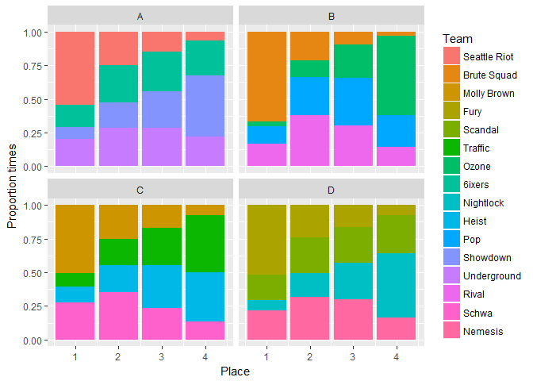
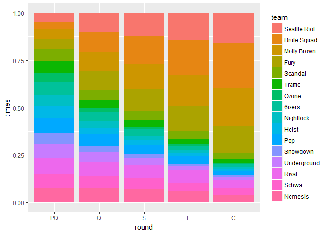
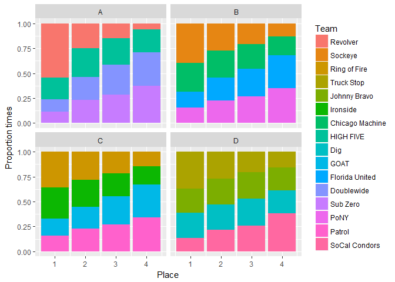
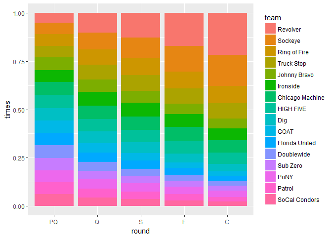
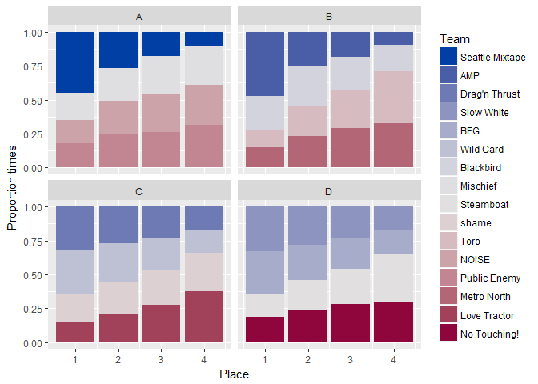
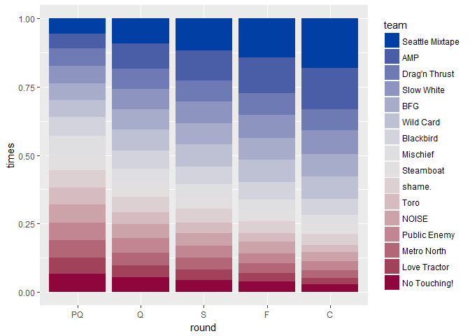

# Simulation Summary
Matt Rissler  
October 6, 2017  


##Women


```r
load("WomenNationalsMOVs.Rdata")

load("WomenSim.Rdata")
n<-nrow(results)/16
n
```

```
## [1] 10000
```


```r
results %>% 
  ungroup() %>%
  group_by(team, pool_place, pool_name) %>%
  summarise(times=n()/n) %>% 
  ungroup() %>%
  mutate(team= parse_factor(team, rownames(MOV))) %>%
  spread(pool_place, times) %>%
  arrange(pool_name, team) %>%
  knitr::kable()
```


team           pool_name         1        2        3        4
-------------  ----------  -------  -------  -------  -------
Seattle Riot   A            0.5444   0.2458   0.1453   0.0645
6ixers         A            0.1662   0.2781   0.2952   0.2605
Showdown       A            0.0861   0.1880   0.2727   0.4532
Underground    A            0.2033   0.2881   0.2868   0.2218
Brute Squad    B            0.6643   0.2115   0.0967   0.0275
Ozone          B            0.0360   0.1226   0.2466   0.5948
Pop            B            0.1291   0.2859   0.3511   0.2339
Rival          B            0.1706   0.3800   0.3056   0.1438
Molly Brown    C            0.5063   0.2496   0.1674   0.0767
Traffic        C            0.1022   0.1994   0.2777   0.4207
Heist          C            0.1138   0.2004   0.3178   0.3680
Schwa          C            0.2777   0.3506   0.2371   0.1346
Fury           D            0.5187   0.2409   0.1652   0.0752
Scandal        D            0.1891   0.2628   0.2635   0.2846
Nightlock      D            0.0755   0.1794   0.2719   0.4732
Nemesis        D            0.2167   0.3169   0.2994   0.1670

```r
results %>% 
  ungroup() %>%
  group_by(team,  pool_name,pool_place) %>%
  summarise(count=n()) %>%
  ggplot(aes(fill= parse_factor(team, rownames(MOV)), x= pool_place, y=count/n))+geom_col(  ) + facet_wrap(~pool_name)+
  labs(x="Place", y="Proportion times", fill="Team")
```

<!-- -->


```r
bracket_summary %>%
  ggplot(aes(x=round, fill=team, y=times))+geom_col(position = "fill") +scale_fill_discrete()
```

<!-- -->

```r
bracket_summary %>% spread(round, times, fill=0) %>% 
  mutate( PQ=8*PQ/sum(PQ), Q=8*Q/sum(Q), S=4*S/sum(S), F=2*F/sum(F), C=C/sum(C)) %>% knitr::kable()
```


team                PQ        Q        S        F        C
-------------  -------  -------  -------  -------  -------
Seattle Riot    0.3911   0.7987   0.4850   0.2915   0.1616
Brute Squad     0.3082   0.8651   0.5898   0.3677   0.2360
Molly Brown     0.4170   0.8018   0.5305   0.3270   0.2001
Fury            0.4061   0.7836   0.4608   0.2621   0.1411
Scandal         0.5263   0.4568   0.2002   0.0839   0.0335
Traffic         0.4771   0.3181   0.1345   0.0541   0.0218
Ozone           0.3692   0.1730   0.0548   0.0163   0.0050
6ixers          0.5733   0.3917   0.1430   0.0477   0.0132
Nightlock       0.4513   0.2885   0.0899   0.0294   0.0108
Heist           0.5182   0.2613   0.1005   0.0340   0.0106
Pop             0.6370   0.4863   0.2018   0.0799   0.0245
Showdown        0.4607   0.2462   0.0763   0.0235   0.0072
Underground     0.5749   0.4240   0.1414   0.0463   0.0158
Rival           0.6856   0.5878   0.2771   0.1265   0.0456
Schwa           0.5877   0.5066   0.2305   0.0886   0.0327
Nemesis         0.6163   0.6105   0.2839   0.1215   0.0405


##Men


```r
load("MenNationalsMOVs.Rdata")
load("MensSim.Rdata")
n<-nrow(results)/16
n
```

```
## [1] 10000
```


```r
results %>% 
  ungroup() %>%
  group_by(team, pool_place, pool_name) %>%
  summarise(times=n()/n) %>% 
  ungroup() %>%
  mutate(team= parse_factor(team, rownames(MOV))) %>%
  spread(pool_place, times) %>%
  arrange(pool_name, team) %>%
  knitr::kable()
```


team              pool_name         1        2        3        4
----------------  ----------  -------  -------  -------  -------
Revolver          A            0.5446   0.2460   0.1471   0.0623
HIGH FIVE         A            0.2140   0.2921   0.2686   0.2253
Doublewide        A            0.1288   0.2317   0.2988   0.3407
Sub Zero          A            0.1126   0.2302   0.2855   0.3717
Sockeye           B            0.3975   0.2693   0.2049   0.1283
Chicago Machine   B            0.2871   0.2725   0.2479   0.1925
Florida United    B            0.1622   0.2307   0.2774   0.3297
PoNY              B            0.1532   0.2275   0.2698   0.3495
Ring of Fire      C            0.3584   0.2799   0.2147   0.1470
Ironside          C            0.3119   0.2717   0.2335   0.1829
GOAT              C            0.1719   0.2195   0.2811   0.3275
Patrol            C            0.1578   0.2289   0.2707   0.3426
Truck Stop        D            0.3675   0.2710   0.2049   0.1566
Johnny Bravo      D            0.2422   0.2583   0.2666   0.2329
Dig               D            0.2544   0.2509   0.2678   0.2269
SoCal Condors     D            0.1359   0.2198   0.2607   0.3836

```r
results %>% 
  ungroup() %>%
  group_by(team,  pool_name,pool_place) %>%
  summarise(count=n()) %>%
  ggplot(aes(fill= parse_factor(team, rownames(MOV)), x= pool_place, y=count/n))+geom_col(  ) + facet_wrap(~pool_name)+
  labs(x="Place", y="Proportion times", fill="Team")
```

<!-- -->


```r
bracket_summary %>%
  ggplot(aes(x=round, fill=team, y=times))+geom_col(position = "fill") +scale_fill_discrete()
```

<!-- -->

```r
bracket_summary %>% spread(round, times, fill=0) %>% 
  mutate( PQ=8*PQ/sum(PQ), Q=8*Q/sum(Q), S=4*S/sum(S), F=2*F/sum(F), C=C/sum(C)) %>% knitr::kable()
```


team                   PQ        Q        S        F        C
----------------  -------  -------  -------  -------  -------
Revolver           0.3931   0.8056   0.5128   0.3393   0.2174
Sockeye            0.4742   0.7104   0.4313   0.2666   0.1611
Ring of Fire       0.4946   0.6343   0.3469   0.1747   0.0894
Truck Stop         0.4759   0.6148   0.3280   0.1585   0.0793
Johnny Bravo       0.5249   0.5107   0.2403   0.1098   0.0510
Ironside           0.5052   0.5643   0.2876   0.1340   0.0625
Chicago Machine    0.5204   0.5583   0.2777   0.1402   0.0627
HIGH FIVE          0.5607   0.5158   0.2585   0.1325   0.0603
Dig                0.5187   0.4888   0.2206   0.0927   0.0372
GOAT               0.5006   0.3842   0.1549   0.0589   0.0232
Florida United     0.5081   0.3956   0.1735   0.0720   0.0285
Doublewide         0.5305   0.3705   0.1526   0.0623   0.0237
Sub Zero           0.5157   0.3474   0.1472   0.0593   0.0237
PoNY               0.4973   0.3851   0.1731   0.0777   0.0337
Patrol             0.4996   0.3678   0.1532   0.0651   0.0248
SoCal Condors      0.4805   0.3464   0.1418   0.0564   0.0215


##Mixed


```r
load("MixedNationalsMOVs.Rdata")
load("MixedSim.Rdata")
n<-nrow(results)/16
n
```

```
## [1] 10000
```


```r
results %>% 
  ungroup() %>%
  group_by(team, pool_place, pool_name) %>%
  summarise(times=n()/n) %>% 
  ungroup() %>%
  mutate(team= parse_factor(team, rownames(MOV))) %>%
  spread(pool_place, times) %>%
  arrange(pool_name, team) %>%
  knitr::kable()
```


team              pool_name         1        2        3        4
----------------  ----------  -------  -------  -------  -------
Seattle Mixtape   A            0.4489   0.2665   0.1760   0.1086
Mischief          A            0.1979   0.2425   0.2773   0.2823
NOISE             A            0.1753   0.2479   0.2821   0.2947
Public Enemy      A            0.1779   0.2431   0.2646   0.3144
AMP               B            0.4696   0.2523   0.1848   0.0933
Blackbird         B            0.2591   0.2972   0.2492   0.1945
Toro              B            0.1225   0.2173   0.2757   0.3845
Metro North       B            0.1488   0.2332   0.2903   0.3277
Drag'n Thrust     C            0.3204   0.2699   0.2352   0.1745
Wild Card         C            0.3280   0.2799   0.2261   0.1660
shame.            C            0.2076   0.2467   0.2650   0.2807
Love Tractor      C            0.1440   0.2035   0.2737   0.3788
Slow White        D            0.3272   0.2802   0.2256   0.1670
BFG               D            0.3205   0.2636   0.2317   0.1842
Steamboat         D            0.1653   0.2229   0.2577   0.3541
No Touching!      D            0.1870   0.2333   0.2850   0.2947

```r
results %>% 
  ungroup() %>%
  group_by(team,  pool_name,pool_place) %>%
  summarise(count=n()) %>%
  ggplot(aes(fill= parse_factor(team, rownames(MOV)), x= pool_place, y=count/n))+geom_col(  ) + facet_wrap(~pool_name)+
  labs(x="Place", y="Proportion times", fill="Team")
```

<!-- -->


```r
bracket_summary <- braket_results %>% 
  mutate(round=parse_factor(round, c("PQ", "Q", "S", "F", "C")),
         team=parse_factor(team, levels=rownames(MOV))) %>%
  group_by(round, team) %>%
  summarize(times=n()/n) 

bracket_summary <- braket_results %>% 
  group_by(round, team, mov>0) %>%
  summarize(times=n()/n) %>% rename(win=`mov > 0`) %>% 
  filter(round=="F", win) %>% ungroup() %>% 
  mutate(round = "C", 
         round=parse_factor(round, c("PQ", "Q", "S", "F", "C")),
         team=parse_factor(team, levels=rownames(MOV))) %>% select(-win) %>%
  bind_rows(bracket_summary) 

bracket_summary %>%
  ggplot(aes(x=round, fill=team, y=times))+geom_col(position = "fill") +scale_fill_discrete()
```

<!-- -->

```r
bracket_summary %>% spread(round, times, fill=0) %>% 
  mutate( PQ=8*PQ/sum(PQ), Q=8*Q/sum(Q), S=4*S/sum(S), F=2*F/sum(F), C=C/sum(C)) %>% knitr::kable()
```


team                   PQ        Q        S        F        C
----------------  -------  -------  -------  -------  -------
Seattle Mixtape    0.4425   0.7211   0.4655   0.2846   0.1799
AMP                0.4371   0.7445   0.4385   0.2640   0.1518
Drag'n Thrust      0.5051   0.5988   0.3126   0.1560   0.0784
Slow White         0.5058   0.5990   0.3185   0.1677   0.0864
BFG                0.4953   0.5881   0.3026   0.1598   0.0823
Wild Card          0.5060   0.6145   0.3265   0.1656   0.0815
Blackbird          0.5464   0.5252   0.2590   0.1259   0.0584
Mischief           0.5198   0.4368   0.1930   0.0833   0.0367
Steamboat          0.4806   0.3841   0.1692   0.0745   0.0338
shame.             0.5117   0.4637   0.2072   0.0894   0.0394
Toro               0.4930   0.3357   0.1467   0.0622   0.0248
NOISE              0.5300   0.4219   0.1913   0.0848   0.0351
Public Enemy       0.5077   0.4183   0.1740   0.0746   0.0332
Metro North        0.5235   0.3755   0.1696   0.0725   0.0284
Love Tractor       0.4772   0.3421   0.1502   0.0609   0.0220
No Touching!       0.5183   0.4307   0.1756   0.0742   0.0279
