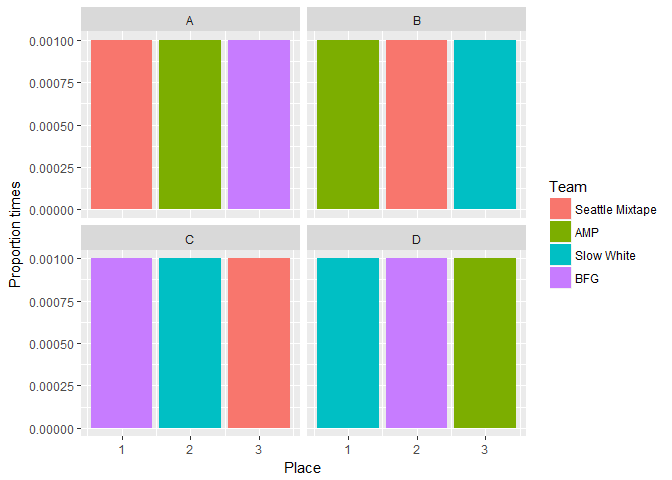
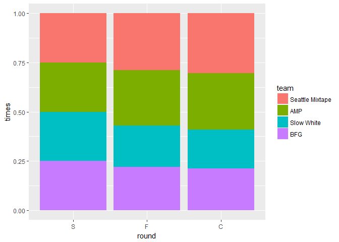

# USAU Womens Predictions
`r format(Sys.time(), '%d %B, %Y')`  


<!-- #1 v 4  -->
<!-- #2 v 3 -->
<!-- #1 v 3 -->
<!-- #2 v 4 -->
<!-- #1 v 2 -->
<!-- #3 v 4  -->


```r
results<- bind_rows(Get_Pool_results(MOV, poolA, "A", n),
                    Get_Pool_results(MOV, poolB, "B", n),
                    Get_Pool_results(MOV, poolC, "C", n),
                    Get_Pool_results(MOV, poolD, "D", n))
```


```r
  results <- tibble(team=c("Seattle Mixtape", "Seattle Mixtape", "Seattle Mixtape",
                           "Slow White", "Slow White", "Slow White",
                           "BFG", "BFG", "BFG",
                           "AMP", "AMP", "AMP"),
                    pool_name=c("A","B", "C", 
                                "B", "C", "D",
                                "C", "D", "A",
                                "D", "A", "B"),
                    pool_place=c(1, 2, 3, 
                                 3, 2, 1,
                                 1, 2, 3,
                                 3, 2, 1),
                    sim=rep(1,12))
```


```r
results <- results %>% mutate(round="pool")


results %>% 
  ungroup() %>%
  group_by(team, pool_place, pool_name) %>%
  summarise(times=n()/n) %>% 
  ungroup() %>%
  mutate(team= parse_factor(team, rownames(MOV))) %>%
  spread(pool_place, times) %>%
  arrange(pool_name, team) %>%
  knitr::kable()
```


team              pool_name        1       2       3
----------------  ----------  ------  ------  ------
Seattle Mixtape   A            0.001      NA      NA
AMP               A               NA   0.001      NA
BFG               A               NA      NA   0.001
Seattle Mixtape   B               NA   0.001      NA
AMP               B            0.001      NA      NA
Slow White        B               NA      NA   0.001
Seattle Mixtape   C               NA      NA   0.001
Slow White        C               NA   0.001      NA
BFG               C            0.001      NA      NA
AMP               D               NA      NA   0.001
Slow White        D            0.001      NA      NA
BFG               D               NA   0.001      NA

```r
results %>% 
  ungroup() %>%
  group_by(team,  pool_name,pool_place) %>%
  summarise(count=n()) %>%
  ggplot(aes(fill= parse_factor(team, rownames(MOV)), x= pool_place, y=count/n))+geom_col(  ) + facet_wrap(~pool_name)+
  labs(x="Place", y="Proportion times", fill="Team")
```

<!-- -->


```r
for(i in 1:n){
  #Prequarters
  #B2 v C3
  loop_results <- results 
  pq_results[i,]<-c(Get_PQ_result(MOV, loop_results, i, "B", 2, "C", 3),"PQ 1")
  #Winner v A1
  if(as.numeric(pq_results[i,]$mov) > 0 ){
    q_results[i,] <- c(Get_PQ_result(MOV, loop_results, i, "A", 1, "B", 2),"Q 1")
  } else {
    q_results[i,] <- c(Get_PQ_result(MOV, loop_results, i, "A", 1, "C", 3),"Q 1")
  }
  #B3 v C2
  
  pq_results[i+n,]<-c(Get_PQ_result(MOV, loop_results, i, "B", 3, "C", 2),"PQ 2")
  
  #Winner v D1
  if(as.numeric(pq_results[i+n,]$mov) > 0 ){
    q_results[i+n,] <- c(Get_PQ_result(MOV, loop_results, i, "D", 1, "B", 3),"Q 2")
  } else {
    q_results[i+n,] <- c(Get_PQ_result(MOV, loop_results, i, "D", 1, "C", 2),"Q 2")
  }
  
  
  #D2 v A3
  
  pq_results[i+2*n,]<-c(Get_PQ_result(MOV, loop_results, i, "D", 2, "A", 3), "PQ 3")
  
  #Winner v C1
  if(as.numeric(pq_results[i+2*n,]$mov) > 0 ){
    q_results[i+2*n,] <- c(Get_PQ_result(MOV, loop_results, i, "C", 1, "D", 2),"Q 3")
  } else {
    q_results[i+2*n,] <- c(Get_PQ_result(MOV, loop_results, i, "C", 1, "A", 3),"Q 3")
  }
  #D3 v A2
  
  #Winner v B1
  pq_results[i+3*n,]<-c(Get_PQ_result(MOV, loop_results, i, "D", 3, "A", 2), "PQ 4")
  if(as.numeric(pq_results[i+3*n,]$mov) > 0 ){
    q_results[i+3*n,] <- c(Get_PQ_result(MOV, loop_results, i, "B", 1, "D", 3),"Q 4")
  } else {
    q_results[i+3*n,] <- c(Get_PQ_result(MOV, loop_results, i, "B", 1, "A", 2),"Q 4")
  }
  
  Q1winner <- ifelse(as.numeric(q_results[i,]$mov)>0, q_results[i,]$team1, q_results[i,]$team2)
  Q2winner <- ifelse(as.numeric(q_results[i+n,]$mov)>0, q_results[i+n,]$team1, q_results[i+n,]$team2)
  
  s_results[i,] <- c(i,Get_Game_result(MOV, Q1winner, Q2winner), "S 1")
  
  Q3winner <- ifelse(as.numeric(q_results[i+2*n,]$mov)>0, q_results[i+2*n,]$team1, q_results[i+2*n,]$team2)
  Q4winner <- ifelse(as.numeric(q_results[i+3*n,]$mov)>0, q_results[i+3*n,]$team1, q_results[i+3*n,]$team2)
  
  s_results[i+n,] <- c(i,Get_Game_result(MOV, Q3winner, Q4winner), "S 2")
  
  S1winner <- ifelse(as.numeric(s_results[i,]$mov)>0, s_results[i,]$team1, s_results[i,]$team2)
  S2winner <- ifelse(as.numeric(s_results[i+n,]$mov)>0, s_results[i+n,]$team1, s_results[i+n,]$team2)
  
  f_results[i,] <- c(i,Get_Game_result(MOV, S1winner, S2winner), "F 1")
  
  if(i %% 100==0)   cat(i, "\n")
}
```

```
## 100 
## 200 
## 300 
## 400 
## 500 
## 600 
## 700 
## 800 
## 900 
## 1000
```


```r
braket_results <- bind_rows(pq_results,q_results,s_results,f_results)

braket_results <- braket_results %>% 
  mutate( team1=parse_factor(rownames(MOV)[as.integer(team1)], levels=rownames(MOV)),
          team2=parse_factor(rownames(MOV)[as.integer(team2)], levels=rownames(MOV))) %>%
  separate(game, c("round", "game"))

braket_results <- braket_results %>% gather(key=seed, value=team, contains("team")) %>%
  mutate(sim=as.numeric(sim), score=as.numeric(score), mov=as.numeric(mov),
         seed=if_else(seed=="team1", "Hi", "Lo"),
         mov=if_else(seed=="Lo", -mov, mov))

bracket_summary <- braket_results %>% 
  mutate(round=parse_factor(round, c("PQ", "Q", "S", "F", "C")),
         team=parse_factor(team, levels=rownames(MOV))) %>%
  group_by(round, team) %>%
  summarize(times=n()/n) 

bracket_summary <- braket_results %>% 
  group_by(round, team, mov>0) %>%
  summarize(times=n()/n) %>% rename(win=`mov > 0`) %>% 
  filter(round=="F", win) %>% ungroup() %>% 
  mutate(round = "C", 
         round=parse_factor(round, c("PQ", "Q", "S", "F", "C")),
         team=parse_factor(team, levels=rownames(MOV))) %>% select(-win) %>%
  bind_rows(bracket_summary) 
```


```r
bracket_summary %>% filter(round %in% c("S", "F", "C")) %>%
  ggplot(aes(x=round, fill=team, y=times))+geom_col(position = "fill") +scale_fill_discrete()
```

<!-- -->

```r
bracket_summary %>% spread(round, times) %>% replace_na(list(PQ=0)) %>%
  mutate( PQ=8*PQ/sum(PQ), Q=8*Q/sum(Q), S=4*S/sum(S), F=2*F/sum(F), C=C/sum(C)) %>%
  select(-PQ, -Q) %>% knitr::kable()
```


team                S       F       C
----------------  ---  ------  ------
Seattle Mixtape     1   0.579   0.305
AMP                 1   0.563   0.285
Slow White          1   0.421   0.199
BFG                 1   0.437   0.211


```r
save(results, braket_results, bracket_summary, file="WomenSim.Rdata")
```
