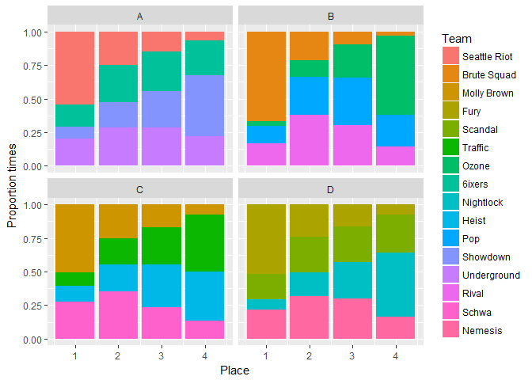
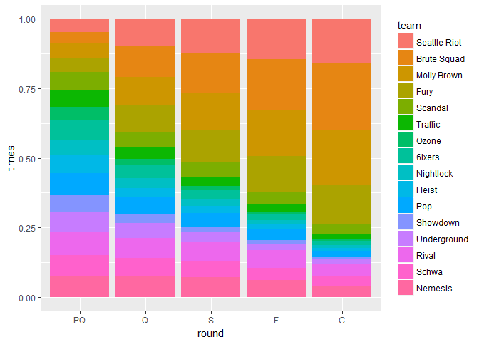

# USAU Womens Predictions
`r format(Sys.time(), '%d %B, %Y')`  


<!-- #1 v 4  -->
<!-- #2 v 3 -->
<!-- #1 v 3 -->
<!-- #2 v 4 -->
<!-- #1 v 2 -->
<!-- #3 v 4  -->


```r
results<- bind_rows(Get_Pool_results(MOV, poolA, "A", n),
                    Get_Pool_results(MOV, poolB, "B", n),
                    Get_Pool_results(MOV, poolC, "C", n),
                    Get_Pool_results(MOV, poolD, "D", n))
```


```r
results <- results %>% mutate(round="pool")


results %>% 
  ungroup() %>%
  group_by(team, pool_place, pool_name) %>%
  summarise(times=n()/n) %>% 
  ungroup() %>%
  mutate(team= parse_factor(team, rownames(MOV))) %>%
  spread(pool_place, times) %>%
  arrange(pool_name, team) %>%
  knitr::kable()
```


team           pool_name         1        2        3        4
-------------  ----------  -------  -------  -------  -------
Seattle Riot   A            0.5444   0.2458   0.1453   0.0645
6ixers         A            0.1662   0.2781   0.2952   0.2605
Showdown       A            0.0861   0.1880   0.2727   0.4532
Underground    A            0.2033   0.2881   0.2868   0.2218
Brute Squad    B            0.6643   0.2115   0.0967   0.0275
Ozone          B            0.0360   0.1226   0.2466   0.5948
Pop            B            0.1291   0.2859   0.3511   0.2339
Rival          B            0.1706   0.3800   0.3056   0.1438
Molly Brown    C            0.5063   0.2496   0.1674   0.0767
Traffic        C            0.1022   0.1994   0.2777   0.4207
Heist          C            0.1138   0.2004   0.3178   0.3680
Schwa          C            0.2777   0.3506   0.2371   0.1346
Fury           D            0.5187   0.2409   0.1652   0.0752
Scandal        D            0.1891   0.2628   0.2635   0.2846
Nightlock      D            0.0755   0.1794   0.2719   0.4732
Nemesis        D            0.2167   0.3169   0.2994   0.1670

```r
results %>% 
  ungroup() %>%
  group_by(team,  pool_name,pool_place) %>%
  summarise(count=n()) %>%
  ggplot(aes(fill= parse_factor(team, rownames(MOV)), x= pool_place, y=count/n))+geom_col(  ) + facet_wrap(~pool_name)+
  labs(x="Place", y="Proportion times", fill="Team")
```

<!-- -->


```r
for(i in 1:n){
  #Prequarters
  #B2 v C3
  loop_results <- results %>% filter(sim==i)
  pq_results[i,]<-c(Get_PQ_result(MOV, loop_results, i, "B", 2, "C", 3),"PQ 1")
  #Winner v A1
  if(as.numeric(pq_results[i,]$mov) > 0 ){
    q_results[i,] <- c(Get_PQ_result(MOV, loop_results, i, "A", 1, "B", 2),"Q 1")
  } else {
    q_results[i,] <- c(Get_PQ_result(MOV, loop_results, i, "A", 1, "C", 3),"Q 1")
  }
  #B3 v C2
  
  pq_results[i+n,]<-c(Get_PQ_result(MOV, loop_results, i, "B", 3, "C", 2),"PQ 2")
  
  #Winner v D1
  if(as.numeric(pq_results[i+n,]$mov) > 0 ){
    q_results[i+n,] <- c(Get_PQ_result(MOV, loop_results, i, "D", 1, "B", 3),"Q 2")
  } else {
    q_results[i+n,] <- c(Get_PQ_result(MOV, loop_results, i, "D", 1, "C", 2),"Q 2")
  }
  
  
  #D2 v A3
  
  pq_results[i+2*n,]<-c(Get_PQ_result(MOV, loop_results, i, "D", 2, "A", 3), "PQ 3")
  
  #Winner v C1
  if(as.numeric(pq_results[i+2*n,]$mov) > 0 ){
    q_results[i+2*n,] <- c(Get_PQ_result(MOV, loop_results, i, "C", 1, "D", 2),"Q 3")
  } else {
    q_results[i+2*n,] <- c(Get_PQ_result(MOV, loop_results, i, "C", 1, "A", 3),"Q 3")
  }
  #D3 v A2
  
  #Winner v B1
  pq_results[i+3*n,]<-c(Get_PQ_result(MOV, loop_results, i, "D", 3, "A", 2), "PQ 4")
  if(as.numeric(pq_results[i+3*n,]$mov) > 0 ){
    q_results[i+3*n,] <- c(Get_PQ_result(MOV, loop_results, i, "B", 1, "D", 3),"Q 4")
  } else {
    q_results[i+3*n,] <- c(Get_PQ_result(MOV, loop_results, i, "B", 1, "A", 2),"Q 4")
  }
  
  Q1winner <- ifelse(as.numeric(q_results[i,]$mov>0), q_results[i,]$team1, q_results[i,]$team2)
  Q2winner <- ifelse(as.numeric(q_results[i+n,]$mov>0), q_results[i+n,]$team1, q_results[i+n,]$team2)
  
  s_results[i,] <- c(i,Get_Game_result(MOV, Q1winner, Q2winner), "S 1")
  
  Q3winner <- ifelse(as.numeric(q_results[i+2*n,]$mov>0), q_results[i+2*n,]$team1, q_results[i+2*n,]$team2)
  Q4winner <- ifelse(as.numeric(q_results[i+3*n,]$mov>0), q_results[i+3*n,]$team1, q_results[i+3*n,]$team2)
  
  s_results[i+n,] <- c(i,Get_Game_result(MOV, Q3winner, Q4winner), "S 2")
  
  S1winner <- ifelse(as.numeric(s_results[i,]$mov>0), s_results[i,]$team1, s_results[i,]$team2)
  S2winner <- ifelse(as.numeric(s_results[i+n,]$mov>0), s_results[i+n,]$team1, s_results[i+n,]$team2)
  
  f_results[i,] <- c(i,Get_Game_result(MOV, S1winner, S2winner), "F 1")
  
  if(i %% 100==0)   cat(i, "\n")
}
```

```
## 100 
## 200 
## 300 
## 400 
## 500 
## 600 
## 700 
## 800 
## 900 
## 1000 
## 1100 
## 1200 
## 1300 
## 1400 
## 1500 
## 1600 
## 1700 
## 1800 
## 1900 
## 2000 
## 2100 
## 2200 
## 2300 
## 2400 
## 2500 
## 2600 
## 2700 
## 2800 
## 2900 
## 3000 
## 3100 
## 3200 
## 3300 
## 3400 
## 3500 
## 3600 
## 3700 
## 3800 
## 3900 
## 4000 
## 4100 
## 4200 
## 4300 
## 4400 
## 4500 
## 4600 
## 4700 
## 4800 
## 4900 
## 5000 
## 5100 
## 5200 
## 5300 
## 5400 
## 5500 
## 5600 
## 5700 
## 5800 
## 5900 
## 6000 
## 6100 
## 6200 
## 6300 
## 6400 
## 6500 
## 6600 
## 6700 
## 6800 
## 6900 
## 7000 
## 7100 
## 7200 
## 7300 
## 7400 
## 7500 
## 7600 
## 7700 
## 7800 
## 7900 
## 8000 
## 8100 
## 8200 
## 8300 
## 8400 
## 8500 
## 8600 
## 8700 
## 8800 
## 8900 
## 9000 
## 9100 
## 9200 
## 9300 
## 9400 
## 9500 
## 9600 
## 9700 
## 9800 
## 9900 
## 10000
```


```r
braket_results <- bind_rows(pq_results,q_results,s_results,f_results)

braket_results <- braket_results %>% 
  mutate( team1=parse_factor(rownames(MOV)[as.integer(team1)], levels=rownames(MOV)),
          team2=parse_factor(rownames(MOV)[as.integer(team2)], levels=rownames(MOV))) %>%
  separate(game, c("round", "game"))

braket_results <- braket_results %>% gather(key=seed, value=team, contains("team")) %>%
  mutate(sim=as.numeric(sim), score=as.numeric(score), mov=as.numeric(mov),
         seed=if_else(seed=="team1", "Hi", "Lo"),
         mov=if_else(seed=="Lo", -mov, mov))

bracket_summary <- braket_results %>% 
  mutate(round=parse_factor(round, c("PQ", "Q", "S", "F", "C")),
         team=parse_factor(team, levels=rownames(MOV))) %>%
  group_by(round, team) %>%
  summarize(times=n()/n) 

bracket_summary <- braket_results %>% 
  group_by(round, team, mov>0) %>%
  summarize(times=n()/n) %>% rename(win=`mov > 0`) %>% 
  filter(round=="F", win) %>% ungroup() %>% 
  mutate(round = "C", 
         round=parse_factor(round, c("PQ", "Q", "S", "F", "C")),
         team=parse_factor(team, levels=rownames(MOV))) %>% select(-win) %>%
  bind_rows(bracket_summary) 
```


```r
bracket_summary %>%
  ggplot(aes(x=round, fill=team, y=times))+geom_col(position = "fill") +scale_fill_discrete()
```

<!-- -->

```r
bracket_summary %>% spread(round, times) %>% 
  mutate( PQ=8*PQ/sum(PQ), Q=8*Q/sum(Q), S=4*S/sum(S), F=2*F/sum(F), C=C/sum(C)) %>% knitr::kable()
```


team                PQ        Q        S        F        C
-------------  -------  -------  -------  -------  -------
Seattle Riot    0.3911   0.7987   0.4850   0.2915   0.1616
Brute Squad     0.3082   0.8651   0.5898   0.3677   0.2360
Molly Brown     0.4170   0.8018   0.5305   0.3270   0.2001
Fury            0.4061   0.7836   0.4608   0.2621   0.1411
Scandal         0.5263   0.4568   0.2002   0.0839   0.0335
Traffic         0.4771   0.3181   0.1345   0.0541   0.0218
Ozone           0.3692   0.1730   0.0548   0.0163   0.0050
6ixers          0.5733   0.3917   0.1430   0.0477   0.0132
Nightlock       0.4513   0.2885   0.0899   0.0294   0.0108
Heist           0.5182   0.2613   0.1005   0.0340   0.0106
Pop             0.6370   0.4863   0.2018   0.0799   0.0245
Showdown        0.4607   0.2462   0.0763   0.0235   0.0072
Underground     0.5749   0.4240   0.1414   0.0463   0.0158
Rival           0.6856   0.5878   0.2771   0.1265   0.0456
Schwa           0.5877   0.5066   0.2305   0.0886   0.0327
Nemesis         0.6163   0.6105   0.2839   0.1215   0.0405


```r
save(results, braket_results, bracket_summary, file="WomenSim.Rdata")
```
